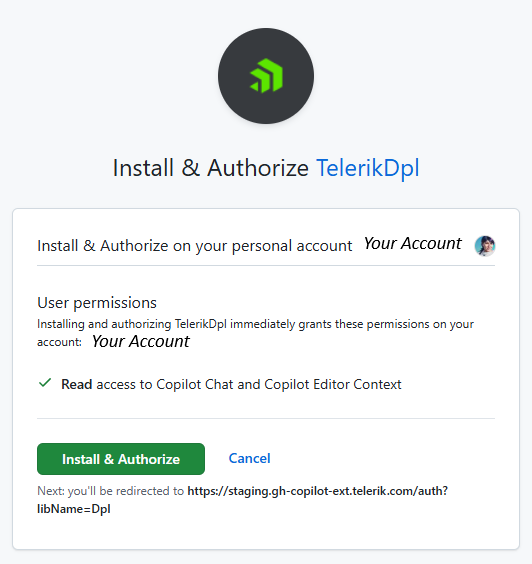
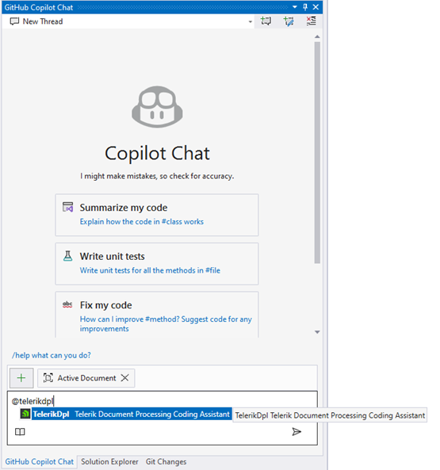

# Telerik Document Processing GitHub Copilot Extension

The Telerik Document Processing Libraries (DPL) [GitHub Copilot](https://github.com/features/copilot) extension is an AI-powered coding assistant that provides specialized knowledge about the Telerik [Document Processing Libraries]().

This extension enhances GitHub Copilot with proprietary context about Telerik Document Processing Libraries, helping you:

* Generate code snippets using Document Processing Libraries.
* Get contextual suggestions for component properties and methods.
* Access best practices and implementation patterns.
* Speed up development with AI-powered code completion.

## Prerequisites for the GitHub Copilot Extension

In addition to the [prerequisites for the AI Coding Assistant](), before using the Telerik Document Processing Libraries GitHub Copilot extension, ensure you have:

* An active [GitHub Copilot](https://github.com/features/copilot) subscription. You can enable or configure GitHub Copilot on the [Copilot Settings page in your GitHub account](https://github.com/settings/copilot).
* The latest version of your [Copilot-enabled app](https://docs.github.com/en/copilot/building-copilot-extensions/about-building-copilot-extensions#supported-clients-and-ides) (for example, Visual Studio or Visual Studio Code).

## Installation

Follow these steps to install and configure the Telerik Document Processing Copilot extension:

1. Go to the [Telerik Document Processing GitHub App](https://github.com/apps/telerikdpl) page and click the **Install** button.
1. You will see a list that includes your GitHub account and all GitHub organizations that you are part of. **Select your GitHub account**.
1. Click the **Install & Authorize** button. This will allow the GitHub Copilot extension to integrate with your GitHub account.

       

1. Enter your GitHub password when prompted.
1. You will be redirected to **telerik.com**. Enter your **Telerik account** credentials if prompted. This step links the GitHub Copilot extension with your Telerik account.
1. Upon successful Telerik authentication, you will be redirected to a confirmation page that indicates successful Copilot extension installation.
1. Restart your [Copilot-enabled app](https://docs.github.com/en/copilot/building-copilot-extensions/about-building-copilot-extensions#supported-clients-and-ides) (for example, Visual Studio and Visual Studio Code).
1. Start a new chat session in Copilot.

## Usage

To use the Telerik DPL Copilot extension:

1. Open the GitHub Copilot chat window in your [Copilot-enabled app](https://docs.github.com/en/copilot/building-copilot-extensions/about-building-copilot-extensions#supported-clients-and-ides) (for example, Visual Studio or VS Code).
1. Ensure you are in **Chat** mode and not in **Edit** or **Agent** mode. The Edit and Agent modes do not use the Telerik Copilot extension. However, the Agent mode can use the [Telerik DPL MCP server]().
1. Start your prompt with `@telerikdpl` and type your request. Verify that `@telerikdpl` is recognized and highlighted; otherwise, the extension may not be properly installed.

        
1. Look for a status label such as **Telerik DPL working...** or **Telerik DPL generating response...** in the output to confirm the extension is active.
1. Grant permission to the Telerik DPL extension to read your workspace files when prompted.
1. For unrelated queries, start a new chat session in a new window to avoid context pollution from previous conversations.

### Sample Prompts

The following examples demonstrate useful prompts for the Telerik DPL extension:

* "`@telerikdpl` Generate a PDF document with a table 3x3 with Name, Age, City as columns"
* "`@telerikdpl` Generate a PDF document with a text and an image"

## Number of Requests

A Telerik [Subscription license](https://www.telerik.com/purchase/faq/licensing-purchasing) is recommended in order to use the Telerik DPL AI Coding Assistant without restrictions. Perpetual license holders and trial users can make a [limited number of requests per year](#number-of-requests).

## Troubleshooting

If you encounter issues:

* Ensure the `@telerikdpl` mention is properly highlighted in your prompt.
* Verify that you have an active GitHub Copilot subscription.
* Restart your IDE after installation.
* Check that you're in Chat mode, not Edit or Agent mode.

## See Also 

* [GitHub Copilot Documentation](https://docs.github.com/en/copilot)
* [GitHub Copilot Tutorials](https://github.com/features/copilot/tutorials)
* [Telerik DPL MCP Server]()
* [Document Processing Libraries]()
