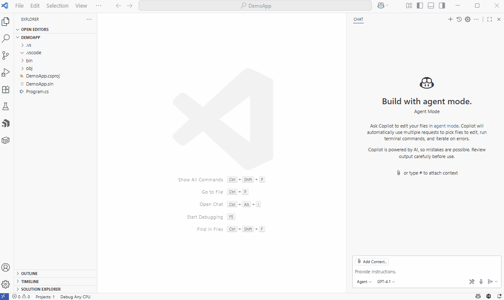
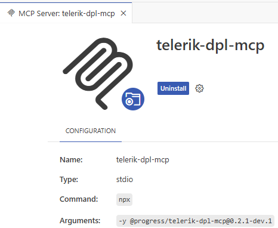
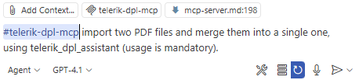
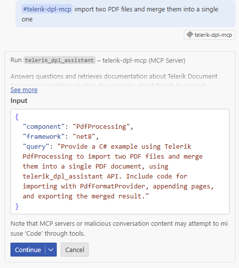
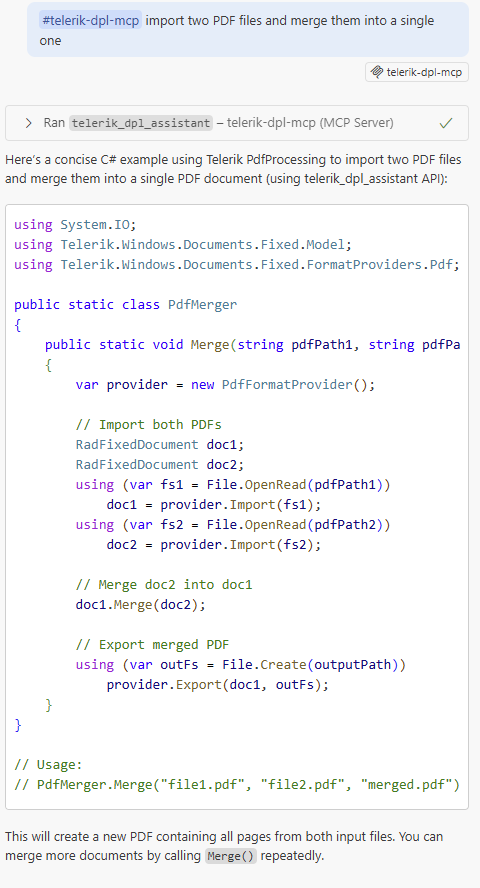
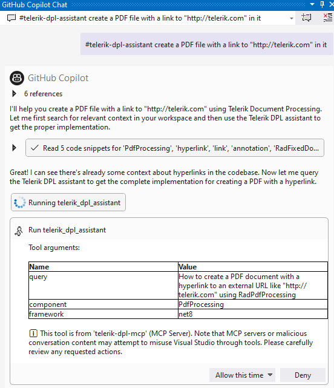

<style>
img[alt$="><"] {
  border: 1px solid lightgrey;
}
</style>

# MCP Server

The Telerik Document Processing [MCP (Model Context Protocol) server](https://modelcontextprotocol.io/introduction) lets you interact with AI and reach new levels of developer productivity. The MCP server provides proprietary context to AI-powered IDEs, apps and tools. You can use the MCP server for Document Processing code generation and successfully prompt more complex questions and tasks, and generate tailored code that includes the [Telerik Document Processing Libraries](https://www.telerik.com/document-processing-libraries).

>tip The MCP server can be [installed also as a NuGet package](), instead of using __Node.js__ and `npm` commands as shown below.

## Supported Libraries

* [RadPdfProcessing]()
* [RadSpreadProcessing]()
* [RadSpreadStreamProcessing]()
* [RadWordsProcessing]()
* [RadZipLibrary]()

## Prerequisites for the MCP Server

To use the Telerik Document Processing Libraries (DPL) MCP Server, you need:

* A [Telerik user account](https://www.telerik.com/account/).
* An active [Telerik license](https://www.telerik.com/purchase.aspx?filter=web) that includes Telerik Document Processing.
* An application that uses the Telerik [Document Processing Libraries]().
* [.NET](https://learn.microsoft.com/en-us/dotnet/core/whats-new/dotnet-8/overview) {{site.mindotnetversion}} or later, or [Node.js](https://nodejs.org/en) 18 or later.
* An [MCP-compatible client (IDE, code editor, or app)](https://modelcontextprotocol.io/clients) that supports MCP tools (latest version recommended). For example, the latest [Visual Studio Code](https://code.visualstudio.com/).

## Installation

Depending on your environment, you can install the Telerik DPL MCP server either by using the .NET tooling or Node.js.

### Using the .NET Tooling

Use the `dnx` script (.NET 10 or later only) or the `dotnet` CLI (.NET {{site.mindotnetversion}} and .NET 9)

* .NET 10:

  ```json
    dnx Telerik.DPL.MCP
  ```

* .NET 8 and .NET 9:

  ```json
    dotnet tool install Telerik.DPL.MCP
  ```

### Using npm: 

Use the documentation of your AI-powered MCP client to add the [Telerik Document Processing MCP server](https://www.npmjs.com/package/@progress/telerik-dpl-mcp) to a specific workspace or globally. You can see installation tips and examples for some popular MCP clients below.

```bash
npm i @progress/telerik-dpl-mcp
```

Next, make sure the configuration in your `mcp.json` is [correct](#configuring-mcp-json), and then [add your Telerik license](#configuring-your-license).

### Installing in VS Code

   

## Configuration

To configure the Telerik DPL MCP server you need to configure the license and mcp.json as follows:

### Configuring mcp.json

Use the settings in the following table to configure the Telerik DPL MCP server in the [`mcp.json` file](https://code.visualstudio.com/docs/copilot/customization/mcp-servers) of your code editor. Select the correct value based on your development environment.
Use these settings when configuring the server in your MCP client:

| Setting Name | .NET 10 Value | .NET 8 / .NET 9 Value | Node.js Value |
|---------|---------------|-----------------------|---------------|
| Package Name | `"Telerik.DPL.MCP"` | `"Telerik.DPL.MCP"` | `"@progress/telerik-dpl-mcp"` |
| Type | `"stdio"` | `"stdio"` | `"stdio"` |
| Command | `"dnx"` | `"dotnet"` | `"npx"` |
| Arguments | `"Telerik.DPL.MCP", "--yes"` | `"tool", "run", "telerik-dpl-mcp"` | `"-y"` |
| Server Name | `"telerik-dpl-assistant"` | `"telerik-dpl-assistant"` | `"telerik-dpl-assistant"` |

### License Configuration

An active Document Processing license is required to use the Telerik DPL MCP server. 

* When installing the MCP server by using the .NET tooling (`dnx` or `dotnet tool install`), the [Telerik license key]() will be retrieved automatically if it is present in the default directory on your system (`%AppData%\Telerik\telerik-license.txt` on Windows and `~/.telerik/telerik-license.txt` on Linux). No additional action is required.
* When using the .NET tooling, but your [license key file]() is not in the default directory, use one of the options below to configure your license.
* When using Node.js, add your [license key file]() as an environment variable in your `mcp.json` file using one of the options below:

* As a license file path (recommended)

  ```json
  "env": {
      "TELERIK_LICENSE_PATH": "THE_PATH_TO_YOUR_LICENSE_FILE"
  }
  ```

* As a license key value

  ```json
  "env": {
      "TELERIK_LICENSE": "YOUR_LICENSE_KEY_HERE"
  }
  ```

> Using a license file path is recommended unless you're sharing settings across different systems. Remember to [update your license key](#updating-your-license-key) when necessary.

>note Usually, the `.mcp.json` file is expected to be found in the user's directory: %USERPROFILE%
 
## Visual Studio Configuration

> * Early Visual Studio 17.14 versions require the Copilot Chat window to be open when opening a solution for the MCP server to work properly.
> * For complete setup instructions, see [Use MCP servers in Visual Studio](https://learn.microsoft.com/en-us/visualstudio/ide/mcp-servers).

The steps below describe the sample procedure for configuring the Telerik DPL MCP server in Visual Studio.

1\. Add an `.mcp.json` file to either of the following locations:

  * For a workspace-specific setup, add the file to the solution's folder.
  * For a global setup, add the file to your user directory, `%USERPROFILE%` (for example, `C:\Users\YourName\.mcp.json`).

2\. Add the following configuration to the mcp.json file:

  * In .NET 10:

    ```json
    {
      "servers": {
        "telerik-dpl-assistant": {
          "type": "stdio",
          "command": "dnx",
          "args": ["Telerik.DPL.MCP", "--yes"],
          "env": {
            "TELERIK_LICENSE_PATH": "THE_PATH_TO_YOUR_LICENSE_FILE",
            // or
            "TELERIK_LICENSE": "YOUR_LICENSE_KEY"
          }
        }
      },
      "inputs": []
    }
    ```

  * In .NET 8 and .NET 9:

    ```json
    {
      "servers": {
        "telerik-dpl-assistant": {
          "type": "stdio",
          "command": "dotnet",
          "args": ["tool", "run", "telerik-dpl-mcp"],
          "env": {
            "TELERIK_LICENSE_PATH": "THE_PATH_TO_YOUR_LICENSE_FILE",
            // or
            "TELERIK_LICENSE": "YOUR_LICENSE_KEY"
          }
        }
      },
      "inputs": []
    }
    ```

  * In Node.js:

    ```json
    {
      "servers": {
        "telerik-dpl-assistant": {
          "type": "stdio",
          "command": "npx",
          "args": ["-y", "@progress/telerik-dpl-mcp@latest"],
          "env": {
            "TELERIK_LICENSE_PATH": "THE_PATH_TO_YOUR_LICENSE_FILE",
            // or
            "TELERIK_LICENSE": "YOUR_LICENSE_KEY"
          }
        }
      },
      "inputs": []
    }
  ```

3\. Restart Visual Studio.

4\. Enable the `telerik-dpl-assistant` tool in the [Copilot Chat window's tool selection dropdown](https://learn.microsoft.com/en-us/visualstudio/ide/mcp-servers?view=vs-2022#configuration-example-with-github-mcp-server).

Add the `.mcp.json` file to your user directory (`%USERPROFILE%`, e.g., `C:\Users\YourName\.mcp.json`).

## Visual Studio Code

For complete setup instructions, see [Use MCP servers in Visual Studio Code](https://code.visualstudio.com/docs/copilot/chat/mcp-servers).

> Visual Studio Code 1.102.1 or newer is required to use the Telerik MCP Server
> * For complete setup instructions, see [Use MCP servers in Visual Studio Code](https://code.visualstudio.com/docs/copilot/chat/mcp-servers).

The basic setup in Visual Studio Code involves the following steps:

1. Enable [`chat.mcp.enabled`](vscode://settings/chat.mcp.enabled) in Visual Studio Code settings.
2. Create `.vscode/mcp.json` in your workspace root (or user folder for global setup):

  * In .NET 10:

    ```json
    {
      "servers": {
        "telerik-dpl-assistant": {
          "type": "stdio",
          "command": "dnx",
          "args": ["Telerik.DPL.MCP", "--yes"],
          "env": {
            "TELERIK_LICENSE_PATH": "THE_PATH_TO_YOUR_LICENSE_FILE",
            // or
            "TELERIK_LICENSE": "YOUR_LICENSE_KEY"
          }
        }
      },
      "inputs": []
    }
    ```

  * In .NET 8 and .NET 9:

    ```json
    {
      "servers": {
        "telerik-dpl-assistant": {
          "type": "stdio",
          "command": "dotnet",
          "args": ["tool", "run", "telerik-dpl-mcp"],
          "env": {
            "TELERIK_LICENSE_PATH": "THE_PATH_TO_YOUR_LICENSE_FILE",
            // or
            "TELERIK_LICENSE": "YOUR_LICENSE_KEY"
          }
        }
      },
      "inputs": []
    }
    ```

  * In Node.js:

    ```json
    {
      "servers": {
        "telerik-dpl-assistant": {
          "type": "stdio",
          "command": "npx",
          "args": ["-y", "@progress/telerik-dpl-mcp@latest"],
          "env": {
            "TELERIK_LICENSE_PATH": "THE_PATH_TO_YOUR_LICENSE_FILE",
            // or
            "TELERIK_LICENSE": "YOUR_LICENSE_KEY"
          }
        }
      },
      "inputs": []
    }
 ```

3. For global discovery, enable [`chat.mcp.discovery.enabled`](vscode://settings/chat.mcp.discovery.enabled) in `settings.json`:

 ```json
 {
   "chat.mcp.discovery.enabled": true
 }
 ```

4. Restart Visual Studio Code.

  

## Cursor

For complete setup instructions, see [Model Context Protocol](https://docs.cursor.com/context/mcp).

Create `.cursor/mcp.json` in your workspace root (or user folder for global setup):

* In .NET 10:

    ```json
    {
      "mcpServers": {
        "telerik-dpl-assistant": {
          "type": "stdio",
          "command": "dnx",
          "args": ["Telerik.DPL.MCP", "--yes"],
          "env": {
            "TELERIK_LICENSE_PATH": "THE_PATH_TO_YOUR_LICENSE_FILE",
            // or
            "TELERIK_LICENSE": "YOUR_LICENSE_KEY"
          }
        }
      },
      "inputs": []
    }
    ```

* In .NET 8 and .NET 9:

    ```NET8/9
    {
      "mcpServers": {
        "telerik-dpl-assistant": {
          "type": "stdio",
          "command": "dotnet",
          "args": ["tool", "run", "telerik-dpl-mcp"],
          "env": {
            "TELERIK_LICENSE_PATH": "THE_PATH_TO_YOUR_LICENSE_FILE",
            // or
            "TELERIK_LICENSE": "YOUR_LICENSE_KEY"
          }
        }
      },
      "inputs": []
    }
    ```

* In Node.js:

    ```Nodejs
    {
      "mcpServers": {
        "telerik-dpl-assistant": {
          "type": "stdio",
          "command": "npx",
          "args": ["-y", "@progress/telerik-dpl-mcp@latest"],
          "env": {
            "TELERIK_LICENSE_PATH": "THE_PATH_TO_YOUR_LICENSE_FILE",
            // or
            "TELERIK_LICENSE": "YOUR_LICENSE_KEY"
          }
        }
      },
      "inputs": []
    }
    ```

## Usage

By default, MCP clients do not call MCP tools in a deterministic way. Some MCP clients like VS Code allow you to explicitly reference the desired MCP tool in your prompt.

>note When switching between tasks and files, start a new session in a new chat window to avoid polluting the context with irrelevant or outdated information.

To use the Telerik DPL MCP server:

1. Choose your preferred mode and model.

    At the time of publishing, **Claude Sonnet 4** and **GPT-5** produce optimal results.

1. Start your prompt with `#telerik-dpl-assistant` (or with # followed by your custom server name, if set).

2. Inspect the output and verify that the MCP Server is used. Look for a similar statement in the output (the exact text may vary across tools):
   - Visual Studio: `Running telerik-dpl-assistant`
   - Visual Studio Code: `Running telerik-dpl-assistant`
   - Cursor: `Calling MCP tool telerik-dpl-assistant`

3. If the MCP server is not used even though it's installed and enabled, double-check the server name in your configuration and try rephrasing your prompt.

4. Grant permissions when prompted (per session, workspace, or always).

5. Start fresh sessions for unrelated prompts to avoid context pollution.

6. Use in **Chat** (**Ask**) and **Agent** modes.

### Improving Server Usage

To increase the likelihood of the Telerik DPL MCP server being used, add custom instructions to your AI tool:
- [GitHub Copilot custom instructions](https://docs.github.com/en/copilot/customizing-copilot/adding-repository-custom-instructions-for-github-copilot#about-repository-custom-instructions-for-github-copilot-chat)
- [Cursor rules](https://docs.cursor.com/context/rules)

### Sample Prompts

The following examples demonstrate useful prompts for the Telerik Document Processing MCP Server:

* "`#telerik-dpl-assistant` generate a pdf document with text "Hello" and a table 3x3"

       

|Copilot calling the DPL MCP Server in VS Code|Copilot final answer in VS Code|
|----|----| 
|||    


* "`#telerik-dpl-assistant` create a PDF file with a link to "http://telerik.com" in it"

>caption Running MCP Server in Visual Studio 

   

## Usage Limits

A Telerik [Subscription license](https://www.telerik.com/purchase.aspx?filter=web) is recommended in order to use the Telerik DPL AI Coding Assistant without restrictions. Perpetual license holders and trial users can make a [limited number of requests per year](#usage-limits).

## Local AI Model Integration

You can use the Telerik DPL MCP server with local large language models (LLMs):

1. Run a local model, for example, through [Ollama](https://ollama.com).
2. Use a bridge package like [MCP-LLM Bridge](https://github.com/patruff/ollama-mcp-bridge).
3. Connect your local model to the Telerik DPL MCP server.

This setup allows you to use the Telerik AI Coding Assistant without cloud-based AI models.

## See Also

* [AI Coding Assistant Overview]()
* [Telerik Document Processing Prompt Library]()
* [MCP Server as a NuGet Package]()