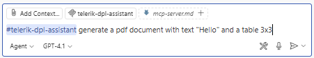
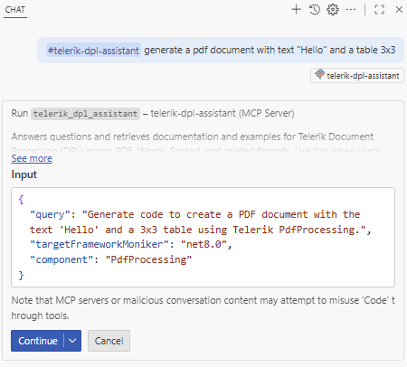
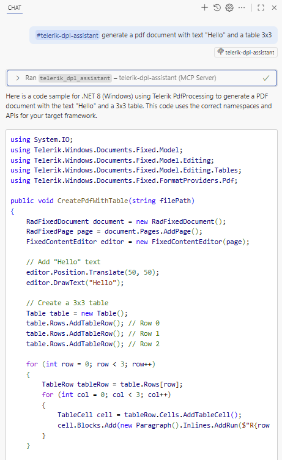

<style>
img[alt$="><"] {
  border: 1px solid lightgrey;
}
</style>

# MCP Server

The Telerik Document Processing [MCP (Model Context Protocol) Server](https://modelcontextprotocol.io/introduction) lets you interact with AI and reach new levels of developer productivity. The MCP server provides proprietary context to AI-powered IDEs, apps and tools. You can use the MCP server for Document Processing code generation and successfully prompt more complex questions and tasks, and generate tailored code that includes the [Telerik Document Processing Libraries](https://www.telerik.com/document-processing-libraries).

## Supported Libraries

* [RadPdfProcessing]()
* [RadSpreadProcessing]()
* [RadSpreadStreamProcessing]()
* [RadWordsProcessing]()
* [RadZipLibrary]()

## Prerequisites for the MCP Server

In addition to the [prerequisites for the AI Coding Assistant](#prerequisites-for-the-ai-coding-assistant), to use the Telerik Document Processing (DPL) MCP server, you need:

* [Node.js](https://nodejs.org/en) 18 or newer.
* An [MCP-compatible client](https://modelcontextprotocol.io/clients) that supports **MCP tools** (latest version recommended).

## Installation

Use the documentation of your AI-powered MCP client to add the [Telerik Document Processing MCP server](https://www.npmjs.com/package/@progress/telerik-dpl-mcp) to a specific workspace or globally. You can see installation tips and examples for some popular MCP clients below.

### Installing the Telerik Document Processing MCP server using npm:  

```bash
npm i @progress/telerik-dpl-mcp
```

### Installing in VS Code

   

## Configuration

Use these settings when configuring the server in your MCP client:

|Setting|Value|
|----|----|
| Package Name | `@progress/telerik-dpl-mcp` |
| Type | `stdio` (standard input/output transport) |
| Command | `npx` |
| Arguments | `-y` |
| Server Name | `telerik-dpl-mcp` (customizable) |

### License Configuration

Add your [Telerik license key]() as an environment parameter in your `mcp.json` file either as a path or as a script key.

#### Option 1: License File Path (Recommended)

 ```json
 "env": {
     "TELERIK_LICENSE_PATH": "THE_PATH_TO_YOUR_LICENSE_FILE"
 }
 ```

#### Option 2: Direct License Key

 ```json
 "env": {
     "TELERIK_LICENSE": "YOUR_LICENSE_KEY_HERE"
 }
 ```

> Option 1 is recommended unless you're sharing settings across different systems. Remember to [update your license key](#updating-your-license-key) when necessary.

>note Usually, the `.mcp.json` file is expected to be found in the user's directory: %USERPROFILE%
 
## Visual Studio

For complete setup instructions, see [Use MCP servers in Visual Studio](https://learn.microsoft.com/en-us/visualstudio/ide/mcp-servers).

> Early Visual Studio 17.14 versions require the Copilot Chat window to be open when opening a solution for the MCP server to work properly.

### Workspace-Specific Setup:

1. Add `.mcp.json` to your solution folder:

 ```json
 {
   "servers": {
     "telerik-dpl-assistant": {
       "type": "stdio",
       "command": "npx",
       "args": ["-y", "@progress/telerik-dpl-mcp@latest"],
       "env": {
         "TELERIK_LICENSE_PATH": "THE_PATH_TO_YOUR_LICENSE_FILE",
         // or
         "TELERIK_LICENSE": "YOUR_LICENSE_KEY"
       }
     }
   },
   "inputs": []
 }
 ```

2. Restart Visual Studio.
3. Enable the `telerik-dpl-assistant` tool in the [Copilot Chat window's tool selection dropdown](https://learn.microsoft.com/en-us/visualstudio/ide/mcp-servers?view=vs-2022#configuration-example-with-github-mcp-server).

### Global Setup:

Add the `.mcp.json` file to your user directory (`%USERPROFILE%`, e.g., `C:\Users\YourName\.mcp.json`).

## Visual Studio Code

For complete setup instructions, see [Use MCP servers in Visual Studio Code](https://code.visualstudio.com/docs/copilot/chat/mcp-servers).

> Visual Studio Code 1.102.1 or newer is required to use the Telerik MCP Server

The basic setup in Visual Studio Code follows these steps:

1. Enable [`chat.mcp.enabled`](vscode://settings/chat.mcp.enabled) in Visual Studio Code settings.
2. Create `.vscode/mcp.json` in your workspace root (or user folder for global setup):

 ```json
{
    "servers": {
        "telerik-dpl-assistant": {
            "type": "stdio",
            "command": "npx",
            "args": [
                "@progress/telerik-dpl-mcp@latest"],
            "env": {
				"TELERIK_LICENSE_PATH": "THE_PATH_TO_YOUR_LICENSE_FILE",
				// or
				"TELERIK_LICENSE": "YOUR_LICENSE_KEY"
            }
        }
    },
    "inputs": []
}
 ```

3. For global discovery, enable [`chat.mcp.discovery.enabled`](vscode://settings/chat.mcp.discovery.enabled) in `settings.json`:

 ```json
 {
   "chat.mcp.discovery.enabled": true
 }
 ```

4. Restart Visual Studio Code.

  

## Cursor

For complete setup instructions, see [Model Context Protocol](https://docs.cursor.com/context/mcp).

Create `.cursor/mcp.json` in your workspace root (or user folder for global setup):

```json
{
  "mcpServers": {
    "telerik-dpl-assistant": {
      "type": "stdio",
      "command": "npx",
      "args": ["-y", "@progress/telerik-dpl-mcp@latest"],
      "env": {
        "TELERIK_LICENSE_PATH": "THE_PATH_TO_YOUR_LICENSE_FILE",
        // or
        "TELERIK_LICENSE": "YOUR_LICENSE_KEY"
      }
    }
  }
}
```

## Usage

>note When switching between tasks and files, start a new session in a new chat window to avoid polluting the context with irrelevant or outdated information.

The Telerik Document Processing MCP Server can be used in `Agent` mode as follows:

1. Start your prompt with `#telerik-dpl-assistant` (or with # followed by your custom server name, if set).

2. Inspect the output and verify that the MCP Server is used. Look for a similar statement in the output (the exact text may vary across tools):
   - Visual Studio: `Running telerik-dpl-assistant`
   - Visual Studio Code: `Running telerik-dpl-assistant`
   - Cursor: `Calling MCP tool telerik-dpl-assistant`

3. If the MCP server is not used even though it's installed and enabled, double-check the server name in your configuration and try rephrasing your prompt.

4. Grant permissions when prompted (per session, workspace, or always).

4. Start fresh sessions for unrelated prompts to avoid context pollution.

### Improving Server Usage

To increase the likelihood of the Telerik MCP server being used, add custom instructions to your AI tool:
- [GitHub Copilot custom instructions](https://docs.github.com/en/copilot/customizing-copilot/adding-repository-custom-instructions-for-github-copilot#about-repository-custom-instructions-for-github-copilot-chat)
- [Cursor rules](https://docs.cursor.com/context/rules)

### Sample Prompts

The following examples demonstrate useful prompts for the Telerik Document Processing MCP Server:

* "`#telerik-dpl-assistant` generate a pdf document with text "Hello" and a table 3x3"

       

|Copilot calling the DPL MCP Server in VS Code|Copilot final answer in VS Code|
|----|----| 
|||    


* "`#telerik-dpl-assistant` create a PDF file with a link to "http://telerik.com" in it"


>caption Running MCP Server in Visual Studio 

   

## Usage Limits

A Telerik [Subscription license](https://www.telerik.com/purchase.aspx?filter=web) is recommended in order to use the Telerik DPL AI Coding Assistant without restrictions. Perpetual license holders and trial users can make a [limited number of requests per year](#usage-limits).

## Local AI Model Integration

You can use the Telerik DPL MCP server with local large language models (LLMs):

1. Run a local model, for example, through [Ollama](https://ollama.com).
2. Use a bridge package like [MCP-LLM Bridge](https://github.com/patruff/ollama-mcp-bridge).
3. Connect your local model to the Telerik MCP server.

This setup allows you to use the Telerik AI Coding Assistant without cloud-based AI models.

## See Also

* [AI Coding Assistant Overview]()
* [Telerik Document Processing Prompt Library]()