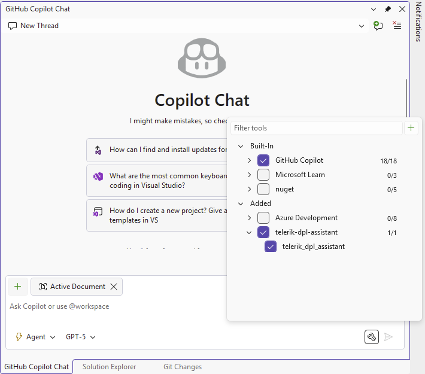

# Telerik DPL MCP Server (NuGet)

The Telerik Document Processing [MCP (Model Context Protocol) server](https://modelcontextprotocol.io/introduction) is also available as a NuGet package. This NuGet distribution exposes the same AI Coding Assistant functionality as the npm package. 

Starting with **.NET 10**, you can execute it directly through the `dnx` command. For **.NET 8 and .NET 9** (where `dnx` is not available), you can [install it as a global dotnet tool](https://learn.microsoft.com/dotnet/core/tools/dotnet-tool-install) and invoke its executable.

## Prerequisites 

| Target Runtime | Required SDK | Invocation Method | Notes |
|----------------|--------------|-------------------|-------|
| .NET 8 / .NET 9 | .NET 8 or .NET 9 SDK | [dotnet tool](https://learn.microsoft.com/dotnet/core/tools/global-tools) | `dnx` not supported. Install tool manually. |
| .NET 10 | .NET 10 SDK (Preview 6 or later) | `dnx` dynamic execution | Simplest approach. No prior install step. |

Additional requirements:

* A [Telerik user account](https://www.telerik.com/account/).
* An active [Telerik license](https://www.telerik.com/purchase.aspx?filter=web) that includes Telerik Document Processing.
* An application that uses the Telerik [Document Processing Libraries]().

## Summary of Installation Approaches

| Aspect | .NET 8 / 9 | .NET 10 |
|--------|------------|---------|
| Availability of `dnx` | Not available | Available |
| Install Command | `dotnet tool install Telerik.DPL.MCP` | None (resolved on demand) |
| .mcp.json Command | `dotnet` | `dnx` |
| .mcp.json Args | `telerik-dpl-assistant` | `Telerik.DPL.MCP`, `--yes` |
| Update Version | Re-run tool install with `--version` or `tool update` | Handled by latest package resolved by `dnx` |
| Offline Use | Requires prior tool install | Requires prior NuGet cache warm-up |

## Server Installation

### .NET 8 / .NET 9

  * Global installation

Install the MCP server as a global tool in your solution root (or another chosen path):

**Install the Telerik DPL MCP Server as a global .NET tool**

````powershell
dotnet tool install -g Telerik.DPL.MCP
````

If updating:

**Update the globally installed Telerik DPL MCP Server tool**

````powershell
dotnet tool update -g Telerik.DPL.MCP
````

These commands install/update the Telerik DPL MCP [dotnet tool](https://learn.microsoft.com/dotnet/core/tools/global-tools) globally. Global tools are installed in the following directories by default when you specify the **-g** or **--global** option:

* Windows - `%USERPROFILE%\.dotnet\tools`
* Linux/MacOS - `$HOME/.dotnet/tools`

  * Local installation

    1. Navigate to the solution folder.
    2. Run `dotnet tool new-manifest` in the Terminal.
    3. Run `dotnet tool install Telerik.DPL.MCP` in the Terminal.

### .NET 10

No manual install step is needed. The `dnx` command will download and execute the NuGet package on demand.

## Server Configuration

### .NET 8 / .NET 9 Configuration (`.mcp.json`)

Add `.mcp.json` file to your solution root (or to `%USERPROFILE%` for global usage):

**Sample `.mcp.json` configuration for a global .NET 8 or .NET 9 setup**

```json
    {
      "servers": {
        "telerik-dpl-assistant": {
          "type": "stdio",
          "command": "dotnet",
          "args": ["tool", "run", "telerik-dpl-assistant"],
          "env": {
            "TELERIK_LICENSE_PATH": "THE_PATH_TO_YOUR_LICENSE_FILE",
            // or
            "TELERIK_LICENSE": "YOUR_LICENSE_KEY"
          }
        }
      },
      "inputs": []
    }
```

For the **local** installation use the following `.mcp.json`:

**Sample `.mcp.json` configuration for a local .NET 8 or .NET 9 setup**

```json
    {
      "servers": {
        "telerik-dpl-assistant": {
         "type": "stdio",
         "command": "telerik-dpl-assistant",
          "env": {
            "TELERIK_LICENSE_PATH": "THE_PATH_TO_YOUR_LICENSE_FILE",
            // or
            "TELERIK_LICENSE": "YOUR_LICENSE_KEY"
          }
        }
      },
      "inputs": []
    }
```


### .NET 10 Configuration (`.mcp.json`)

Use these settings when configuring the server in your MCP client:

**Sample `.mcp.json` configuration for a .NET 10 `dnx` setup**

```json
    {
      "servers": {
        "telerik-dpl-assistant": {
          "type": "stdio",
          "command": "dnx",
          "args": ["Telerik.DPL.MCP", "--yes"],
          "env": {
            "TELERIK_LICENSE_PATH": "THE_PATH_TO_YOUR_LICENSE_FILE",
            // or
            "TELERIK_LICENSE": "YOUR_LICENSE_KEY"
          }
        }
      },
      "inputs": []
    }
```

You can substitute `TELERIK_LICENSE` instead of `TELERIK_LICENSE_PATH` (*see [License Configuration](#license-configuration) section below for details and recommendations*). The `inputs` array is optional and not required for the current functionality.

After saving the file, restart Visual Studio and enable the `telerik-dpl-assistant` tool in the [Copilot Chat window's tool selection dropdown](https://learn.microsoft.com/visualstudio/ide/mcp-servers?view=vs-2022#configuration-example-with-github-mcp-server).

**Visual Studio example of enabling the Telerik DPL MCP Server tool in Copilot Chat**

 

### Global Setup

To enable the server globally for all projects, add the `.mcp.json` file to your user directory (`%USERPROFILE%`, e.g., `C:\Users\{YourName}\.mcp.json`).

## License Configuration

Add your [Telerik license key]() using one of these options in the `env` section.

**Option 1: License File Path (Recommended)**

**License configuration example that uses the Telerik license file path**

````json
"env": {
	"TELERIK_LICENSE_PATH": "THE_PATH_TO_YOUR_LICENSE_FILE"
}
````

The `THE_PATH_TO_YOUR_LICENSE_FILE` should point to the `telerik-license.txt` file, usually in the AppData folder. Often it will look like:

`"TELERIK_LICENSE_PATH": "%appdata%/Telerik/telerik-license.txt"`

**Option 2: Direct License Key**

**License configuration example that uses the Telerik license key value directly**

````json
"env": {
	"TELERIK_LICENSE": "YOUR_LICENSE_KEY_HERE"
}
````

> Option 1 is recommended unless you share settings across different systems. Remember to [update your license key](#updating-your-license-key) when necessary.

## Visual Studio Usage

After configuration and restart:

1. Open Copilot Chat.
2. Enable the `telerik-dpl-assistant` tool.
3. Grant permissions when prompted (*per session, workspace, or always*).
4. Start fresh sessions for unrelated prompts to avoid context pollution. You can check the Output pane of Visual Studio for diagnostics (select output from **GitHub Copilot**).

## See Also

* [AI Coding Assistant Overview]()
* [Telerik Document Processing Prompt Library]()
* [npm-based Telerik DPL MCP Server]()