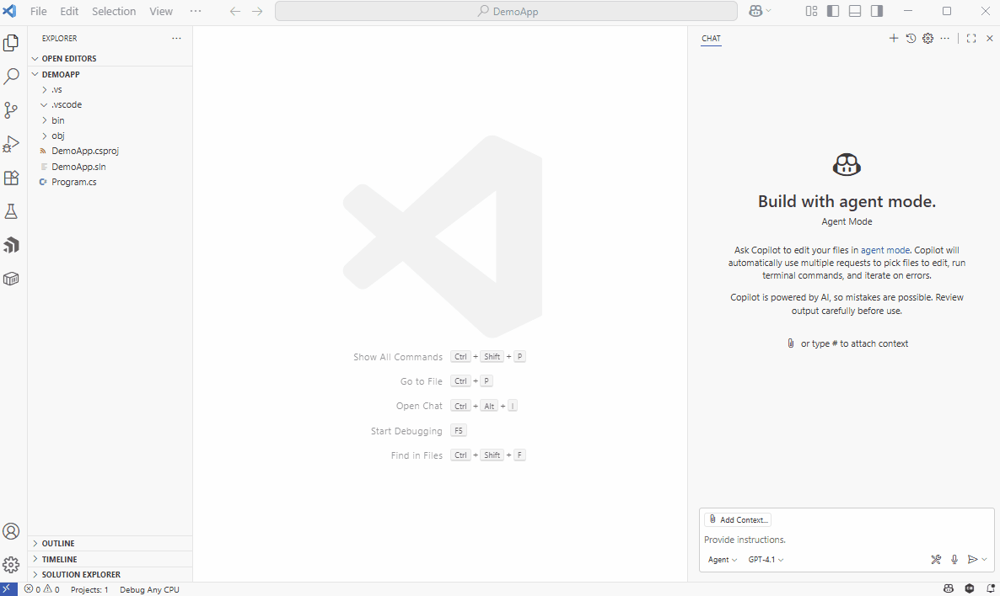
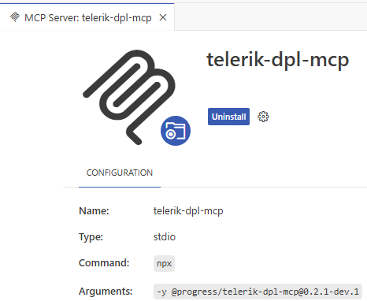
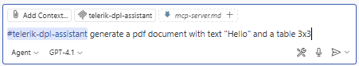
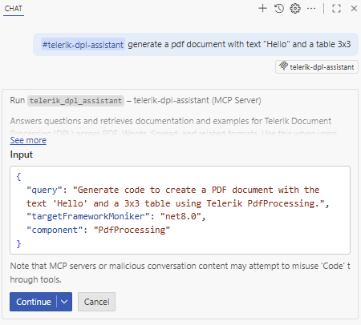
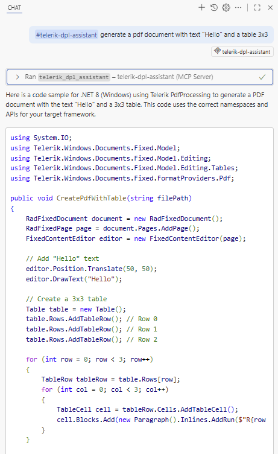
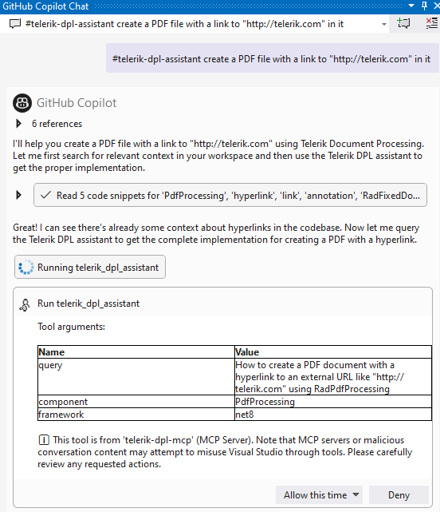

<style>
img[alt$="><"] {
  border: 1px solid lightgrey;
}
</style>

# MCP Server

The Telerik Document Processing [MCP (Model Context Protocol) server](https://modelcontextprotocol.io/introduction) provides Document Processing context to AI-powered IDEs, apps, and tools. Use it to generate tailored code and complete complex tasks with the [Telerik Document Processing Libraries](https://www.telerik.com/document-processing-libraries).

>important Visual Studio can hang during tool calls. See [Troubleshooting](#troubleshooting).

>important The npm package `@progress/telerik-dpl-mcp` is deprecated. For current installations and updates, migrate to the [NuGet package `Telerik.DPL.MCP`]().

>tip The recommended way to install the MCP server is through the [NuGet package](). The Node.js/npm-based approach documented below is deprecated.

## Supported Libraries

* [RadPdfProcessing]()
* [RadSpreadProcessing]()
* [RadSpreadStreamProcessing]()
* [RadWordsProcessing]()
* [RadZipLibrary]()

## Prerequisites for the MCP Server

To use the Telerik Document Processing Libraries (DPL) MCP Server, you need:

* A [Telerik user account](https://www.telerik.com/account/).
* An active [Telerik license](https://www.telerik.com/purchase.aspx?filter=web) that includes Telerik Document Processing.
* An application that uses the Telerik [Document Processing Libraries]().
* [.NET](https://learn.microsoft.com/dotnet/core/whats-new/dotnet-8/overview) {{site.mindotnetversion}} or later, or [Node.js](https://nodejs.org/en) 18 or later.
* An [MCP-compatible client (IDE, code editor, or app)](https://modelcontextprotocol.io/clients) that supports MCP tools (use the latest version). For example, the latest [Visual Studio Code](https://code.visualstudio.com/).

## Installation

Install the Telerik DPL MCP server with the .NET tooling. The legacy Node.js package remains available for existing setups but is deprecated.

### Install with Telerik CLI (Recommended)

The easiest way to install and configure the Telerik DPL MCP Server is through the [Telerik CLI](). A single command line sets up the MCP server for your IDE automatically:

**Telerik CLI command that installs and configures the Telerik DPL MCP Server**

```powershell
telerik mcp config dpl
```

This command automatically creates or updates the `.mcp.json` configuration file for all supported IDEs. You can also specify a target IDE with the `--ide` option (for example, `telerik mcp config dpl --ide vscode`). For more details, see [Telerik CLI - Install DPL MCP Server](#install-dpl-mcp-server).

### Using the .NET Tooling

Use the `dnx` script (.NET 10 or later only) or the `dotnet` CLI (.NET {{site.mindotnetversion}} and .NET 9)

* .NET 10:

  **Command that runs the Telerik DPL MCP Server with `dnx`**

  ```json
    dnx Telerik.DPL.MCP
  ```

* .NET 8 and .NET 9:

  **Command that installs the Telerik DPL MCP Server with `dotnet tool`**

  ```json
    dotnet tool install Telerik.DPL.MCP
  ```

### Using npm

>important **Deprecated**: The npm package `@progress/telerik-dpl-mcp` is deprecated. Migrate to the [NuGet package `Telerik.DPL.MCP`]() for the current installation and configuration flow.

Use your AI-powered MCP client's documentation to add the legacy [Telerik Document Processing MCP server package](https://www.npmjs.com/package/@progress/telerik-dpl-mcp) to a workspace or global configuration.

**npm command that installs the Telerik DPL MCP Server package**

```bash
npm i @progress/telerik-dpl-mcp
```

Next, verify that the configuration in your `mcp.json` is [correct](#configuring-mcp-json), and then [add your Telerik license](#configuring-your-license).

### Installing in VS Code

**Visual Studio Code example of installing and configuring the Telerik DPL MCP Server**

   

## Configuration

To configure the Telerik DPL MCP server, configure the license and `mcp.json` as follows:

### Configuring mcp.json

Use the settings in the following table to configure the Telerik DPL MCP server in the [`mcp.json` file](https://code.visualstudio.com/docs/copilot/customization/mcp-servers) of your code editor. Select the correct value based on your development environment:

| Setting Name | .NET 10 Value | .NET 8 / .NET 9 Value | Node.js Value (Deprecated) |
|---------|---------------|-----------------------|----------------------------|
| Package Name | `"Telerik.DPL.MCP"` | `"Telerik.DPL.MCP"` | `"@progress/telerik-dpl-mcp"` *(deprecated)* |
| Type | `"stdio"` | `"stdio"` | `"stdio"` *(deprecated)* |
| Command | `"dnx"` | `"dotnet"` | `"npx"` *(deprecated)* |
| Arguments | `"Telerik.DPL.MCP", "--yes"` | `"tool", "run", "telerik-dpl-mcp"` | `"-y"` *(deprecated)* |
| Server Name | `"telerik-dpl-assistant"` | `"telerik-dpl-assistant"` | `"telerik-dpl-assistant"` *(deprecated)* |

### License Configuration

An active Document Processing license is required to use the Telerik DPL MCP server. 

* When installing the MCP server by using the .NET tooling (`dnx` or `dotnet tool install`), the [Telerik license key]() is retrieved automatically if it is present in the default directory on your system (`%AppData%\Telerik\telerik-license.txt` on Windows and `~/.telerik/telerik-license.txt` on Linux). No additional action is required.
* When using the .NET tooling, but your [license key file]() is not in the default directory, use one of the options below to configure your license.
* When using Node.js, add your [license key file]() as an environment variable in your `mcp.json` file using one of the options below:

* As a license file path (recommended)

  **License configuration example that references the Telerik license file path**

  ```json
  "env": {
      "TELERIK_LICENSE_PATH": "THE_PATH_TO_YOUR_LICENSE_FILE"
  }
  ```

* As a license key value

  **License configuration example that sets the Telerik license key directly**

  ```json
  "env": {
      "TELERIK_LICENSE": "YOUR_LICENSE_KEY_HERE"
  }
  ```

>tip A license file path is recommended unless you share settings across different systems. [Update your license key](#updating-your-license-key) when necessary.

>note Usually, the `.mcp.json` file is expected to be found in the user's directory: %USERPROFILE%
 
## Visual Studio Configuration

> * Early Visual Studio 17.14 versions require the Copilot Chat window to be open when opening a solution for the MCP server to work properly.
> * For complete setup instructions, see [Use MCP servers in Visual Studio](https://learn.microsoft.com/visualstudio/ide/mcp-servers).

The steps below describe the sample procedure for configuring the Telerik DPL MCP server in Visual Studio.

1. Add an `.mcp.json` file to either of the following locations:

  * For a workspace-specific setup, add the file to the solution's folder.
  
  * For a global setup, add the file to your user directory, `%USERPROFILE%` (for example, `C:\Users\YourName\.mcp.json`).

2. Add the following configuration to the mcp.json file:

  * In .NET 10:

    **Visual Studio `.mcp.json` example for a .NET 10 Telerik DPL MCP Server setup**

    ```json
    {
      "servers": {
        "telerik-dpl-assistant": {
          "type": "stdio",
          "command": "dnx",
          "args": ["Telerik.DPL.MCP", "--yes"],
          "env": {
            "TELERIK_LICENSE_PATH": "THE_PATH_TO_YOUR_LICENSE_FILE",
            // or
            "TELERIK_LICENSE": "YOUR_LICENSE_KEY"
          }
        }
      },
      "inputs": []
    }
    ```

  * In .NET 8 and .NET 9:

    * Global Installation 

      1. Run `dotnet tool install --global Telerik.DPL.MCP` in the Terminal.

      2. Update global MCP config: %userprofile%.mcp.json with following configuration:

    **Visual Studio global `.mcp.json` example for a .NET 8 or .NET 9 Telerik DPL MCP Server setup**

    ```json
    {
      "servers": {
			"telerik-dpl-assistant": {
			"type": "stdio",
			"command": "telerik-dpl-assistant",
			"env": {
            "TELERIK_LICENSE_PATH": "THE_PATH_TO_YOUR_LICENSE_FILE",
            // or
            "TELERIK_LICENSE": "YOUR_LICENSE_KEY"
          }
        }
      },
      "inputs": []
    }
    ```

    * Local Installation

      1. Navigate to the solution folder.

      2. Run `dotnet tool new-manifest` in the Terminal.

      3. Run `dotnet tool install Telerik.DPL.MCP` in the Terminal.

      4. Create/update solution based MCP Config %solutiondir%.mcp.json with the following configuration:

    **Visual Studio workspace `.mcp.json` example for a .NET 8 or .NET 9 Telerik DPL MCP Server setup**

    ```json
    {
      "servers": {
        "telerik-dpl-assistant": {
          "type": "stdio",
          "command": "dotnet",
          "args": ["tool", "run", "telerik-dpl-assistant"],
          "env": {
            "TELERIK_LICENSE_PATH": "THE_PATH_TO_YOUR_LICENSE_FILE",
            // or
            "TELERIK_LICENSE": "YOUR_LICENSE_KEY"
          }
        }
      },
      "inputs": []
    }
    ```

  * In Node.js:

    >important **Deprecated**: Node.js/npm-based setup uses deprecated package `@progress/telerik-dpl-mcp`. Use the NuGet-based setup from [Telerik DPL MCP Server as a NuGet Package]() for new and updated configurations.

    **Visual Studio `.mcp.json` example for a Node.js Telerik DPL MCP Server setup**

    ```json
    {
      "servers": {
        "telerik-dpl-assistant": {
          "type": "stdio",
          "command": "npx",
          "args": ["-y", "@progress/telerik-dpl-mcp@latest"],
          "env": {
            "TELERIK_LICENSE_PATH": "THE_PATH_TO_YOUR_LICENSE_FILE",
            // or
            "TELERIK_LICENSE": "YOUR_LICENSE_KEY"
          }
        }
      },
      "inputs": []
    }
    ```

3. Restart Visual Studio.

4. Enable the `telerik-dpl-assistant` tool in the [Copilot Chat window's tool selection dropdown](https://learn.microsoft.com/visualstudio/ide/mcp-servers?view=vs-2022#configuration-example-with-github-mcp-server).

Add the `.mcp.json` file to your user directory (`%USERPROFILE%`, for example, `C:\Users\YourName\.mcp.json`).

## Visual Studio Code

For complete setup instructions, see [Use MCP servers in Visual Studio Code](https://code.visualstudio.com/docs/copilot/chat/mcp-servers).

>important Visual Studio Code 1.102.1 or later is required to use the Telerik MCP Server.

For complete setup instructions, see [Use MCP servers in Visual Studio Code](https://code.visualstudio.com/docs/copilot/chat/mcp-servers).

The basic setup in Visual Studio Code involves the following steps:

1. Enable [`chat.mcp.enabled`](vscode://settings/chat.mcp.enabled) in Visual Studio Code settings.
2. Create `.vscode/mcp.json` in your workspace root (or user folder for global setup):

  * In .NET 10:

    **Visual Studio Code `mcp.json` example for a .NET 10 Telerik DPL MCP Server setup**

    ```json
    {
      "servers": {
        "telerik-dpl-assistant": {
          "type": "stdio",
          "command": "dnx",
          "args": ["Telerik.DPL.MCP", "--yes"],
          "env": {
            "TELERIK_LICENSE_PATH": "THE_PATH_TO_YOUR_LICENSE_FILE",
            // or
            "TELERIK_LICENSE": "YOUR_LICENSE_KEY"
          }
        }
      },
      "inputs": []
    }
    ```

  * In .NET 8 and .NET 9:

    **Visual Studio Code `mcp.json` example for a .NET 8 or .NET 9 Telerik DPL MCP Server setup**

    ```json
    {
      "servers": {
        "telerik-dpl-assistant": {
          "type": "stdio",
          "command": "dotnet",
          "args": ["tool", "run", "telerik-dpl-assistant"],
          "env": {
            "TELERIK_LICENSE_PATH": "THE_PATH_TO_YOUR_LICENSE_FILE",
            // or
            "TELERIK_LICENSE": "YOUR_LICENSE_KEY"
          }
        }
      },
      "inputs": []
    }
    ```

  * In Node.js:

    >important **Deprecated**: Node.js/npm-based setup uses deprecated package `@progress/telerik-dpl-mcp`. Use the NuGet-based setup from [Telerik DPL MCP Server as a NuGet Package]() for new and updated configurations.

    **Visual Studio Code `mcp.json` example for a Node.js Telerik DPL MCP Server setup**

    ```json
    {
      "servers": {
        "telerik-dpl-assistant": {
          "type": "stdio",
          "command": "npx",
          "args": ["-y", "@progress/telerik-dpl-mcp@latest"],
          "env": {
            "TELERIK_LICENSE_PATH": "THE_PATH_TO_YOUR_LICENSE_FILE",
            // or
            "TELERIK_LICENSE": "YOUR_LICENSE_KEY"
          }
        }
      },
      "inputs": []
    }
    ```

3. For global discovery, enable [`chat.mcp.discovery.enabled`](vscode://settings/chat.mcp.discovery.enabled) in `settings.json`:

 **Visual Studio Code settings example that enables global MCP discovery**

 ```json
 {
   "chat.mcp.discovery.enabled": true
 }
 ```

4. Restart Visual Studio Code.

**Visual Studio Code example with the Telerik DPL MCP Server enabled in Copilot Chat**

  

## Cursor

For complete setup instructions, see [Model Context Protocol](https://docs.cursor.com/context/mcp).

Create `.cursor/mcp.json` in your workspace root (or user folder for global setup):

* In .NET 10:

    **Cursor `mcp.json` example for a .NET 10 Telerik DPL MCP Server setup**

    ```json
    {
      "mcpServers": {
        "telerik-dpl-assistant": {
          "type": "stdio",
          "command": "dnx",
          "args": ["Telerik.DPL.MCP", "--yes"],
          "env": {
            "TELERIK_LICENSE_PATH": "THE_PATH_TO_YOUR_LICENSE_FILE",
            // or
            "TELERIK_LICENSE": "YOUR_LICENSE_KEY"
          }
        }
      },
      "inputs": []
    }
    ```

* In .NET 8 and .NET 9:

    **Cursor `mcp.json` example for a .NET 8 or .NET 9 Telerik DPL MCP Server setup**

    ```json
    {
      "mcpServers": {
        "telerik-dpl-assistant": {
          "type": "stdio",
          "command": "dotnet",
          "args": ["tool", "run", "telerik-dpl-assistant"],
          "env": {
            "TELERIK_LICENSE_PATH": "THE_PATH_TO_YOUR_LICENSE_FILE",
            // or
            "TELERIK_LICENSE": "YOUR_LICENSE_KEY"
          }
        }
      },
      "inputs": []
    }
    ```

* In Node.js:

    >important **Deprecated**: Node.js/npm-based setup uses deprecated package `@progress/telerik-dpl-mcp`. Use the NuGet-based setup from [Telerik DPL MCP Server as a NuGet Package]() for new and updated configurations.

    **Cursor `mcp.json` example for a Node.js Telerik DPL MCP Server setup**

    ```json
    {
      "mcpServers": {
        "telerik-dpl-assistant": {
          "type": "stdio",
          "command": "npx",
          "args": ["-y", "@progress/telerik-dpl-mcp@latest"],
          "env": {
            "TELERIK_LICENSE_PATH": "THE_PATH_TO_YOUR_LICENSE_FILE",
            // or
            "TELERIK_LICENSE": "YOUR_LICENSE_KEY"
          }
        }
      },
      "inputs": []
    }
    ```

## Using the MCP Server

By default, MCP clients do not call MCP tools in a deterministic way. Some MCP clients such as VS Code allow you to explicitly reference the desired MCP tool in your prompt.

>note When switching between tasks and files, start a new session in a new chat window to avoid polluting the context with irrelevant or outdated information.

To use the Telerik DPL MCP server:

1. Choose your preferred mode and model.

    At the time of publishing, **Claude Sonnet 4** and **GPT-5** produce optimal results.

1. Start your prompt with `#telerik-dpl-assistant` (or with # followed by your custom server name, if set).

2. Inspect the output and verify that the MCP Server is used. Look for a similar statement in the output (the exact text may vary across tools):
   * Visual Studio: `Running telerik-dpl-assistant`
   * Visual Studio Code: `Running telerik-dpl-assistant`
   * Cursor: `Calling MCP tool telerik-dpl-assistant`

3. If the MCP server is not used even though it is installed and enabled, verify the server name in your configuration and rephrase your prompt.

4. Grant permissions when prompted (per session, workspace, or always).

5. Start fresh sessions for unrelated prompts to avoid context pollution.

6. Use in **Chat** (**Ask**) and **Agent** modes.

### Improving Server Usage

To increase the likelihood of the Telerik DPL MCP server being used, add custom instructions to your AI tool:

* [GitHub Copilot custom instructions](https://docs.github.com/en/copilot/customizing-copilot/adding-repository-custom-instructions-for-github-copilot#about-repository-custom-instructions-for-github-copilot-chat)
* [Cursor rules](https://docs.cursor.com/context/rules)

### Sample Prompts

The following examples demonstrate useful prompts for the Telerik Document Processing MCP Server:

* "`#telerik-dpl-assistant` generate a pdf document with text "Hello" and a table 3x3"

  **Visual Studio Code sample prompt that asks the Telerik DPL MCP Server to generate a PDF document**

     

**Visual Studio Code example of the MCP tool call and generated result for the sample PDF prompt**

|Copilot calling the DPL MCP Server in VS Code|Copilot final answer in VS Code|
|----|----| 
|||    


* "`#telerik-dpl-assistant` create a PDF file with a link to "http://telerik.com" in it"

**Visual Studio example of running a Telerik DPL MCP Server prompt that creates a PDF with a hyperlink**

   

## Usage Limits

A Telerik [Subscription license](https://www.telerik.com/purchase.aspx?filter=web) is recommended to use the Telerik DPL AI Coding Assistant without restrictions. Perpetual license holders and trial users can make a [limited number of requests per year](#usage-limits).

## Local AI Model Integration

You can use the Telerik DPL MCP server with local large language models (LLMs):

1. Run a local model, for example, through [Ollama](https://ollama.com).
2. Use a bridge package like [MCP-LLM Bridge](https://github.com/patruff/ollama-mcp-bridge).
3. Connect your local model to the Telerik DPL MCP server.

This setup allows you to use the Telerik AI Coding Assistant without cloud-based AI models.


## See Also

* [AI Coding Assistant Overview]()
* [Telerik Document Processing Prompt Library]()
* [MCP Server as a NuGet Package]()