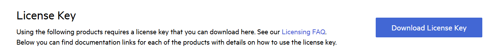

# Setting Up Your Telerik Document Processing Libraries License Key
Starting with the Q1 2025 release, the libraries from Telerik Document Processing require activation through a license key (trial or commercial). This article describes how to download, install, and update your personal license key.

To install the license key and activate the libraries:

1. [Download the license key](#downloading-the-license-key).
1. [Install or update the license key file on your system or in your project](#installing-or-updating-your-license-key).

The implementation of the 2025 licensing requirements will occur in two phases:

>important Please install **&lt;PackageReference Include="Telerik.Licensing" Version="1.*" /&gt;**.

- Phase 1 - Starting with the 2025 Q1 release, a missing or invalid license causes [warnings during build](#license-activation-errors-and-warnings). The commercial distributions of the libraries do not exhibit any functional restrictions.
- Phase 2 - Starting with the 2025 Q2 release, a missing or invalid license will result in [build errors and run-time indicators](#license-activation-errors-and-warnings), such as watermarks and banners.

Note that future updates of the product may restrict or disable some features when no valid license is present. You can send us feedback through the Contact Us form or by [opening a support ticket](https://www.telerik.com/account/support-center/contact-us?utm_source=licensing&utm_medium=console&utm_campaign=no_references).

## Downloading the License Key

The Telerik Document Processing Libraries are only distributed as a part of several Telerik bundles and are licensed only according to the terms of the bundle under which they are obtained. In the [License Keys](https://www.telerik.com/account/your-licenses/license-keys) article you can find specific license key instruction for each respective bundle.

To download a license key, you must have either a developer license or a trial license. If you are new, you can sign up for a [free trial](https://www.telerik.com/account/trials) first, and then follow the steps below.

1. Go to the [License Keys](https://www.telerik.com/account/your-licenses/license-keys) page in your Telerik account.
1. Click the **Download License Key** button.



The [Progress Control Panel](https://www.telerik.com/download-trial-file/v2/control-panel), automated MSI installer, and the Visual Studio Extensions (if available) of each product will automatically download and store your license key in your home directory. This makes it available for all projects that you develop on your local machine.

## Installing or Updating Your License Key
Whenever you purchase a new license or renew an existing one, always [download](#downloading-the-license-key) and install a new license key. The new license key includes information about all previous license purchases. The procedure for the installation of a new license key and update of a license key is the same:

1. Copy the [downloaded](#downloading-the-license-key) telerik-license.txt license key file to your home directory. This makes the license key available to all projects that you develop on your computer.
   1. For Windows: %AppData%\Telerik\telerik.license.txt
   1. For Mac/Linux: ~/.telerik/telerik.license.txt
      Alternatively, copy the telerik-license.txt license key file to the root folder of your project. This makes the license key available only to this project. Do not commit the file to source control as this is your personal license key.
1. Add the Telerik.Licensing NuGet package as a project dependency. This package will automatically locate the license file at build time. If your project doesn’t use NuGet packages, see the next document section.

### Installing a License Key in Projects without NuGet References
If you’re not using NuGet packages in your project, add the license as a code snippet:

1. Go to the [License Keys](https://www.telerik.com/account/your-licenses/license-keys) page in your Telerik account.
1. On the corresponding product row, click the **View key** link in the **SCRIPT KEY** column.

1. Copy the C# code snippet into a new file, for example, TelerikLicense.cs.
1. Add the TelerikLicense.cs file to your project.

Do not publish the license key code snippet in publicly accessible repositories. This is your personal license key.

-----

## Adding the License Key to CI Services
This article describes how to set up and activate your [license key](https://www.telerik.com/account/your-licenses/license-keys) across a few popular CI services by using environment variables.

When working with CI/CD platforms, always add the Telerik.Licensing NuGet package as a project dependency. This package activates the product libraries at build time by using the provided license key.

The license activation process in a CI/CD environment involves the following steps:

1. [Download](https://www.telerik.com/account/your-licenses/license-keys) a license key from your Telerik account.
2. Add the Telerik.Licensing NuGet package as a project dependency:\<PackageReference Include="Telerik.Licensing" Version="1.\*" /\>
2. [Create an environment variable](#creating-an-environment-variable) and add your license key as a value.

### Creating an Environment Variable
The recommended approach for providing your license key to the Telerik.Licensing NuGet package is to use environment variables. Each CI/CD platform has a different process for setting environment variables and this article lists only some of the most popular examples.

#### Azure Pipelines (YAML)
1. Create a new [User-defined Variable](https://docs.microsoft.com/en-us/azure/devops/pipelines/process/variables?view=azure-devops&tabs=yaml%2Cbatch) named TELERIK\_LICENSE.
1. Paste the contents of the license key file as a value.

#### Azure Pipelines (Classic)
1. Create a new [user-defined variable](https://docs.microsoft.com/en-us/azure/devops/pipelines/process/variables?view=azure-devops&tabs=classic%2Cbatch) named TELERIK\_LICENSE.
1. Paste the contents of the license key file as a value.

#### GitHub Actions
1. Create a new [Repository Secret](https://docs.github.com/en/actions/reference/encrypted-secrets#creating-encrypted-secrets-for-a-repository) or an [Organization Secret](https://docs.github.com/en/actions/reference/encrypted-secrets#creating-encrypted-secrets-for-an-organization).
1. Set the name of the secret to TELERIK\_LICENSE and paste the contents of the license file as a value.
1. After running npm install or yarn, add a build step to activate the license:

```yaml
env:
    TELERIK_LICENSE: ${{ secrets.TELERIK_LICENSE }}
```
-----
## Frequently Asked Questions
This article lists the answers to the most frequently asked questions (FAQs) about working with the license key.
### [2025 Q2] Will the product function with an expired license key?
This depends on your license type.

- **Perpetual licenses** will continue to function normally with an expired license key. However, the following will happen if you update or install a package version which is released after the expiration date of the license:
  - A watermark appears on application startup.
  - A modal dialog appears on application startup.
  - A warning message is logged in the build log.
    See the [Invalid License]() section for more information.
- **Subscription licenses** will prevent you from building the application with an expired license key. Deployed applications will continue to function normally.
- **Trial licenses** will prevent you from building or running the application. The following will happen if you try to build or run the application:
  - A watermark appears on application startup.
  - A modal dialog appears on application startup.
  - A warning message similar to the following is logged in the build log.
    See the [Invalid License]() section for more information.

Note that future updates of the library may restrict or disable some features when no valid license is present.
### I updated the version of the product packages in my project and the invalid license errors have appeared. What is the cause of this behavior?
If this happens, the possible reason is that the end date of the license activated in your application is before the release date of the newly installed product. To fix this issue:

1. [Download a new license key](#downloading-the-license-key).
1. [Activate the new license key](#installing-or-updating-your-license-key) in your project.

### Can I use the same license key in multiple builds?
You can use your personal license key in multiple pipelines, builds, and environments.

However, each individual developer must use a unique personal license key.
### Does the license key expire?
Yes, the license key expires at the end of your support subscription:

- For trial users, this is at the end of your 30-day trial.
- For commercial license holders, this is when your subscription term expires.

You will need to obtain and install a new license key after starting a trial, renewing a license, or upgrading a license.

An expired perpetual license key is valid for all product versions published before its expiration date.
### Do I need an Internet connection to activate the license?
No, the license activation and validation are performed entirely offline.

The license is not validated with our services at any point in the project lifecycle.
### Do I have to add the license key to source control?
No, you do not have to add the telerik-license.txt license key file or its contents to source control.

Build servers must use the TELERIK\_LICENSE environment variable described in [Adding the License Key to CI Services](#adding-the-license-key-to-ci-services).

Do not store the license key in plaintext, for example, in a GitHub Actions Workflow definition.
### What happens if both the environment variable and the license key file are present?
If both the TELERIK\_LICENSE environment variable and the telerik-license.txt file are present, then the environment variable will be used.

To enforce the use of the license key file, unset the environment variable.
### My team has more than one license holder. Which key do we have to use?
To activate the product, you can use any of the keys associated with your subscriptions.
### Are earlier versions of the product affected?
No, versions released prior to Jan 2025 do not require a license key.
### What happens if I make a change to non-Telerik parts of the code after the subscription expires?
This depends on your license:

- If you have a perpetual license, you can build the application with the Telerik libraries.
- If you have an expired subscription license, the build will fail.

-----
## License Activation Errors and Warnings
Starting with the 2025 Q1 release, using a product without a license or with an invalid license causes specific license warnings and errors. This article defines what an invalid license is, explains what is causing it, and describes the related license warnings and errors.

The implementation of the 2025 product licensing requirements will occur in two phases:

- Phase 1 - Starting with the 2025 Q1 release, a missing or invalid license logs a warning in the build log.
- Phase 2 - Starting with the 2025 Q2 release, a missing, expired, or invalid license will result in:
  - A watermark appearing on application startup.
  - A modal dialog appearing on application startup. Clicking the **OK** button of the dialog closes the dialog and removes the banner until the next application startup.
  - A warning message appearing in the build log:

### Invalid License
An invalid license can be caused by any of the following:

- Using an expired subscription license-subscription licenses expire at the end of the subscription term.
- Using a perpetual license for product versions released outside the validity period of your license.
- Using an expired trial license.
- A missing license for the product.
- Not installing a license key in your application.
- Not updating the license key after renewing your product license.

### License Warnings and Errors
Using the product in a project with an expired or missing license, the Telerik.Licensing build task will indicate the following errors:

- No license key is detected - [Install a license key](#installing-or-updating-your-license-key) to activate the libraries and remove the error message.
- Invalid license key - [Download a new license key](#downloading-the-license-key) and install it to activate the libraries and remove the error message.

In addition, the following conditions will be logged:

|**Condition**|**Solution**|
|----|----|
|Your subscription license has expired.|Renew your subscription and [download a new license key](#downloading-the-license-key).|
|Your perpetual license is invalid.|You are using a product version outside the validity period of your perpetual license. To resolve this, do either of the following: <br> - Purchase a license for the current product version, then download and install a new key. <br> - Downgrade to a version covered by your perpetual license, as specified in the message. |
|Your trial license has expired.|Purchase a commercial license to continue using the product.|
|Your license is not valid for the detected product(s).|Review the purchase options for the listed products.<br>Alternatively, remove the references to the listed packages from package.json.|

Starting with the 2025 Q2 release of the product in May 2025, all conditions above will be treated as errors.

## See Also

* [License Agreement]()
* [Redistributing Telerik Document Processing]()
* [Unable to find package Telerik.Licensing]()
* [Handling License Key File Name and Environment Variable Name Changes in the 2025 Q1 Release]()
* [Telerik.Licensing NuGet package is not available on the Telerik NuGet feed]()

