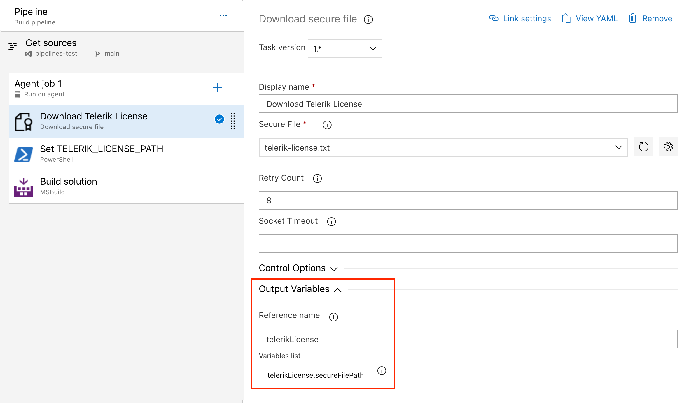
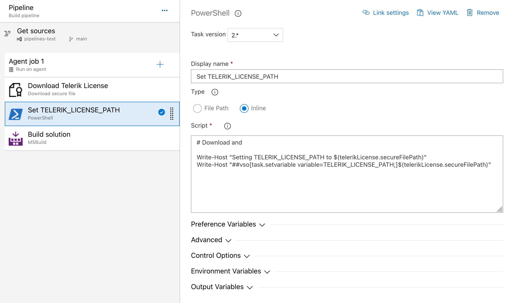

# Adding the License Key to CI Services
This article describes how to set up and activate your [license key](https://www.telerik.com/account/your-licenses/license-keys) across a few popular CI services by using environment variables.

The license activation process in a CI/CD environment involves the following steps:

1. [Download](https://www.telerik.com/account/your-licenses/license-keys) a license key from your [Telerik account](https://www.telerik.com/account/).
1. [Create an environment variable](#creating-an-environment-variable) named **TELERIK_LICENSE** and add your license key as a value. Alternatively, use the [Azure Secure files approach](#using-secure-files-on-azure-devops).

### Creating an Environment Variable
The recommended approach for providing your license key to the _Telerik.Licensing_ NuGet package is to use environment variables. Each CI/CD platform has a different process for setting environment variables and this article lists only some of the most popular examples.

>important If your CI/CD service is not listed in this article, don’t hesitate to contact the Telerik technical support.

#### GitHub Actions
1. Create a new [Repository Secret](https://docs.github.com/en/actions/reference/encrypted-secrets#creating-encrypted-secrets-for-a-repository) or an [Organization Secret](https://docs.github.com/en/actions/reference/encrypted-secrets#creating-encrypted-secrets-for-an-organization).
1. Set the name of the secret to _TELERIK\_LICENSE_ and paste the contents of the license file as a value.
1. After running _npm install_ or _yarn_, add a build step to activate the license:

```yaml
env:
    TELERIK_LICENSE: ${{ secrets.TELERIK_LICENSE }}
```

#### Azure Pipelines
1. Create a new [secret variable](https://learn.microsoft.com/en-us/azure/devops/pipelines/process/variables?view=azure-devops&tabs=yaml%2Cbatch#secret-variables) named _TELERIK\_LICENSE_.
1. Paste the contents of the license key file as a value.

>important Always consider the _Variable size limit_—if you are using a [Variable Group](https://learn.microsoft.com/en-us/azure/devops/pipelines/library/variable-groups?view=azure-devops&tabs=azure-pipelines-ui%2Cyaml), the license key will typically exceed the character limit for the variable values. The only way to have a long value in the Variable Group is to [link it from Azure Key Vault](https://learn.microsoft.com/en-us/azure/devops/pipelines/library/link-variable-groups-to-key-vaults?view=azure-devops). If you cannot use a Key Vault, then use a normal pipeline variable instead (see above) or use the [Secure files](#using-secure-files-on-azure-devops) approach instead.

### Using Secure Files on Azure DevOps

[Secure files](https://learn.microsoft.com/en-us/azure/devops/pipelines/library/secure-files?view=azure-devops) are an alternative approach for sharing the license key file in Azure Pipelines that does not have the size limitations of environment variables.

You have two options for the file-based approach. Set the _TELERIK_LICENSE_PATH_ variable or add a file named _telerik-license.txt_ to the project directory or a parent directory.

>important Make sure you’re referencing _Telerik.Licensing v1.4.10_ or later.

#### YAML Pipeline

With a YAML pipeline, you can use the [DownloadSecureFile@1](https://learn.microsoft.com/en-us/azure/devops/pipelines/tasks/reference/download-secure-file-v1?view=azure-pipelines) task, then use _$(name.secureFilePath)_ to reference it. For example:

```yaml
- task: DownloadSecureFile@1
    name: DownloadTelerikLicenseFile # defining the 'name' is important
    displayName: 'Download Telerik License Key File'
    inputs:
      secureFile: 'telerik-license.txt'
  - task: MSBuild@1
    displayName: 'Build Project'
    inputs:
      solution: 'myapp.csproj'
      platform: Any CPU
      configuration: Release
      msbuildArguments: '/p:RestorePackages=false'
    env:
      # use the name.secureFilePath value to set TELERIK_LICENSE_PATH
      TELERIK_LICENSE_PATH: $(DownloadTelerikLicenseFile.secureFilePath)
```
#### Classic Pipeline

With a classic pipeline, use the “Download secure file” task and a PowerShell script to set _TELERIK\_LICENSE\_PATH_ to the secure file path.

1. Add a “Download secure file” task and set the output variable's name to _telerikLicense_.

     

1. Add a PowerShell task and set the _TELERIK\_LICENSE\_PATH_ variable to the _secureFilePath_ property of the output variable:

     

The script to set the environment variable is quoted below:

```powershell
Write-Host "Setting TELERIK_LICENSE_PATH to $(telerikLicense.secureFilePath)"
Write-Host "##vso[task.setvariable variable=TELERIK_LICENSE_PATH;]$(telerikLicense.secureFilePath)"
```

Alternatively, copy the file into the repository directory:

```powershell
echo "Copying $(telerikLicense.secureFilePath) to $(Build.Repository.LocalPath)/telerik-license.txt"
Copy-Item -Path $(telerikLicense.secureFilePath) -Destination "$(Build.Repository.LocalPath)/telerik-license.txt" -Force
```

### Using TelerikLicensing.Register method on AWS Lambdas

As of version **1.6.7** [ Telerik.Licensing](https://www.nuget.org/packages/Telerik.Licensing) offers the parameterless **TelerikLicensing.Register()** method and the **TelerikLicensing.Register(…script key…)** method allowing the developers to validate the Telerik license when running [AWS Lambda](https://docs.aws.amazon.com/lambda/latest/dg/welcome.html) functions, plugins, or a class library that uses Telerik Document Processing consumed by any third-party software (Word, Excel, Revit, AutoCAD, MFC app, etc.). It is necessary to upgrade the Telerik.Licensing NuGet package at least to **1.6.7** and call the Register method in the body of the function. Thus, the Telerik license will be validated, and the trial message is not expected to be printed (for licensed users) in the generated document:

```csharp
namespace LicensingInLambda;
 
public class Function
{
    public string FunctionHandler(string input, ILambdaContext context)
    {
        // Lambda function entry point
 
        // This requires Telerik.Licensing to be added to the function project
        TelerikLicensing.Register();
 
        // TODO: DPL - generate PDF here
 
        var entryAssembly = Assembly.GetEntryAssembly();
        var name = entryAssembly?.GetName();
 
        return $"Entry assembly: {entryAssembly?.GetName()} ... {Class1.DoYourMagic()}";
    }
}
```

## See Also

* [License Activation Errors and Warnings]()
* [Setting Up Your License Key]()
* [License Key FAQ]()
* [License Agreement]()
* [Redistributing Telerik Document Processing]()
* [Unable to find package Telerik.Licensing]()
* [Handling License Key File Name and Environment Variable Name Changes in the 2025 Q1 Release]()
* [Telerik.Licensing NuGet package is not available on the Telerik NuGet feed]()
* [Telerik License Approaches](https://github.com/LanceMcCarthy/DevOpsExamples?tab=readme-ov-file#telerik-license-approaches)

