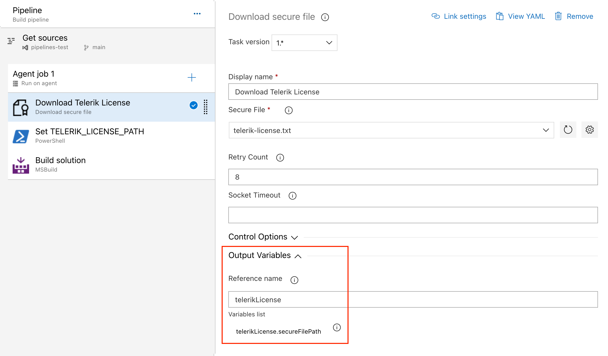
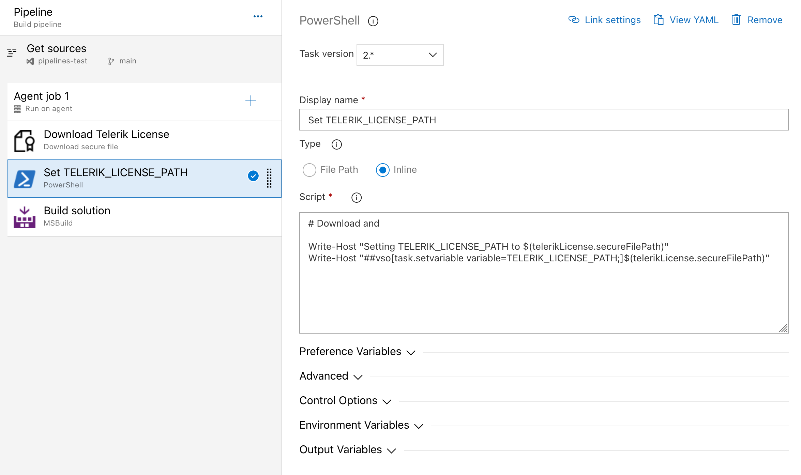

---
title: Adding the License Key to CI/CD Services
description: Learn how to activate your Telerik Document Processing license key in CI/CD services such as GitHub Actions and Azure Pipelines.
page_title: Adding the License Key to CI/CD Services
slug: adding-license-key-ci-cd-services
tags: license, key, ci, cd, github, azure, deployment, environment
published: True
position: 1
---

# Adding the License Key to CI/CD Services

Use this article to activate your [license key](https://www.telerik.com/account/your-licenses/license-keys) in CI/CD services such as GitHub Actions and Azure Pipelines. The goal is to make the `Telerik.Licensing` package available during automated builds so your build agents can validate the license without manual intervention.

This article covers the recommended environment-variable approach, the Azure DevOps secure-file alternative, and the `TelerikLicensing.Register()` method for AWS Lambda scenarios.

## Before You Start

Before you configure a CI/CD service, make sure that you have:

1. Downloaded a license key from your [Telerik account](https://www.telerik.com/account/).
2. Added the `Telerik.Licensing` package to the project that uses Telerik Document Processing.
3. Decided whether you will provide the license through `TELERIK_LICENSE`, through `TELERIK_LICENSE_PATH`, or through `TelerikLicensing.Register()`.

The license activation process in a CI/CD environment involves the following steps:

1. [Download](https://www.telerik.com/account/your-licenses/license-keys) a license key from your [Telerik account](https://www.telerik.com/account/).
2. [Create an environment variable](#creating-an-environment-variable) named `TELERIK_LICENSE` and add your license key as a value.
3. If you use Azure DevOps and the key is too large for your chosen variable storage, use the [secure-files approach](#using-secure-files-on-azure-devops) instead.
4. If you run in an AWS Lambda or similar hosted function scenario, use [`TelerikLicensing.Register()`](#using-teleriklicensingregister-on-aws-lambda) when that model is a better fit.

## Choose a License Delivery Approach

Use one of these approaches:

* `TELERIK_LICENSE`: Recommended for most CI/CD services.
* `TELERIK_LICENSE_PATH`: Useful when the license is stored as a file on the build agent.
* `TelerikLicensing.Register()`: Useful for AWS Lambda functions, plugins, class libraries, and other cases where environment-based activation is not the best fit.

## Creating an Environment Variable

The recommended way to provide the license key to the `Telerik.Licensing` NuGet package is to use environment variables. Each CI/CD platform exposes secrets differently, so the sections below focus on the most common setups.

>important
>
> If your CI/CD service is not listed in this article, contact Telerik technical support and adapt the same `TELERIK_LICENSE` or `TELERIK_LICENSE_PATH` approach to the secret-management system that your service provides.

### GitHub Actions

Use a GitHub secret to store the license key and map it to the `TELERIK_LICENSE` environment variable during the workflow run.

1. Create a new [Repository Secret](https://docs.github.com/en/actions/reference/encrypted-secrets#creating-encrypted-secrets-for-a-repository) or an [Organization Secret](https://docs.github.com/en/actions/reference/encrypted-secrets#creating-encrypted-secrets-for-an-organization).
2. Set the secret name to `TELERIK_LICENSE` and paste the contents of the license key file as the value.
3. In the workflow YAML, expose that secret as an environment variable for the build step or job.

```yaml
env:
    TELERIK_LICENSE: ${{ secrets.TELERIK_LICENSE }}
```

After the environment variable is available to the process that restores, builds, or publishes your project, the licensing package can validate the key automatically.

### Azure Pipelines

Use a secret pipeline variable when the value fits inside the supported size limits.

1. Create a new [secret variable](https://learn.microsoft.com/en-us/azure/devops/pipelines/process/variables?view=azure-devops&tabs=yaml%2Cbatch#secret-variables) named _TELERIK\_LICENSE_.
2. Paste the contents of the license key file as the variable value.

>important
>
> Always consider the variable-size limit. If you use a [Variable Group](https://learn.microsoft.com/en-us/azure/devops/pipelines/library/variable-groups?view=azure-pipelines-ui%2Cyaml), the license key will usually exceed the character limit for variable values. To store a long value in a Variable Group, [link the value from Azure Key Vault](https://learn.microsoft.com/en-us/azure/devops/pipelines/library/link-variable-groups-to-key-vaults?view=azure-devops). If you cannot use Key Vault, use a normal secret pipeline variable or the [secure-files approach](#using-secure-files-on-azure-devops).

## Using Secure Files on Azure DevOps

[Secure files](https://learn.microsoft.com/en-us/azure/devops/pipelines/library/secure-files?view=azure-devops) are an alternative approach for sharing the license key file in Azure Pipelines that does not have the size limitations of environment variables.

You have two options for the file-based approach:

* Set the `TELERIK_LICENSE_PATH` variable.
* Add a file named `telerik-license.txt` to the project directory or a parent directory.

>important
>
> Make sure that you use `Telerik.Licensing` version `1.4.10` or later.

### YAML Pipeline

With a YAML pipeline, use the [DownloadSecureFile@1](https://learn.microsoft.com/en-us/azure/devops/pipelines/tasks/reference/download-secure-file-v1?view=azure-pipelines) task and then reference `$(name.secureFilePath)`:

```yaml
- task: DownloadSecureFile@1
    name: DownloadTelerikLicenseFile # defining the 'name' is important
    displayName: 'Download Telerik License Key File'
    inputs:
      secureFile: 'telerik-license.txt'
  - task: MSBuild@1
    displayName: 'Build Project'
    inputs:
      solution: 'myapp.csproj'
      platform: Any CPU
      configuration: Release
      msbuildArguments: '/p:RestorePackages=false'
    env:
      # use the name.secureFilePath value to set TELERIK_LICENSE_PATH
      TELERIK_LICENSE_PATH: $(DownloadTelerikLicenseFile.secureFilePath)
```

### Classic Pipeline

With a classic pipeline, use the **Download secure file** task and a PowerShell script to set `TELERIK_LICENSE_PATH` to the secure file path.

1. Add a “Download secure file” task and set the output variable's name to _telerikLicense_.

    

1. Add a PowerShell task and set the _TELERIK\_LICENSE\_PATH_ variable to the _secureFilePath_ property of the output variable:

    

Use this script to set the environment variable:

```powershell
Write-Host "Setting TELERIK_LICENSE_PATH to $(telerikLicense.secureFilePath)"
Write-Host "##vso[task.setvariable variable=TELERIK_LICENSE_PATH;]$(telerikLicense.secureFilePath)"
```

Alternatively, copy the file into the repository directory:

```powershell
echo "Copying $(telerikLicense.secureFilePath) to $(Build.Repository.LocalPath)/telerik-license.txt"
Copy-Item -Path $(telerikLicense.secureFilePath) -Destination "$(Build.Repository.LocalPath)/telerik-license.txt" -Force
```

## Using TelerikLicensing.Register Method on AWS Lambdas

Starting with version **1.6.7**, [Telerik.Licensing](https://www.nuget.org/packages/Telerik.Licensing) offers the parameterless `TelerikLicensing.Register()` method and the `TelerikLicensing.Register(...script key...)` overload. Use these methods when you run [AWS Lambda](https://docs.aws.amazon.com/lambda/latest/dg/welcome.html) functions, plugins, or class libraries that use Telerik Document Processing and need to validate the license at runtime.

To use this approach:

1. Upgrade `Telerik.Licensing` to version `1.6.7` or later.
2. Add the package to the function project.
3. Call `TelerikLicensing.Register()` in the function body before the Telerik Document Processing code runs.

```csharp
namespace LicensingInLambda;
 
public class Function
{
    public string FunctionHandler(string input, ILambdaContext context)
    {
        // Lambda function entry point
 
        // This requires Telerik.Licensing to be added to the function project
        TelerikLicensing.Register();
 
        // TODO: DPL - generate PDF here
 
        var entryAssembly = Assembly.GetEntryAssembly();
        var name = entryAssembly?.GetName();
 
        return $"Entry assembly: {entryAssembly?.GetName()} ... {Class1.DoYourMagic()}";
    }
}
```

## Verify the Setup

After you configure the license in your CI/CD service, run a build that restores and builds the project that references Telerik Document Processing.

Confirm these points:

* The CI/CD job can access `TELERIK_LICENSE` or `TELERIK_LICENSE_PATH`.
* The job completes without license activation errors.
* Generated documents do not contain trial warnings for licensed builds.

## Troubleshooting

Check these common issues when activation does not work as expected:

* The secret is missing at runtime: Confirm that the pipeline step, job, or process actually receives `TELERIK_LICENSE`.
* Azure variable storage rejects the value: Use a normal secret pipeline variable, Azure Key Vault, or [secure files](#using-secure-files-on-azure-devops).
* File-based activation does not work: Verify that `TELERIK_LICENSE_PATH` points to the actual downloaded file and that the agent can read it.
* AWS Lambda still shows trial output: Confirm that `TelerikLicensing.Register()` runs before any Telerik Document Processing code.
* Licensing still fails: Review [License Activation Errors and Warnings]() and [Setting Up Your License Key]().

## See Also

* [License Activation Errors and Warnings]()
* [Setting Up Your License Key]()
* [License Key FAQ]()
* [License Agreement]()
* [Redistributing Telerik Document Processing]()
* [Unable to find package Telerik.Licensing]()
* [Handling License Key File Name and Environment Variable Name Changes in the 2025 Q1 Release]()
* [Telerik.Licensing NuGet package is not available on the Telerik NuGet feed]()
* [Telerik License Approaches](https://github.com/LanceMcCarthy/DevOpsExamples?tab=readme-ov-file#telerik-license-approaches)
* [How to Download a Script Key]()
* [Resolving Trial Watermark Issues with the Generated Documents in MFC applications]()

