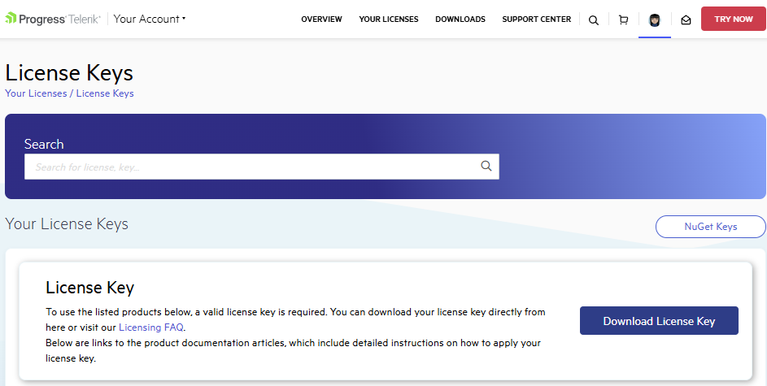
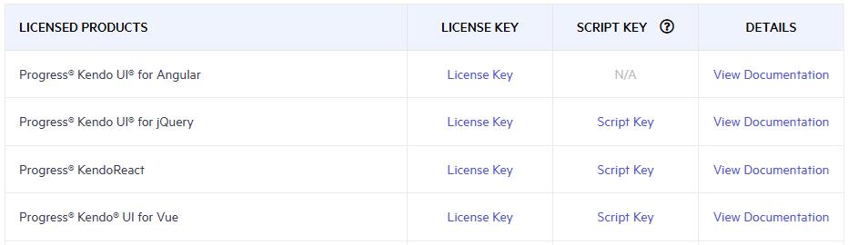

---
title: Set Up the Telerik Document Processing License Key
description: Learn how to set up the Telerik Document Processing license key for local development, CI/CD, and production deployments, and validate the licensing setup.
page_title: Set Up the Telerik Document Processing License Key
slug: setting-up-license-key
tags: license, key, telerik, document, processing, activation, setup, libraries
published: True
position: 0
---

# Set Up the Telerik Document Processing License Key

Starting with the Q1 2025 release, Telerik Document Processing requires activation through a trial or commercial license key. This guide explains how to download the license key, add `Telerik.Licensing`, configure licensing for local development, CI/CD, integration environments, and production servers, and validate that the setup works before deployment.

An invalid license results in [errors and warnings]() during build and runtime indicators such as watermarks and banners.

## How to Choose the Right Licensing Workflow

Use the following decision flow before you configure licensing:

1. If the project uses NuGet packages, use the `Telerik.Licensing` NuGet package and a `telerik-license.txt` file.
2. If the project does not use NuGet packages, use the script-key workflow in [How to Add a License Key without NuGet References](#how-to-add-a-license-key-without-nuget-references).
3. If the app runs only on a local development machine, place the license key in the user home directory or in the project root.
4. If the app runs in CI/CD, integration, staging, or production, make the license key available on the machine or container that performs the build or runs the app. Do not commit the key to source control.
5. If licensing still fails after setup, use the checklist in [How to Validate and Debug the Licensing Setup](#how-to-validate-and-debug-the-licensing-setup).

## Downloading the License Key

Telerik Document Processing is distributed as part of several Telerik bundles and is licensed according to the terms of the bundle under which you obtained it. The [License Keys](https://www.telerik.com/account/your-licenses/license-keys) page contains the bundle-specific download instructions.

To download a license key, you must have either a developer license or a trial license. If you are new, you can sign up for a [free trial](https://www.telerik.com/account/trials) first, and then follow the steps below.

1. Go to the [License Keys](https://www.telerik.com/account/your-licenses/license-keys) page in your Telerik account.
1. Click the **Download License Key** button.



The [Progress Control Panel](https://www.telerik.com/download-trial-file/v2/control-panel), automated MSI installer, and the Visual Studio Extensions (if available) of each product will automatically download and store your license key in your home directory. This makes it available for all projects that you develop on your local machine.

## Activating the Document Processing Libraries

Use this workflow for every project that references Telerik Document Processing through NuGet packages::

1. Copy the [downloaded](#how-to-download-the-license-key) `telerik-license.txt` file to one of the following locations:
  1. For Windows: `%AppData%\Telerik\telerik-license.txt`
  1. For macOS and Linux: `~/.telerik/telerik-license.txt`
  1. Alternatively, copy `telerik-license.txt` to the project root when you want the license key to apply only to a single project.
2. Add the [Telerik.Licensing](https://www.nuget.org/packages/Telerik.Licensing) NuGet package to the same application project that builds or runs Telerik Document Processing:

```xml
<PackageReference Include="Telerik.Licensing" Version="1.*" />
```

>important The `Telerik.Licensing` verifies the DevSeat association at the time your classlib is built, and also provisions at runtime licenses in the Root app. When you have a setup such as **"Root app -> classlib -> Telerik UI"**, the Telerik UI will execute and verify the licensing for the classlib, but will not be applied transitively in the Root app. That's why you **need to add the Telerik.Licensing NuGet package reference to Root app manually**.

When you build the project, the `Telerik.Licensing` NuGet package automatically locates the license file and uses it to activate the product.

>important If the project does not use NuGet packages, use the script-key workflow in [How to Add a License Key without NuGet References](#how-to-add-a-license-key-without-nuget-references).

## How to Configure Licensing for Each Environment

The same license key file supports local development, build agents, integration servers, and production servers. The difference is where the file is stored and how it reaches the environment.

### Local Development Workflow

Use the home-directory location when you want one license key to be available for all projects on the local machine. Use the project-root location when you want the key to apply only to one repository or sample.

For local development:

1. Download the license key.
2. Save `telerik-license.txt` in the user home directory or the project root.
3. Add `Telerik.Licensing` to the app project.
4. Build the project and confirm that no licensing warnings appear.

### CI/CD Workflow

Use a secure secret store in the CI/CD system and make the license key available during the build. Do not commit the key file to source control.

For CI/CD:

1. Store the contents of `telerik-license.txt` in the CI/CD secret store.
2. Restore the file during the pipeline run and place it in the home directory of the build agent or in the repository root before build.
3. Make sure the application project references `Telerik.Licensing`.
4. Build the project and review the build log for licensing warnings.

For CI-specific setup details, see [Adding the License Key to CI Services]().

### Integration, Staging, and Production Workflow

Use the same approach as CI/CD for servers and containers that build or run the application outside developer machines. The license key must be available in the environment where Telerik Document Processing executes.

For integration, staging, and production:

1. Deliver `telerik-license.txt` through the server secret-management or deployment process.
2. Place the file in the service account home directory or in the deployed application root.
3. Keep `Telerik.Licensing` referenced in the application that starts the Telerik Document Processing code path.
4. Verify the deployment logs and the generated output for missing-license warnings, watermarks, or banners.

If you use a class library between the root app and Telerik Document Processing, add `Telerik.Licensing` to the root app as well.

## Adding a License Key to Projects without NuGet References

Telerik strongly recommends the use of NuGet packages whenever possible. Include the license key as a code snippet only when NuGet packages are not an option.

If you’re not using NuGet packages in your project, add the license as a code snippet:

1. Go to the [License Keys](https://www.telerik.com/account/your-licenses/license-keys) page in your Telerik account.
1. On the corresponding product row, click the **Script Key** link in the **SCRIPT KEY** column.

1. Copy the C# code snippet into a new file, for example, TelerikLicense.cs.
1. Add the TelerikLicense.cs file to your project.
1. Add an assembly reference to `Telerik.Licensing.Runtime.dll`.

>caution Do not publish the license key code snippet in publicly accessible repositories. This is your personal license key.

## How to Validate and Debug the Licensing Setup

Use the following checklist after you configure licensing locally or in a deployed environment:

1. Confirm that the project references `Telerik.Licensing`.
2. Confirm that `telerik-license.txt` exists in the expected home directory or project root.
3. Confirm that the app that starts Telerik Document Processing also references `Telerik.Licensing` when the solution uses a root-app-to-class-library architecture.
4. Build the project and check for [license activation errors and warnings]().
5. Run the app and confirm that generated documents do not show trial watermarks or banners.
6. If the app runs in CI/CD or on a server, confirm that the deployment user or service account can access the license file.
7. If restore or build cannot locate the licensing package, see [Unable to find package Telerik.Licensing]() and [Telerik.Licensing NuGet package is not available on the Telerik NuGet feed]().
8. If validation still fails, review [Resolving License Validation Issues in Telerik Document Processing Libraries]() and [Diagnostic Options for Telerik Licensing]().

## Updating Your License Key

Whenever you purchase a new license or renew an existing one, always [download a new license key](#downloading-the-license-key). The new license key includes information about all previous license purchases. Once you have the new license key, replace the existing file in the same location and rebuild the project or redeploy the app.

## See Also

* [License Activation Errors and Warnings]()
* [Adding the License Key to CI Services]()
* [License Key FAQ]()
* [License Agreement]()
* [Redistributing Telerik Document Processing]()
* [Unable to find package Telerik.Licensing]()
* [Handling License Key File Name and Environment Variable Name Changes in the 2025 Q1 Release]()
* [Telerik.Licensing NuGet package is not available on the Telerik NuGet feed]()
* [Diagnostic Options for Telerik Licensing]()
* [Resolving License Validation Issues in Telerik Document Processing Libraries]()
* [Telerik License Approaches](https://github.com/LanceMcCarthy/DevOpsExamples?tab=readme-ov-file#telerik-license-approaches)
* [How to Download a Script Key]()
* [Resolving Trial Watermark Issues with the Generated Documents in MFC applications]()

