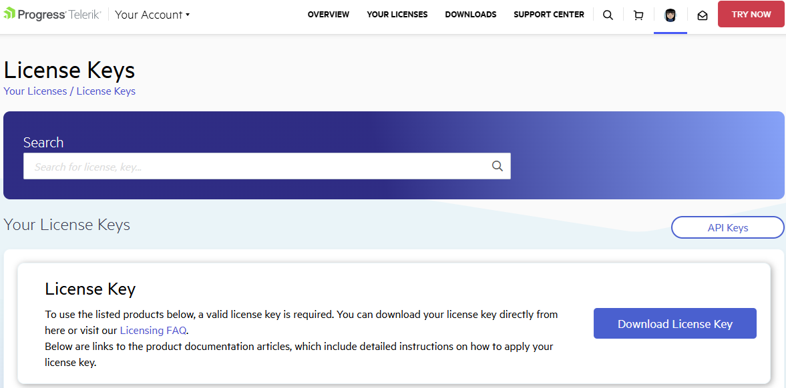

<style>
img[alt$="><"] {
  border: 1px solid lightgrey;
}
</style>

# Setting Up Your Telerik Document Processing Libraries License Key
Starting with the Q1 2025 release, the Telerik Document Processing libraries require activation through a license key (trial or commercial). This article describes how to download and use your personal license key to activate the product.

An invalid license results in [errors and warnings]() during build and run-time indicators such as watermarks and banners.

## Downloading the License Key

The Telerik Document Processing Libraries are only distributed as a part of several Telerik bundles and are licensed only according to the terms of the bundle under which they are obtained. In the [License Keys](https://www.telerik.com/account/your-licenses/license-keys) article you can find specific license key instruction for each respective bundle.

To download a license key, you must have either a developer license or a trial license. If you are new, you can sign up for a [free trial](https://www.telerik.com/account/trials) first, and then follow the steps below.

1. Go to the [License Keys](https://www.telerik.com/account/your-licenses/license-keys) page in your Telerik account.
1. Click the **Download License Key** button.



The [Progress Control Panel](https://www.telerik.com/download-trial-file/v2/control-panel), automated MSI installer, and the Visual Studio Extensions (if available) of each product will automatically download and store your license key in your home directory. This makes it available for all projects that you develop on your local machine.

## Activating the Document Processing Libraries

To activating the Document Processing Libraries:

1. Copy the [downloaded](#downloading-the-license-key) telerik-license.txt license key file to your home directory. This makes the license key available to all projects that you develop on your computer.
   1. For Windows: %AppData%\Telerik\telerik-license.txt
   1. For Mac/Linux: ~/.telerik/telerik-license.txt
      Alternatively, copy the telerik-license.txt license key file to the root folder of your project. This makes the license key available only to this project. Do not commit the file to source control as this is your personal license key.
1. Add the [Telerik.Licensing](https://www.nuget.org/packages/Telerik.Licensing) NuGet package as a project dependency:

```xml
<PackageReference Include="Telerik.Licensing" Version="1.*" />
```

>important The **Telerik.Licensing** verifies the DevSeat association at the time your classlib is built, and also provisions at runtime licenses in the Root app. When you have a setup such as **"Root app -> classlib -> Telerik UI"**, the Telerik UI will execute and verify the licensing for the classlib, but will not be applied transitively in the Root app. That's why you **need to add the Telerik.Licensing NuGet package reference to Root app manually**.

When you build the project, the _Telerik.Licensing_ NuGet package automatically locates the license file and uses it to activate the product.

>important If your project doesn’t use NuGet packages, see [Adding a License Key to Projects without NuGet References](#adding-a-license-key-to-projects-without-nuget-references).

### Adding a License Key to Projects without NuGet References
Telerik strongly recommends the use of NuGet packages whenever possible. Only include the license key as a code snippet when NuGet packages are not an option.

If you’re not using NuGet packages in your project, add the license as a code snippet:

1. Go to the [License Keys](https://www.telerik.com/account/your-licenses/license-keys) page in your Telerik account.
1. On the corresponding product row, click the **Script Key** link in the **SCRIPT KEY** column.

1. Copy the C# code snippet into a new file, for example, TelerikLicense.cs.
1. Add the TelerikLicense.cs file to your project.

>caution Do not publish the license key code snippet in publicly accessible repositories. This is your personal license key.

## Updating Your License Key

Whenever you purchase a new license or renew an existing one, always [download a new license key](#downloading-the-license-key). The new license key includes information about all previous license purchases. This process is referred to as a license key update. Once you have the new license key, use it to activate the product.

## See Also

* [License Activation Errors and Warnings]()
* [Adding the License Key to CI Services]()
* [License Key FAQ]()
* [License Agreement]()
* [Redistributing Telerik Document Processing]()
* [Unable to find package Telerik.Licensing]()
* [Handling License Key File Name and Environment Variable Name Changes in the 2025 Q1 Release]()
* [Telerik.Licensing NuGet package is not available on the Telerik NuGet feed]()
* [Diagnostic Options for Telerik Licensing]()
* [Resolving License Validation Issues in Telerik Document Processing Libraries]()
* [Telerik License Approaches](https://github.com/LanceMcCarthy/DevOpsExamples?tab=readme-ov-file#telerik-license-approaches)

