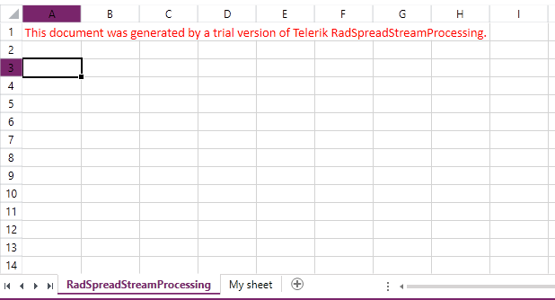

# Trial License Limitations

The free trial license of Telerik Document Processing is fully functional and will work for an unlimited time.

The only difference between the developer and trial versions of the packages is that trial packages add a copyright message to the produced documents.

In PDF and flow formats, this is a message at the top of the document, whereas for XLSX documents the message is added to a separate sheet.

#### Figure 1: XLSX document generated by a trial version of Telerik Document Processing

# See Also

* [How to Upgrade Trial to Licensed Version]() 
* [Setting Up Document Processing Libraries License Key]()

