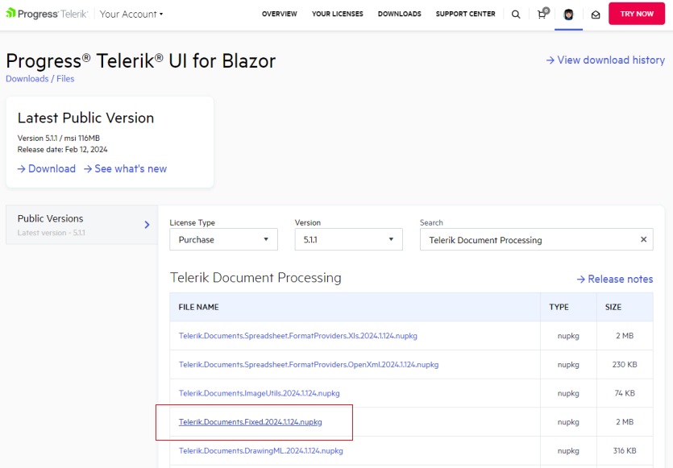
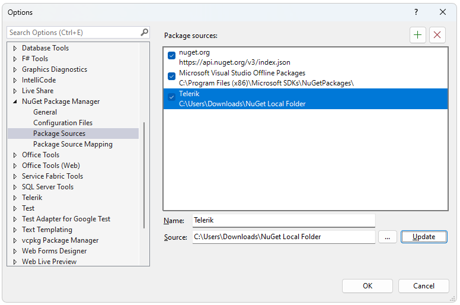
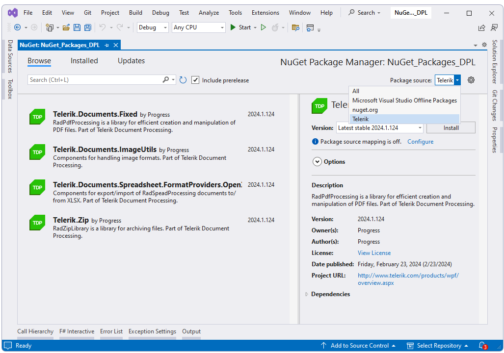
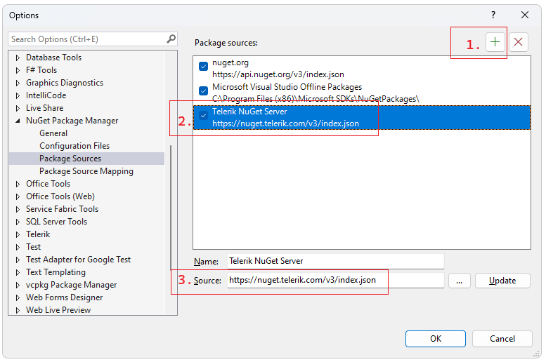
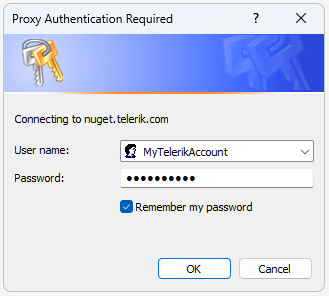
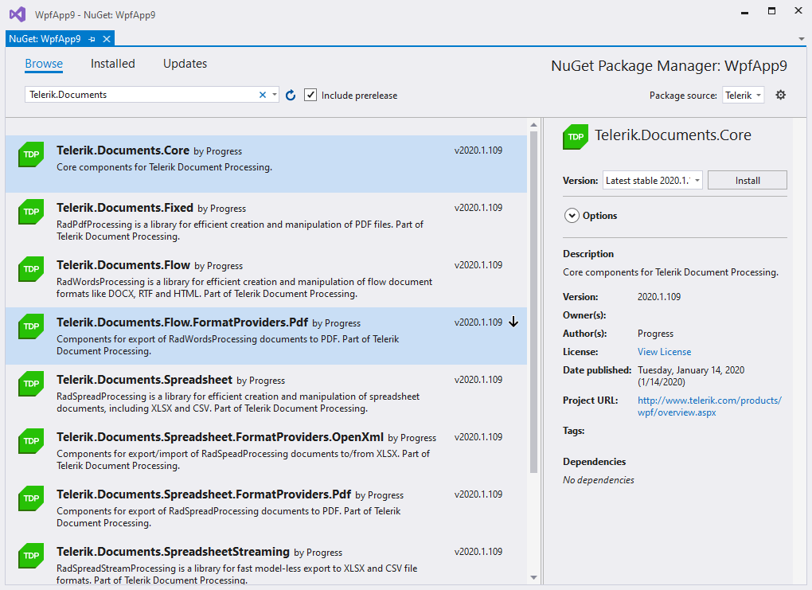

# Install using NuGet Packages

This article describes how you can install the Document Processing Libraries using a NuGet package. There are two ways for getting the NuGet packages:

* [Manually download the packages](#manually-download-nuget-packages)

* [Get the packages from the Telerik NuGet server](#download-from-the-nuget-server)

## Manually Download NuGet Packages

1\. First you need to log in using your Telerik licensed account. Telerik Document Processing is a part of several Telerik bundles and is available in the Downloads section of the suite with which you've obtained the product, e.g. UI for Blazor. This way you will be able to download the packages:

	
2\. Then, you need to add packages to Visual Studio. Open the NuGet manager and then click the Options button:
	

3\. Add new package source. The __Source__ should point to the local folder with the NuGets:
	
 

4\. The final step is to select and install the desired packages. 

 

>important The Telerik Document Processing libraries are available in two versions:
>
>* A version for __.Net Framework 4.0__ or later
>
>* A version for __.Net Standard 2.0__
>
>Both versions are available as NuGet packages but with different names. The assemblies for __.NET Standard__ do __not__ contain the word __Windows__ in their name.

## Download from the NuGet server

Before you can install Telerik NuGet packages, you must configure the Telerik NuGet server (https://nuget.telerik.com/v3/index.json) as a package source in Visual Studio:

>caution The old **https://nuget.telerik.com/nuget** server is deprecated and we encourage our clients to switch to the v3 API. The new v3 API is faster, lighter, and reduces the number of requests from NuGet clients. The **NuGet v2** server at https://nuget.telerik.com/nuget will be sunset in **November 2024**. The new v3 protocol offers faster package searches and restores, improved security, and more reliable infrastructure. To redirect your feed to the NuGet v3 protocol, all you have to do is to change your NuGet package source URL to https://nuget.telerik.com/v3/index.json.  

1\. In the Visual Studio Solution Explorer, right-click a Project, select **Manage NuGet Packages...**, and then select the **Settings** icon:

2\. Select **+** to add a new package source and enter https://nuget.telerik.com/v3/index.json in the **Source** field. Add a name for the new package source, for example, **Telerik NuGet Server**:

3\. Select **Telerik NuGet Server** from the __Package Source__ dropdown, and you will be prompted for a user name and a password. Use the credentials for your [Telerik Account](https://www.telerik.com/account/).

4\. Select and install the desired NuGet packages.

## See Also

 * [Restoring NuGet Packages in Your CI Workflow]()
 * [How to Obtain Telerik Document Processing Libraries for .NET Framework, .NET Standard, .NET Core, .NET 6/.NET 8/.NET 9]()
