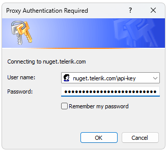

# NuGet Packages 

Telerik provides NuGet packages with the assemblies for all five Document Processing libraries: __RadPdfProcessing__, __RadSpreadProcessing__, __RadSpreadStreamProcessing__, __RadWordsProcessing__, and __RadZipLibrary__. These UI-independent cross-platform libraries enable you to process and convert content in various formats and even work with archive files. We deliver these libraries as a complement to the Telerik UI component suites (UI for ASP.NET, Kendo UI, UI for WPF, UI for WinForms, UI for Xamarin, UI for Blazor), and you don't need to purchase an additional license to use them.

If your workflow relies on NuGet for package management, you can take advantage of the packages that we describe in this article. There is no need to download and install the Document Processing libraries by using other methods.

> The improved Telerik NuGet v3 is now available at https://nuget.telerik.com/v3/index.json. The new v3 API is faster, lighter, and reduces the number of requests from NuGet clients. The old https://nuget.telerik.com/nuget server will be deprecated and we encourage our clients to switch to the v3 API and use https://nuget.telerik.com/v3/index.json to access it.

#### This article contains the following sections:

* [NuGet packages for .NET Framework and .NET Core for Windows](#packages-for-net-framework-and-net-core-for-windows)
* [Packages for .NET Standard 2.0 (.NET Core, .NET 5, .NET 6)](#packages-for-net-standard-20-net-core-net-5-net-6)
* [Get the NuGet Packages](#get-the-nuget-packages)

>important The Telerik Document Processing libraries are available in two versions:
>
>* A version for __.Net Framework 4.0__ or later
>
>* A version for __.Net Standard 2.0__
>
>Both versions are available as NuGet packages but with different names. The assemblies for __.NET Standard__ do __not__ contain the word __Windows__ in their name.

>caption Package lists to use with .NET Standard (left) and .NET Framework (right)

## Packages for .NET Framework and .NET Core for Windows

The following list represents the available NuGet packages for the Document Processing libraries that you can use with the .NET Framework or .NET Core for Windows. Although we offer them as an addition to the Telerik UI components, you can use them without any UI components:

* __Telerik.Windows.Documents.Core:__ The main NuGet package for the Telerik Document Processing libraries. Required when you plan to use the library.
* __Telerik.Windows.Documents.Fixed:__ The package is required when processing `PDF` documents.
* __Telerik.Windows.Documents.CMapUtils:__ Provides a default implementation for getting the data of a predefined CMap table by a given name.
* __Telerik.Windows.Documents.Flow:__ The package is part of the Word Processing Library. Required for processing `HTML`, `DOCX`, `RTF`, and `TXT` documents.
* __Telerik.Windows.Documents.Flow.FormatProviders.Pdf:__ The package for exporting flow documents, such as `DOCX` and `RTF`, to `PDF`.
* __Telerik.Windows.Documents.Spreadsheet:__ The main package for generating spreadsheets.
* __Telerik.Windows.Documents.Spreadsheet.FormatProviders.OpenXml:__ This package is required for the import/export of `XLSX` documents. 
* __Telerik.Windows.Documents.Spreadsheet.FormatProviders.Xls:__ This package is required for the import/export of `XLS` documents. 
* __Telerik.Windows.Documents.Spreadsheet.FormatProviders.Pdf:__ Required for the export of RadSpreadProcessing documents to `PDF`.
* __Telerik.Windows.Documents.SpreadsheetStreaming:__ The main package for generating huge spreadsheet files while using minimum resources.
* __Telerik.Windows.Zip:__ The package is required when working with zipped formats, such as `DOCX` and `XLSX`. It can be used as a standalone library as well. 
* __Telerik.Windows.Zip.Extensions:__ The package provides methods for working with files and platform specific operations. 

## Packages for .NET Standard 2.0 (.NET Core, .NET 5, .NET 6)

The following list represents the available NuGet packages for the Document Processing libraries that you can use with [.NET Standard 2.0](https://github.com/dotnet/standard/blob/master/docs/versions/netstandard2.0.md):

* __Telerik.Documents.Core:__ The main NuGet package from the Telerik Document Processing libraries. Required when you plan to use the library.
* __Telerik.Documents.Fixed:__ The package is required when processing `PDF` documents.
* __Telerik.Documents.ImageUtils:__ This package is required when exporting to `PDF` format a document containing images different than Jpeg and Jpeg2000 or ImageQuality different than High. For more information check the [PdfProcessing`s Cross-Platform Support]() article.
* __Telerik.Documents.CMapUtils:__ Provides a default implementation for getting the data of a predefined CMap table by a given name.
* __Telerik.Documents.Flow:__ The package is part of the Words Processing Library. Required for processing `HTML`, `DOCX`, `RTF`, and `TXT` documents.
* __Telerik.Documents.Flow.FormatProviders.Pdf:__ The package for exporting flow documents, such as `DOCX` and `RTF`, to PDF.
* __Telerik.Documents.Spreadsheet:__ The main package for generating and editing spreadsheets.
* __Telerik.Documents.Spreadsheet.FormatProviders.OpenXml:__ This package is required for the import/export of `XLSX` documents.
* __Telerik.Documents.Spreadsheet.FormatProviders.Xls:__ This package is required for the import/export of `XLS` documents.
* __Telerik.Documents.Spreadsheet.FormatProviders.Pdf:__ Required for the export of RadSpreadProcessing documents to `PDF`.
* __Telerik.Documents.SpreadsheetStreaming:__ The main package for generating huge spreadsheet files while using minimum resources.
* __Telerik.Zip:__ The package is required when working with zipped formats, such as `DOCX` and `XLSX`. It can be used as a standalone library as well. 

## Get the NuGet Packages

Before you can install Telerik NuGet packages, you must configure the Telerik NuGet server (https://nuget.telerik.com/v3/index.json) as a package source in Visual Studio:

1\. In the Visual Studio Solution Explorer, right-click a Project, select **Manage NuGet Packages...**, and then select the **Settings** icon:

2\. Select **+** to add a new package source and enter https://nuget.telerik.com/v3/index.json in the **Source** field. Add a name for the new package source, for example, **Telerik**:

3\. Select **Telerik** from the __Package Source__ dropdown, and you will be prompted for a user name and a password. Use the credentials for your [Telerik Account](https://www.telerik.com/account/).

4\. Select and install the desired NuGet packages.

 

