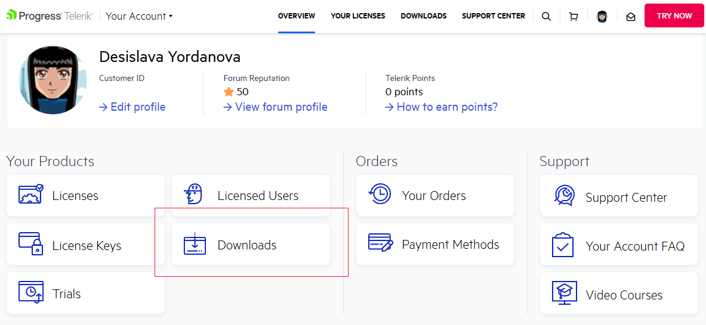
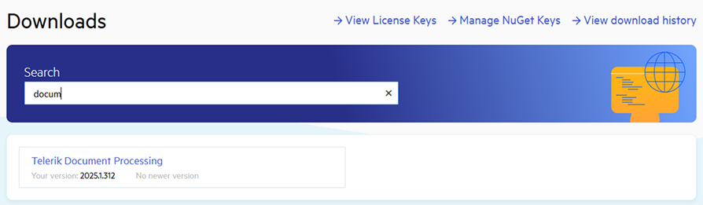
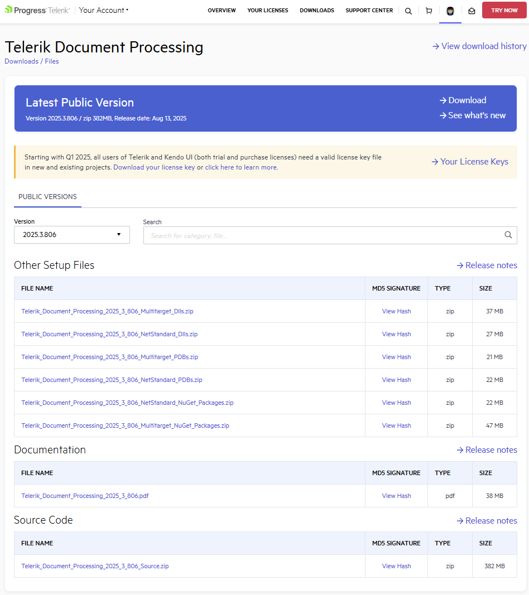

# Download Product Files

Starting with **Q2 2025**, the [Telerik Document Processing libraries]() are available as a separate distribution in the **Downloads** section of your [Telerik account](https://www.telerik.com/account/).

The **Telerik Document Processing** libraries are part of several [Telerik product bundles](https://www.telerik.com/purchase.aspx) and follow the installation steps for the suite with which you have obtained the product. When you purchase a Telerik license, you can download the following files:

* Latest Public version

* Latest [Preview version of the Document Processing libraries]()

* Assemblies available as NuGet packages

* Previous versions

* Source code

* Documentation files

To download these files, follow the steps below:

1\. Log into [your Telerik account](https://www.telerik.com/account/) and click the **Downloads** option: 

**Telerik account Downloads section**

  

2\. Select **Telerik Document Processing**:

**Telerik account download page for Telerik Document Processing product files**

  

3\. Select an asset you want to download: DLLs, PDB files, NuGet Packages, documentation files, or Source code:

**Telerik Document Processing download options for binaries, NuGet packages, documentation, and source code**

   

4\. You can choose between official Public versions or Preview versions (if such exist) according to the activation date of your license. From the **Version** dropdown list, you can also select which specific version to download.

>important If you are looking for a specific version, but it is not listed in the Version list, contact the sales team: **sales@telerik.com**. They will make the required version available for download.

## See Also

* [Review the Document Processing library versions included with Telerik products]()
* [Download the latest internal preview build]()
* [Review the Document Processing release history]()