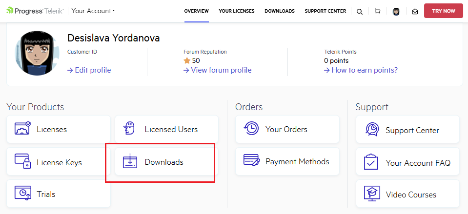
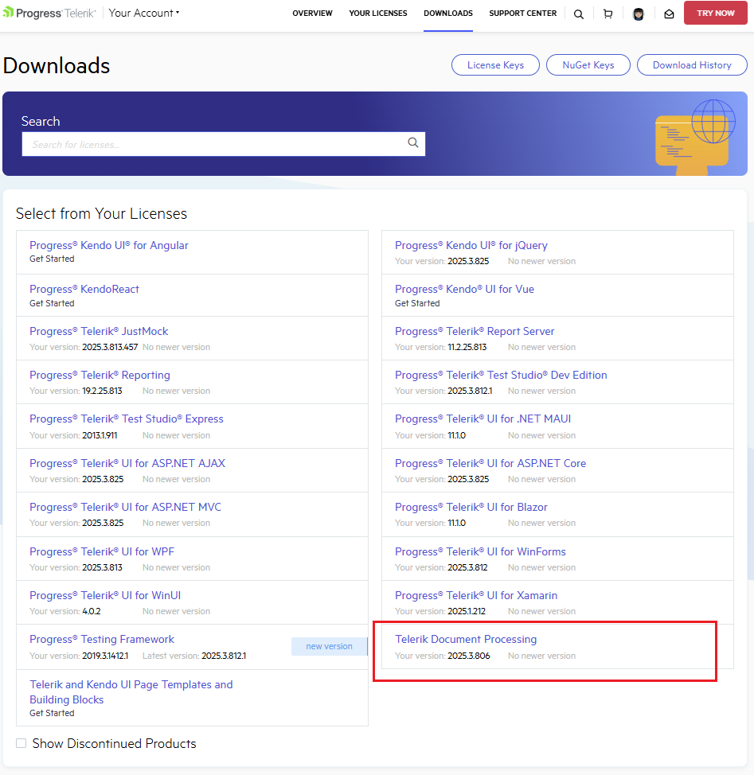

# Download Product Files

As of **Q2 2025** the [Telerik Document Processing]() libraries are available as a separate distribution in the **Downloads** section of your [Telerik account](https://www.telerik.com/account/). 

Since the **Telerik Document Processing** is a part of several [Telerik bundles](https://www.telerik.com/purchase.aspx) and it is installed following the steps for installing the suite with which you've obtained the product, when you purchase a Telerik license, you can download the following files:

* Latest Public version

* Latest [Preview version]()

* Assemblies available as NuGet packages

* Previous versions

* Source code

* Documentation files

To download these files, follow the steps below:

1\. Log into [your Telerik account](https://www.telerik.com/account/) and click the **Downloads** option: 

  

2\. Select **Telerik Document Processing**:

  

3\. Select an asset you want to download: DLLs, PDB files, NuGet Packages, documentation files, or Source code:

   

4\. You can choose between official Public versions or Preview versions (if such exist) according to the activation date of your license. From the **Version** drop down list, you can also select which specific version to download.

>important If you are looking for a specific version, but it isn't listed in the Version list, please contact our sales team: **sales@telerik.com**. They will make the required version available for download.

## See Also

* [What Versions of Document Processing Libraries are Distributed with the Telerik Products]()
* [Latest Internal Build (Preview Version)]()
* [Release History]()