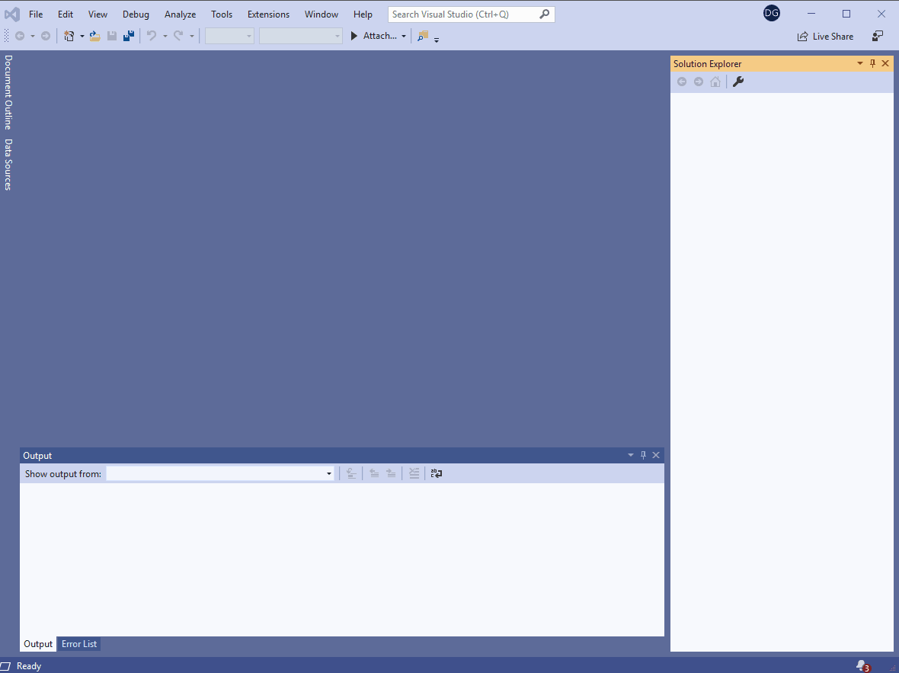
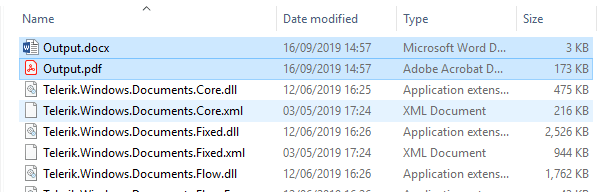

# Create Your First DOCX-to-PDF App with Telerik Document Processing

This getting started guide shows how to create a simple application that uses Telerik Document Processing to generate a DOCX document and then export the same document to PDF.

The Telerik Document Processing libraries in this guide are UI-independent and work across .NET desktop, web, mobile, client-side, server-side, and cloud applications. The example uses RadWordsProcessing to create the document content and a PDF format provider to export it.

## Step 1: Locate or Install Telerik Document Processing

Install `Telerik.Licensing` in the same project where you add the Telerik Document Processing packages.

Telerik Document Processing is available with several Telerik UI component bundles, so the libraries may already be present on your machine. If you already installed one of the supported Telerik UI suites, use the following table to find the installation instructions and the default package location for that suite.

>tip For new development, the recommended installation path is NuGet. For current feed options and setup steps, see [Install using NuGet Packages]().

| UI Components suite | Installation instructions | Default location of the Document Processing packages |
|--------------------|---------------------------|------------------------------------------------|
| UI for ASP.NET AJAX | [Installing Telerik UI for ASP.NET AJAX](https://docs.telerik.com/devtools/aspnet-ajax/installation/which-file-do-i-need-to-install) | <ul><li>`C:\Program Files (x86)\Progress\Telerik UI for ASP.NET AJAX [version]\AdditionalLibraries\Bin40`</li><li>`C:\Program Files (x86)\Progress\Telerik UI for ASP.NET AJAX [version]\AdditionalLibraries\Bin45`</li></ul> |
| UI for ASP.NET MVC | [Installing Telerik UI for ASP.NET MVC](https://docs.telerik.com/kendo-ui/aspnet-mvc/introduction#installation) | <ul><li>`C:\Program Files (x86)\Progress\Telerik UI for ASP.NET MVC [version]\dpl\net40`</li><li>`C:\Program Files (x86)\Progress\Telerik UI for ASP.NET MVC [version]\dpl\netstandard`</li></ul> |
| UI for ASP.NET Core | [Installing Telerik UI for ASP.NET Core](https://docs.telerik.com/aspnet-core/getting-started/installation/document-processing) | Install the libraries as NuGet packages. See [Install using NuGet Packages]() for the current package source and feed configuration steps. |
| UI for Blazor | [Installing Telerik UI for Blazor](https://docs.telerik.com/blazor-ui/common-features/document-processing) | Install the libraries as NuGet packages. See [Install using NuGet Packages]() for the current package source and feed configuration steps. |
| UI for WPF | [Installing Telerik UI for WPF](https://docs.telerik.com/devtools/wpf/installation-and-deployment/installing-telerik-ui-on-your-computer/installation-installing-which-file-do-i-need.html) | <ul><li>`C:\Program Files (x86)\Progress\Telerik UI for WPF [version]\Binaries`</li><li>`C:\Program Files (x86)\Progress\Telerik UI for WPF [version]\Binaries.NoXaml`</li></ul> |
| UI for Silverlight | [Installing Telerik UI for Silverlight](https://docs.telerik.com/devtools/silverlight/installation-and-deployment/installing-telerik-ui-on-your-computer/installation-installing-which-file-do-i-need.html) | <ul><li>`C:\Program Files (x86)\Progress\Telerik UI for WPF [version]\Binaries\Silverlight`</li><li>`C:\Program Files (x86)\Progress\Telerik UI for WPF [version]\Binaries.NoXaml\Silverlight`</li></ul> |
| UI for WinForms | [Installing Telerik UI for WinForms](https://docs.telerik.com/devtools/winforms/installation-deployment-and-distribution/installing-on-your-computer) | <ul><li>`C:\Program Files (x86)\Progress\Telerik UI for WinForms [version]\Bin40`</li><li>`C:\Program Files (x86)\Progress\Telerik UI for WinForms [version]\Bin50`</li><li>`C:\Program Files (x86)\Progress\Telerik UI for WinForms [version]\BinNetCore`</li></ul> |
| UI for WinUI | [Installing Telerik UI for WinUI](https://docs.telerik.com/devtools/winui/installation-and-deployment/installationsteps) | `C:\Program Files (x86)\Progress\Telerik UI for WinUI [version]\DPL`|
| UI for .NET MAUI | [Installing Telerik UI for .NET MAUI](https://docs.telerik.com/devtools/maui/installation/download-product-files) | `[installation_path]/Binaries/Shared`|

## Step 2: Create a Console Application in Visual Studio

This guide uses a console application because Telerik Document Processing is UI-independent.

Open Microsoft Visual Studio and create a new console project. The sample can use a .NET Framework, .NET Standard, or {{site.dotnetversions}} target framework.

### Figure 1: Create a Console Project in Visual Studio

Use the Visual Studio path shown in the following image to create the console application.

## Step 3: Add the Required Telerik Document Processing Packages

This sample uses [RadWordsProcessing]() to create the DOCX file. Add the required packages to the console project before you insert the sample code.

1. Add the packages that provide the RadWordsProcessing document model and DOCX functionality.

	For a .NET Framework project:
	* `Telerik.Windows.Documents.Core`
	* `Telerik.Windows.Documents.Flow`

	For a .NET Standard or {{site.dotnetversions}} project:
	* `Telerik.Documents.Core`
	* `Telerik.Documents.Flow`

1. Add the package that exports the generated document to PDF.

	For a .NET Framework project:
	* `Telerik.Windows.Documents.Flow.FormatProviders.Pdf`

	For a .NET Standard or {{site.dotnetversions}} project:
	* `Telerik.Documents.Flow.FormatProviders.Pdf`

You can find the complete Telerik Document Processing package list in [Available NuGet Packages]().

## Step 4: Create a RadFlowDocument

Use the following snippet to create the `RadFlowDocument` instance that the sample exports later.

### Example 1: Create a RadFlowDocument

<snippet id='first-steps-create-document'/>

## Step 5: Import an Existing DOCX File

Use this optional step if you want to start from an existing DOCX file instead of building the document content entirely in code.

### Example 2: Import a DOCX File

<snippet id='first-steps-import-docx'/>

## Step 6: Export the Generated Document

### Export the RadFlowDocument to DOCX

Use [DocxFormatProvider]() to save the `RadFlowDocument` as a DOCX file. The following snippet creates the provider instance and exports the generated document to the `bin` folder of the current project.
        

### Example 3: Export a RadFlowDocument to DOCX

<snippet id='first-steps-export-docx'/>

### Export the RadFlowDocument to PDF

Use [PdfFormatProvider]() to export the same `RadFlowDocument` to a PDF file.
        
### Example 4: Export a RadFlowDocument to PDF

<snippet id='first-steps-export-pdf'/>

## Step 7: Run the Project and Verify the Output

Run the console application and verify that the `bin` folder contains the generated DOCX and PDF files.

### Figure 2: Generated DOCX and PDF Files

## Next Steps

After you complete this first sample, continue with the following articles to explore editing, merging, inserting, and other document-processing tasks.

* [Explore Features]()
* [Further Information]()

## See Also

* [System Requirements]()
* [Installing on your computer]()
* [Document Processing SDK Examples](https://github.com/telerik/document-processing-sdk)
* [How to Obtain Telerik Document Processing Libraries for .NET Framework, .NET Standard, {{site.dotnetversions}}]()
