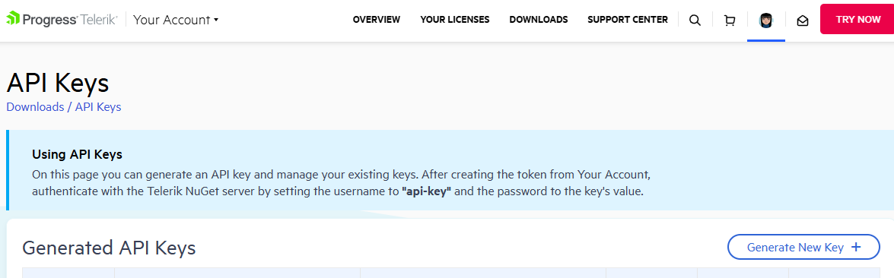
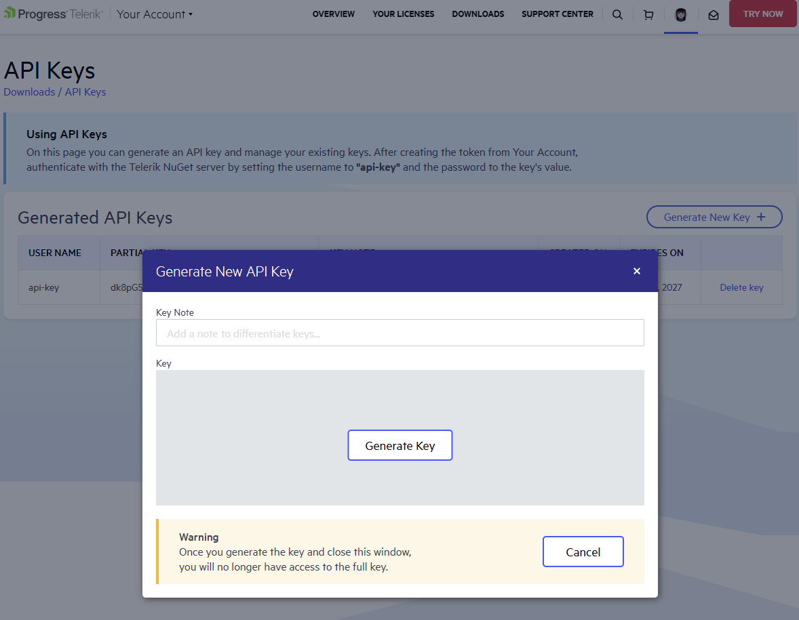
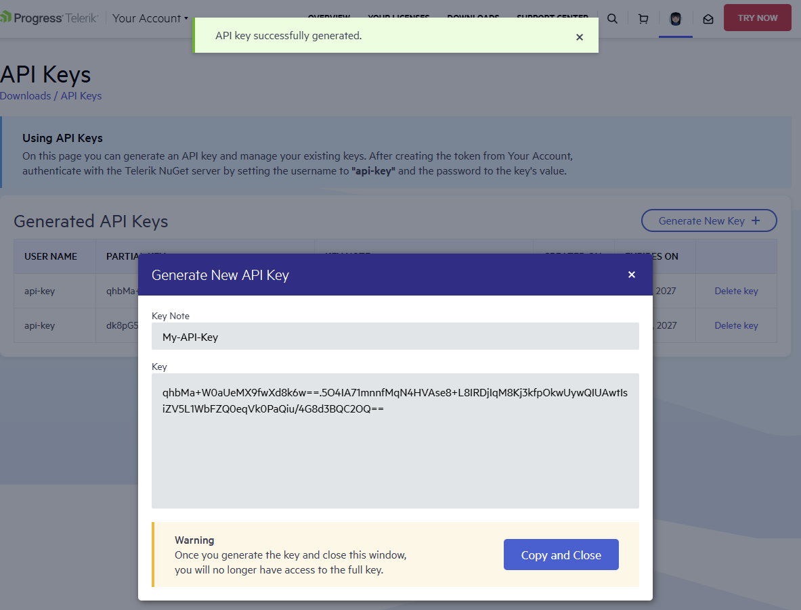
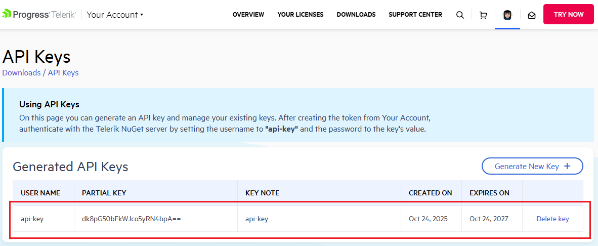

 
# Generating API Keys

Using API Keys provides a secure way to authenticate. This method does not require you to provide your Telerik credentials anywhere. Unlike your Telerik credentials, an API key has a **limited scope** and can be used only with the Telerik NuGet server. If any of your API Keys is compromised, you can quickly delete it and create a new one.

1. Go to the [Telerik account API key management page](https://www.telerik.com/account/downloads/api-keys).

1. Click **Generate New Key +**.

    **Telerik account API Keys page with the Generate New Key action**

     

1. In the **Key Note** field, add a note that describes the API key.

1. Click **Generate Key**.

    **Telerik account dialog for generating a new API key**

     

1. Select **Copy and Close**. Once you close the window, you can no longer copy the generated key. For security reasons, the API Keys page displays only a portion of the key.

    **Telerik account dialog showing the Copy and Close action for a generated API key**

       

    >note The illustrated API key is used for demonstration purposes only and is not valid.

    **Telerik account API Keys page showing a newly generated NuGet API key entry**

      

    >important The validity of the API key is 2 years.

1. Store the generated NuGet API key as you will need it in the next steps. Whenever you need to authenticate your system with the Telerik NuGet server, use api-key as the username and your generated API key as the password.
 
## See Also

* [Restore NuGet packages in a CI workflow]()
* [Configure NuGet package installation]()