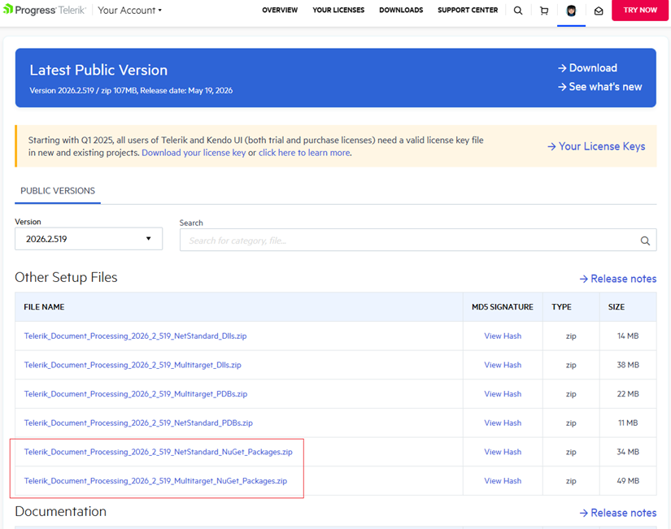
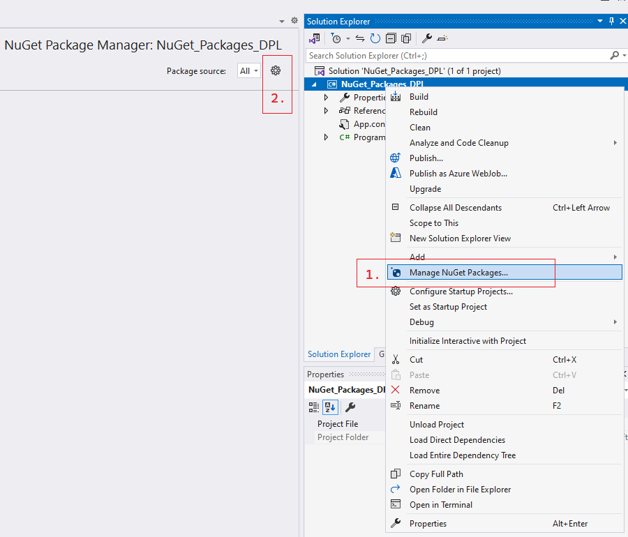
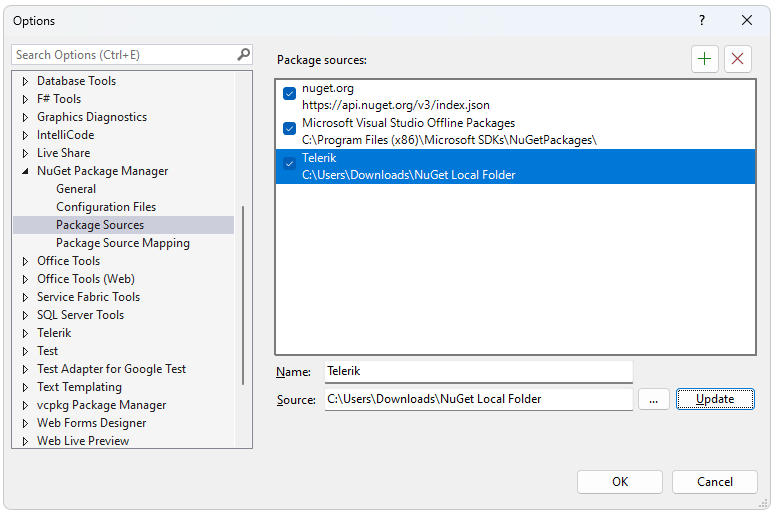
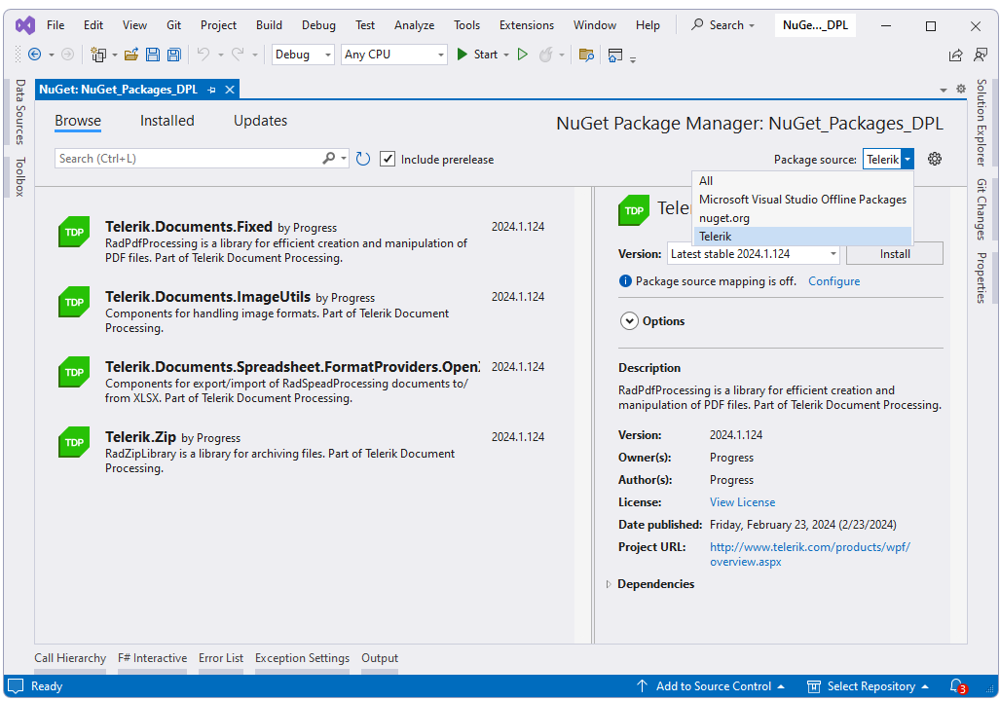
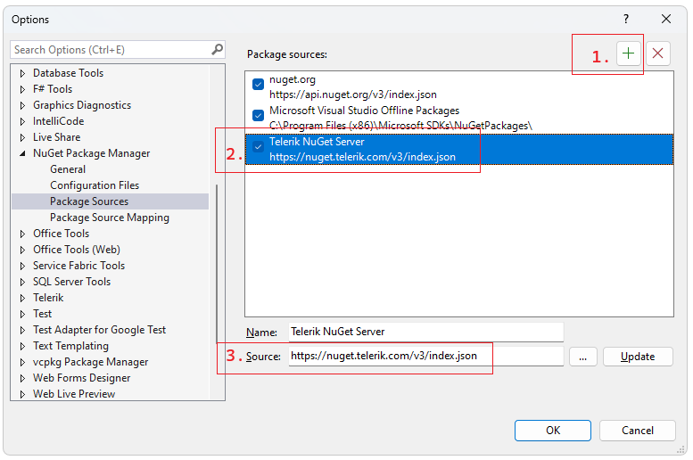
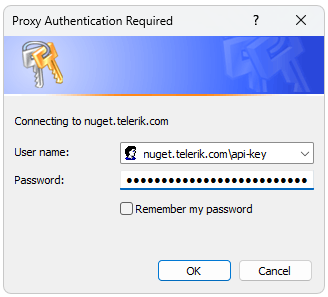
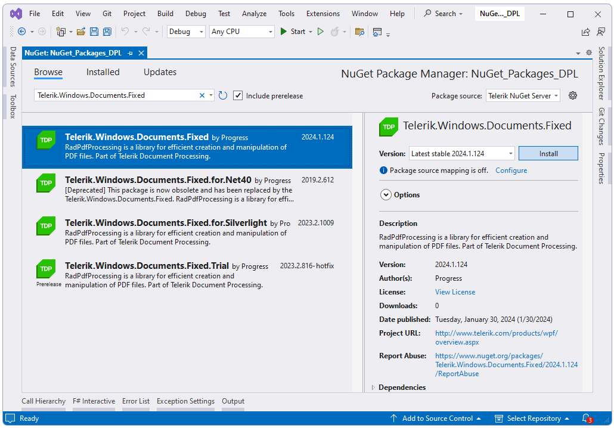

# Install Telerik Document Processing with NuGet Packages

This article explains how to install Telerik Document Processing with NuGet packages, choose the correct package source, and add the package references that your application needs. For the full package list, see [Available NuGet Packages]().

Use one of the following installation paths:

* [How to install from NuGet.org](#how-to-install-telerik-document-processing-from-nugetorg)
* [How to install from a local NuGet feed](#how-to-install-from-a-local-nuget-feed)
* [How to install from the Telerik NuGet server](#how-to-install-from-the-telerik-nuget-server)

## How to Choose the Right NuGet Installation Path

For current Telerik Document Processing releases, use **NuGet.org**. NuGet.org is the default package source in Visual Studio and the .NET CLI, so it requires the least configuration and avoids unnecessary package-source ambiguity.

Use a **local NuGet feed** when you need offline installation, reproducible restores inside a controlled network, or a mirrored package source for build agents.

Use the **Telerik NuGet server** only when you need older package versions that predate the NuGet.org release or when your organization already standardizes on the Telerik private feed.

## Use Explicit PackageReference Entries

Add the package references in the application project that generates, imports, or exports documents. Install `Telerik.Licensing` in the same project, keep all Telerik Document Processing packages on the same release version, and do not mix `Telerik.Documents.*` with `Telerik.Windows.Documents.*` in the same application. For the full package inventory, see [Available NuGet Packages](), and for package-family guidance, see [Telerik.Windows.Documents.* vs Telerik.Documents.*]().

### Cross-Platform PackageReference Example

Use the following `PackageReference` entries for ASP.NET Core, Blazor, console apps, services, and other modern .NET workloads that rely on the `Telerik.Documents.*` package family.

```xml
<Project Sdk="Microsoft.NET.Sdk">
    <PropertyGroup>
        <TargetFramework>net8.0</TargetFramework>
        <TelerikDocumentProcessingVersion>2026.1.210</TelerikDocumentProcessingVersion>
    </PropertyGroup>

    <ItemGroup>
        <PackageReference Include="Telerik.Licensing" Version="1.*" />
        <PackageReference Include="Telerik.Documents.Core" Version="$(TelerikDocumentProcessingVersion)" />
        <PackageReference Include="Telerik.Documents.Flow" Version="$(TelerikDocumentProcessingVersion)" />
        <PackageReference Include="Telerik.Documents.Flow.FormatProviders.Pdf" Version="$(TelerikDocumentProcessingVersion)" />
    </ItemGroup>
</Project>
```

### Windows-Only PackageReference Example

Use the following `PackageReference` entries for .NET Framework or other Windows-only applications that rely on the `Telerik.Windows.Documents.*` package family.

```xml
<Project>
    <PropertyGroup>
        <TelerikDocumentProcessingVersion>2026.1.210</TelerikDocumentProcessingVersion>
    </PropertyGroup>

    <ItemGroup>
        <PackageReference Include="Telerik.Licensing" Version="1.*" />
        <PackageReference Include="Telerik.Windows.Documents.Core" Version="$(TelerikDocumentProcessingVersion)" />
        <PackageReference Include="Telerik.Windows.Documents.Flow" Version="$(TelerikDocumentProcessingVersion)" />
        <PackageReference Include="Telerik.Windows.Documents.Flow.FormatProviders.Pdf" Version="$(TelerikDocumentProcessingVersion)" />
    </ItemGroup>
</Project>
```

If you prefer command-line installation, use package names from the same package family throughout the project and keep all versions aligned.

## Avoid Package-Source Confusion and Restore Issues

Package restore issues often come from mixed package families, stale private-feed credentials, or multiple package sources that resolve different versions of the same dependency. Use the following rules to avoid those failures:

* Prefer NuGet.org for current Telerik Document Processing releases.
* Keep all Telerik Document Processing packages on the same release version.
* Use only one Telerik package family per application: `Telerik.Documents.*` or `Telerik.Windows.Documents.*`.
* When a project uses multiple feeds, configure `NuGet.Config` so restore uses the intended source order and mappings.
* Store feed credentials as secrets in CI/CD systems instead of committing them to source control.

If your build uses more than one package source, start from a minimal `NuGet.Config` file similar to the following example and then adjust it for your environment:

```xml
<?xml version="1.0" encoding="utf-8"?>
<configuration>
    <packageSources>
        <clear />
        <add key="nuget.org" value="https://api.nuget.org/v3/index.json" />
    </packageSources>
</configuration>
```

If an agent or build script installs packages automatically, verify the package family and package source before restore. Most dependency-confusion issues come from automated restores that resolve a similarly named package from the wrong feed or from mixed `Telerik.Documents.*` and `Telerik.Windows.Documents.*` references.

## How to Install Telerik Document Processing from NuGet.org

As of **Q2 2026**, Telerik Document Processing packages are available on [NuGet.org](https://www.nuget.org/). This is the recommended installation path for new development because both Visual Studio and the .NET CLI use NuGet.org by default.

### How to Install from NuGet.org in Visual Studio

1. In Solution Explorer, right-click the project and select **Manage NuGet Packages...**.
2. In **Package source**, verify that **nuget.org** is selected.
3. In the **Browse** tab, search for the package you need, for example `Telerik.Documents.Fixed`.
4. Select the package and then select **Install**.

### How to Install from NuGet.org with the .NET CLI

Use the .NET CLI when you want repeatable setup steps for local development, containers, or automation scripts.

```bash
dotnet add package Telerik.Licensing
dotnet add package Telerik.Documents.Core --version 2026.1.210
dotnet add package Telerik.Documents.Fixed --version 2026.1.210
```

To install a different library, replace `Telerik.Documents.Fixed` with the package that matches your document type.

For example, use `Telerik.Documents.Flow` for Word processing, `Telerik.Documents.Spreadsheet` for spreadsheet processing, and `Telerik.Documents.SpreadsheetStreaming` for large spreadsheet generation.

### How to Install from NuGet.org with Package Manager Console

Use the Visual Studio Package Manager Console when you manage packages inside Visual Studio and want PowerShell-based commands.

```powershell
Install-Package Telerik.Licensing
Install-Package Telerik.Documents.Core -Version 2026.1.210
Install-Package Telerik.Documents.Fixed -Version 2026.1.210
```

>tip You can find the exact package names and supported combinations in [Available NuGet Packages]().

## How to Choose NuGet Setup for Your Environment

The package source is only one part of setup. Use the following guidance to choose the correct package family and restore approach for your environment.

### How to Configure Blazor Web App, Blazor Server, and ASP.NET Core

Use the cross-platform `Telerik.Documents.*` package family. Add `Telerik.Licensing`, `Telerik.Documents.Core`, and the library packages that match the document formats you work with.

For example, a Blazor Web App that creates DOCX files and exports them to PDF typically uses the following packages:

```xml
<ItemGroup>
    <PackageReference Include="Telerik.Licensing" Version="1.*" />
    <PackageReference Include="Telerik.Documents.Core" Version="2026.1.210" />
    <PackageReference Include="Telerik.Documents.Flow" Version="2026.1.210" />
    <PackageReference Include="Telerik.Documents.Flow.FormatProviders.Pdf" Version="2026.1.210" />
</ItemGroup>
```

### How to Configure Blazor WebAssembly

Use the `Telerik.Documents.*` package family in Blazor WebAssembly projects. Do not use `Telerik.Windows.Documents.*` packages in WebAssembly applications.

For PDF processing in Blazor WebAssembly, start with the following package references:

```xml
<ItemGroup>
    <PackageReference Include="Telerik.Licensing" Version="1.*" />
    <PackageReference Include="Telerik.Documents.Core" Version="2026.1.210" />
    <PackageReference Include="Telerik.Documents.Fixed" Version="2026.1.210" />
</ItemGroup>
```

If the application exports PDF content that contains non-JPEG images or uses image quality settings other than `High`, also add the image-processing dependencies described in [Images]().

### How to Configure CI/CD and Build Agents

For CI/CD pipelines and self-hosted build agents, prefer NuGet.org for current releases because it removes the need to configure private-feed credentials. Commit package references and, when needed, a repository-level `NuGet.Config` file, but keep any secrets outside source control.

If your pipeline must restore from the Telerik NuGet server or another authenticated feed, store the API key or credentials in the pipeline secret store and inject them during restore. For CI-specific guidance, see [Restoring NuGet Packages in Your CI Workflow]().

When you automate restores, add one validation step that checks package-family consistency before build. For example, fail the build if the project file contains both `Telerik.Documents.` and `Telerik.Windows.Documents.` package references.

## How to Install from a Local NuGet Feed

Use a local feed when you need offline development, an internal mirror, or controlled package availability inside a secured network.

1. Download the `.nupkg` files for the Telerik suite or distribution that includes Telerik Document Processing from your Telerik account.



2. Copy the `.nupkg` files to a local or network folder that will act as the package source.
3. In Visual Studio, open **Manage NuGet Packages...** and then select the **Settings** icon.



4. Add a new package source. Set **Source** to the folder that contains the `.nupkg` files.



5. Select the local package source and install the required Telerik Document Processing packages.



If you also restore from NuGet.org or another feed, configure `NuGet.Config` so your local feed is used intentionally rather than accidentally.

## How to Install from the Telerik NuGet Server

>note As of Q2 2026, NuGet.org is the recommended source for current Telerik Document Processing packages. Use the Telerik NuGet server for backward compatibility, for older releases, or when your organization requires the Telerik private feed.

The Telerik NuGet server provides authenticated access to Telerik packages and older versions that may not be part of your standard NuGet.org-based workflow.

Before you add the Telerik NuGet server, make sure that you have:

* A commercial or trial license that includes Telerik Document Processing.
* An API key for package restore and automated environments.

### How to Generate a Telerik NuGet API Key

Create an API key as described in [Generate API Keys](). Use the API key instead of a password when you configure the Telerik feed in automation, in `NuGet.Config`, or in command-line restore steps.

### How to Add the Telerik NuGet Server to Visual Studio

Configure the Telerik NuGet server as a package source in Visual Studio with the following feed URL:

```text
https://nuget.telerik.com/v3/index.json
```

1. In Solution Explorer, right-click the project, select **Manage NuGet Packages...**, and then select the **Settings** icon.


2. Select **+** to add a new package source. Enter `https://nuget.telerik.com/v3/index.json` in **Source** and use a descriptive name such as **Telerik NuGet Server**.



3. Select **Telerik NuGet Server** from **Package source** and authenticate with your Telerik account or API-key-based configuration.



4. Select and install the required NuGet packages.



### How to Reset Stored Telerik Feed Credentials

If restore fails because Visual Studio or NuGet is using outdated Telerik feed credentials, reset the stored credentials and add the feed again.

1. Remove the saved credentials in [Windows Credential Manager](https://support.microsoft.com/en-us/windows/accessing-credential-manager-1b5c916a-6a16-889f-8581-fc16e8165ac0). Look for entries such as `nuget.telerik.com` or `VSCredentials_nuget.telerik.com`.
2. Remove the Telerik package source from Visual Studio.
3. If you added the Telerik package source with the .NET CLI, remove it with the following commands:

```bash
dotnet nuget list source
dotnet nuget remove source "Telerik NuGet Server"
```

4. Check `%AppData%\NuGet\NuGet.Config` for persisted Telerik credentials and remove them if they are no longer valid.
5. If Visual Studio still does not prompt for new credentials, follow the steps in [Force NuGet to ask for authentication again](https://stackoverflow.com/questions/43550797/how-to-force-nuget-to-ask-for-authentication-when-connecting-to-a-private-feed).
6. Restart Visual Studio.
7. Add the Telerik NuGet package source again. If you use the Telerik feed in automated restore or .NET applications, configure the API key in [NuGet.Config](#edit-the-nugetconfig-file).

## See Also

* [Available NuGet Packages]()
* [Restoring NuGet Packages in Your CI Workflow]()
* [How to Obtain Telerik Document Processing Libraries for .NET Framework, .NET Standard, {{site.dotnetversions}}]()
* [Handling the "No packages found" Message when Using the Telerik NuGet Server]()
* [Telerik CLI]()
