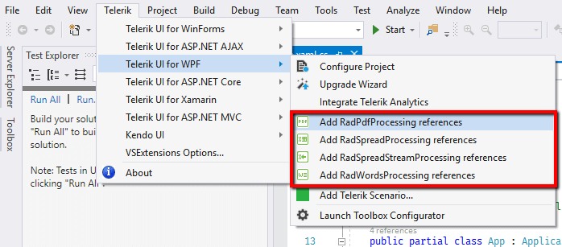
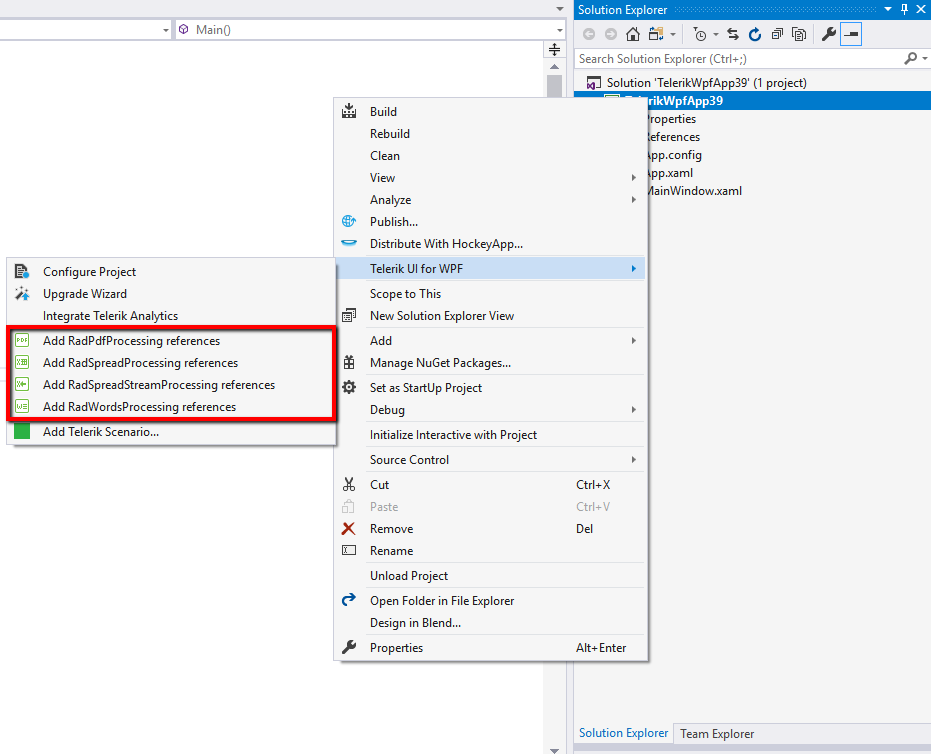
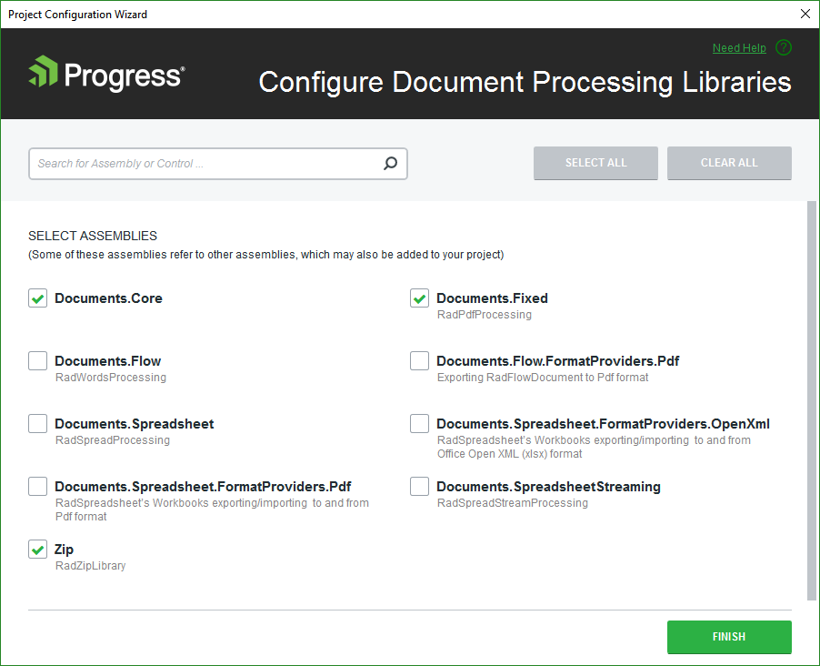

# Document Processing Libraries Configuration Wizard

Telerik Document Processing Configuration Wizard comes with the Visual Studio Extensions of several Telerik bundles. Telerik Document Processing configuration is available when the **Configure Wizard** for the respective product is available.

> Telerik Document Processing Configuration Wizard is part of [Telerik UI for ASP.NET AJAX](https://docs.telerik.com/devtools/aspnet-ajax/general-information/integration-with-visual-studio/visual-studio-extensions/overview), [Telerik UI for ASP.NET MVC](https://docs.telerik.com/aspnet-mvc/vs-integration/introduction), [Telerik UI for WinForms](https://docs.telerik.com/devtools/winforms/installation-deployment-and-distribution/visual-studio-extensions/overview) and [Telerik UI for WPF Visual Studio](https://docs.telerik.com/devtools/wpf/visual-studio-extensions/for-wpf-vs-extensions-overview-wpf) Extensions. More about each of them you can find when you follow the links above.

The wizard could be accessed through:

- The **Telerik** menu in Visual Studio

- The context menu when you right-click on the project you wish to configure

The Telerik Document Processing Configuration wizard allows you to select which libraries your project would use. If a library you selected has any dependencies, they are automatically checked.

Assemblies are pre-selected based on the component you have launched the wizard through. Following is a list of the assemblies that will be selected for each library.

|Component  |Selected assemblies  |
|---------|---------|
|RadPdfProcessing    |Documents.Core Documents.Fixed Zip         |
|RadSpreadProcessing     |    Documents.Core Documents.Fixed Documents.Spreadsheet Documents.SpreadSheet.FormatProviders.OpenXml Documents.SpreadSheet.FormatProviders.Pdf Zip     |
|RadSpreadStreamProcessing     |   Documents.SpreadSheetStreaming Zip      |
|RadWordsProcessing     |   Documents.Core Documents.Fixed Documents.Flow Documents.Flow.FormatProviders.Pdf Zip      |

When you click the **Finish** button, the selected assembly references are added to you project.
