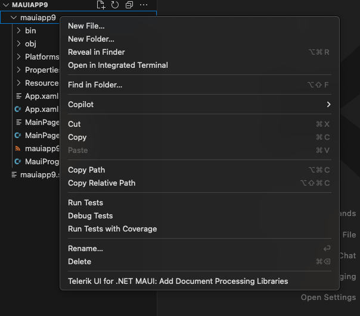
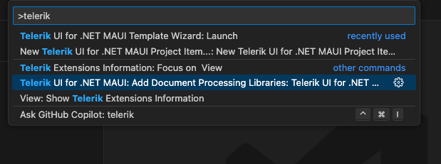
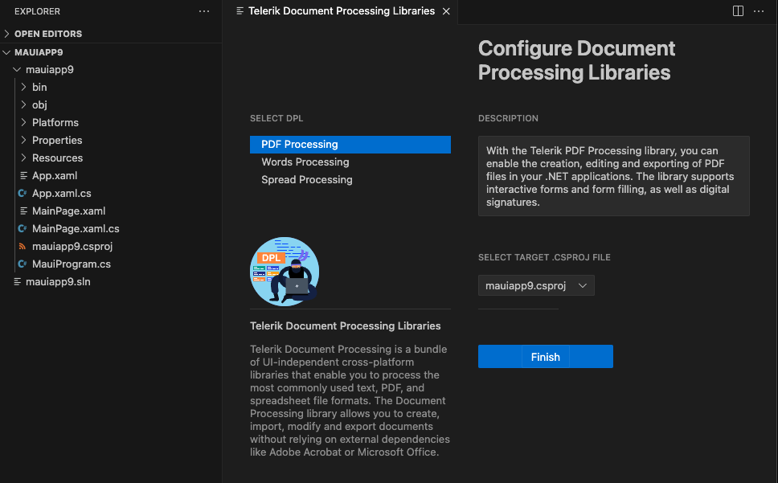

# Configuring Document Processing Libraries

With **Q2 2024** we are adding a Document Processing Configuration Wizard for **Visual Studio Code**. The wizard is included in the Visual Studio Code extension for [Telerik UI for Blazor ](https://marketplace.visualstudio.com/items?itemName=TelerikInc.blazortemplatewizard) and [Telerik UI for ASP.NET Core](https://dotnet.microsoft.com/en-us/apps/aspnet) and it enables you to easily add the required packages when working with the Telerik Document Processing Library.
As of **Q1 2025** we offer the DPL wizard for the [Telerik UI for MAUI](https://marketplace.visualstudio.com/items?itemName=TelerikInc.telerik-maui-productivity-tools) as well.

## Getting the Wizard

To use the Document Processing Libraries Wizard, install the VS Code extension for the desired produckt:

* [Telerik UI for Blazor Visual Studio Code extension](https://marketplace.visualstudio.com/items?itemName=TelerikInc.blazortemplatewizard)

* [Telerik UI for MAUI Visual Studio Code extension](https://marketplace.visualstudio.com/items?itemName=TelerikInc.telerik-maui-productivity-tools)

## Starting the Wizard

### Using the File Explorer Context Menu

To use **Document Processing Libraries Configuration Wizard** from the **VS Code**'s file explorer's context menu:

 1\. Right-click on a file in the files tree.

 2\. Select the `Telerik UI for .NET MAUI: Add Document Processing Libraries`.

    

### Using the Code Editor Command Palette

To use **Document Processing Libraries Configuration Wizard** from the **VS Code** command palette:

 1\. Open the Command Pallette menu by pressing Ctrl+Shift+P on Windows or Linux, or Cmd+Shift+P on Mac.

 2\. Select `Telerik UI for Maui: Add Document Processing Libraries`.

   

After executing one of the options the wizard must appear like this: 

  

The **Telerik Document Processing Configuration wizard** allows you to select which libraries your project would use. It allows you to use the license and selection of the `.csproj` file, in which you want the installation to be provided. This option is useful in cases when the user has many opened projects in the workspace. If a library you selected has any dependencies, they are automatically checked. In the table below there is a list of the packages that will be selected for each library:

|Library  |Packages |
|---------|---------|
|**RadPdfProcessing**|Documents.Core Documents.Fixed ~~Zip~~* Documents.ImageUtils Documents.Fixed.FormatProviders.Image.Skia Documents.CMapUtils|
|**RadSpreadProcessing**|Documents.Core Documents.Fixed Documents.Spreadsheet Documents.SpreadSheet.FormatProviders.OpenXml Documents.SpreadSheet.FormatProviders.Pdf Documents.Spreadsheet.FormatProviders.Xls Documents.ImageUtils ~~Zip~~*|
|**RadWordsProcessing**|Documents.Core Documents.Fixed Documents.Flow Documents.Flow.FormatProviders.Pdf Documents.ImageUtils Documents.Flow.FormatProviders.Doc Documents.DrawingML ~~Zip~~*|

>note As of **Q2 2025** the Zip Library will no longer be used as an internal dependency in the rest of the Document Processing Libraries - PdfProcessing, WordsProcessing, SpreadProcessing, SpreadStreamProcessing. It will be replaced by the System.IO.Compression. We will continue to ship the Telerik Zip Library as a standalone library so clients can still use it separately.

## See Also

* [Visual Studio Code Integration for Telerik UI for Blazor Overview](https://docs.telerik.com/blazor-ui/getting-started/vs-code-integration/introduction) 

