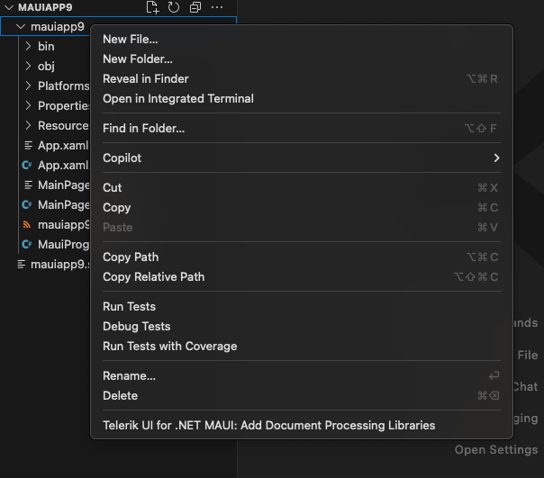
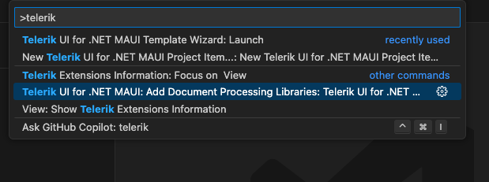
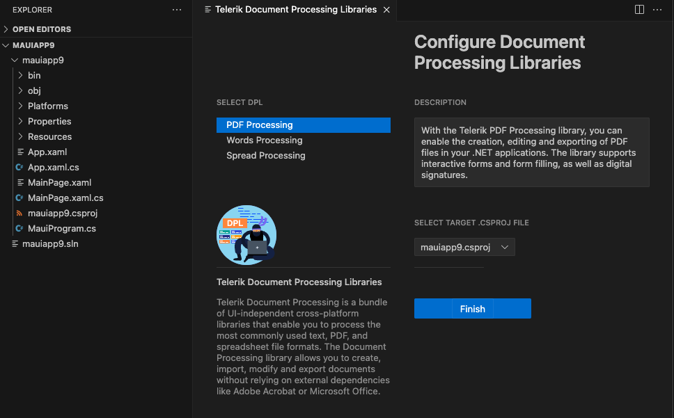

# Configuring Document Processing Libraries

|Minimum Version|Q2 2024|
|----|----|

The **Document Processing Configuration Wizard** is included in the Visual Studio Code extension for [Telerik UI for Blazor](https://marketplace.visualstudio.com/items?itemName=TelerikInc.blazortemplatewizard) and [Telerik UI for ASP.NET Core](https://dotnet.microsoft.com/en-us/apps/aspnet). It allows you to add the required packages when working with the Telerik Document Processing Library.
Starting with **Q1 2025**, the DPL wizard is also available for [Telerik UI for MAUI](https://marketplace.visualstudio.com/items?itemName=TelerikInc.telerik-maui-productivity-tools).

## Getting the Wizard

To use the Document Processing Libraries Wizard, install the VS Code extension for the desired product:

* [Telerik UI for Blazor Visual Studio Code extension](https://marketplace.visualstudio.com/items?itemName=TelerikInc.blazortemplatewizard)

* [Telerik UI for MAUI Visual Studio Code extension](https://marketplace.visualstudio.com/items?itemName=TelerikInc.telerik-maui-productivity-tools)

## Starting the Wizard

### Using the File Explorer Context Menu

To use **Document Processing Libraries Configuration Wizard** from the **VS Code**'s file explorer's context menu:

 1\. Right-click on a file in the files tree.

 2\. Select the `Telerik UI for .NET MAUI: Add Document Processing Libraries`.

    

### Using the Code Editor Command Palette

To use **Document Processing Libraries Configuration Wizard** from the **VS Code** command palette:

 1\. Open the Command Palette menu by pressing `Ctrl`+`Shift`+`P` on Windows or Linux, or `Cmd`+`Shift`+`P` on Mac.

 2\. Select `Telerik UI for Maui: Add Document Processing Libraries`.

   

After you execute one of the options, the wizard appears: 

  

The **Telerik Document Processing Configuration wizard** lets you select which libraries your project uses. You can choose the license and the `.csproj` file in which to install the packages. This option is useful when you have many opened projects in the workspace. If a library you selected has any dependencies, they are automatically checked. The following table lists the packages that are selected for each library:

|Library  |Packages |
|---------|---------|
|**RadPdfProcessing**|Documents.Core Documents.Fixed Documents.ImageUtils Documents.Fixed.FormatProviders.Image.Skia Documents.CMapUtils|
|**RadSpreadProcessing**|Documents.Core Documents.Fixed Documents.Spreadsheet Documents.SpreadSheet.FormatProviders.OpenXml Documents.SpreadSheet.FormatProviders.Pdf Documents.Spreadsheet.FormatProviders.Xls Documents.ImageUtils|
|**RadWordsProcessing**|Documents.Core Documents.Fixed Documents.Flow Documents.Flow.FormatProviders.Pdf Documents.ImageUtils Documents.Flow.FormatProviders.Doc Documents.DrawingML|

>note Starting with **Q2 2025**, the Zip Library is no longer used as an internal dependency in the rest of the Document Processing Libraries (PdfProcessing, WordsProcessing, SpreadProcessing, SpreadStreamProcessing). It is replaced by `System.IO.Compression`. Telerik continues to ship the Zip Library as a standalone library so you can still use it separately.

## See Also

* [Visual Studio Code Integration for Telerik UI for Blazor Overview](https://docs.telerik.com/blazor-ui/getting-started/vs-code-integration/introduction) 

