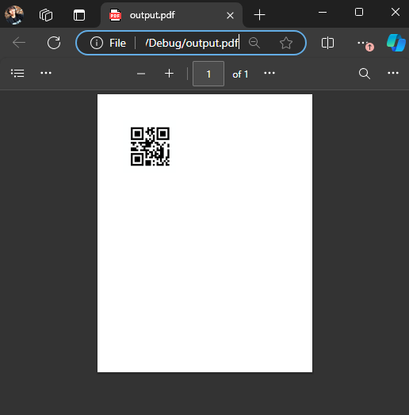

## Environment

| Version | Product | Author | 
| --- | --- | ---- | 
| 2024.2.426| RadPdfProcessing |[Desislava Yordanova](https://www.telerik.com/blogs/author/desislava-yordanova)| 

## Description

Learn how to generate a PDF document and add a barcode to it.  

  

## Solution

To add a barcode to a PDF document, consider using the [WinForms BarcodeView](): 

1\. First, [generate an image of the barcode]().

2\. Then, add the [image to the PDF document](). Here is a sample code snippet:

    ```csharp
    Telerik.WinControls.UI.Barcode.QRCode qrCode1 = new Telerik.WinControls.UI.Barcode.QRCode();
    RadBarcodeView radBarcodeView = new RadBarcodeView();
    radBarcodeView.BindingContext = new BindingContext();
    qrCode1.Version = 1;
    radBarcodeView.Symbology = qrCode1;
    radBarcodeView.Text = "radBarcodeView1";
    radBarcodeView.Value = "1234567";
    radBarcodeView.Invalidate();
    System.Drawing.Image img = radBarcodeView.ExportToImage(200, 200);
    string imageFilePath = "barcodeImage.png";
    img.Save(imageFilePath, System.Drawing.Imaging.ImageFormat.Png);

    RadFixedDocument fixedDocument = new RadFixedDocument();     
    RadFixedDocumentEditor documentEditor = new RadFixedDocumentEditor(fixedDocument);
    FileStream fileStream = new FileStream(imageFilePath, FileMode.Open);
    Telerik.Windows.Documents.Fixed.Model.Resources.ImageSource _imageSource = new Telerik.Windows.Documents.Fixed.Model.Resources.ImageSource(fileStream);
    documentEditor.InsertImageInline(_imageSource);
    documentEditor.InsertLineBreak();
    documentEditor.Dispose();
    PdfFormatProvider provider = new PdfFormatProvider();
    string outputFilePath = "output.pdf";
    File.Delete(outputFilePath);
    using (Stream output = File.OpenWrite(outputFilePath))
    {
        provider.Export(fixedDocument, output);
    }
    Process.Start(new ProcessStartInfo() { FileName = outputFilePath, UseShellExecute = true });
    ```

## Notes

- The WinForms BarcodeView method is suitable for applications where a barcode image can be generated and saved before adding it to the PDF: [Generating a Bar Code Image outside WinForms]().

## See Also

- [RadPdfProcessing Documentation]()
- [WinForms BarcodeView]()
- [Exporting BarcodeView to Image]()
- [Generating a Barcode Image outside WinForms]()

