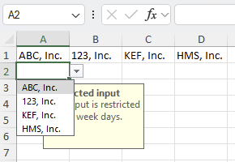

## Environment

| Version | Product | Author | 
| ---- | ---- | ---- | 
| 2025.2.520| RadSpreadProcessing |[Desislava Yordanova](https://www.telerik.com/blogs/author/desislava-yordanova)| 

## Description

Learn how to add a ComboBox with predefined options to an Excel file programmatically using RadSpreadProcessing. Additionally, the ComboBox should support special characters like commas (or another delimiter) within the options. 

## Solution

To add a ComboBox to an Excel file and handle special characters like commas within options, use the [ListDataValidationRule]() with a cell range as the source for the validation. 

     
 
Below is the sample code:

```csharp
// Create a workbook
Workbook workbook = new Workbook();
Worksheet worksheet = workbook.Worksheets.Add();

// Define the ComboBox options in a cell range
worksheet.Cells[0, 0].SetValue("ABC, Inc.");
worksheet.Cells[0, 1].SetValue("123, Inc.");
worksheet.Cells[0, 2].SetValue("KEF, Inc.");
worksheet.Cells[0, 3].SetValue("HMS, Inc.");

// Specify the cell where the ComboBox will be applied (e.g., A2)
CellIndex cellIndex = new CellIndex(1, 0); // A2

// Set up the validation rule with the cell range
ListDataValidationRuleContext context = new ListDataValidationRuleContext(worksheet, cellIndex);
context.InputMessageTitle = "Restricted input";
context.InputMessageContent = "Please select an option from the dropdown.";
context.ErrorStyle = ErrorStyle.Stop;
context.ErrorAlertTitle = "Invalid Input";
context.ErrorAlertContent = "The entered value is not valid. Allowed values are listed in the dropdown.";
context.Argument1 = "=A1:D1"; // Cell range containing the options
ListDataValidationRule rule = new ListDataValidationRule(context);

// Apply the validation rule to the specified cell
worksheet.Cells[cellIndex].SetDataValidationRule(rule);

// Save the workbook to a file
string outputFilePath = "ComboBoxExample.xlsx";
File.Delete(outputFilePath);
using (FileStream stream = new FileStream(outputFilePath, FileMode.Create))
{
    XlsxFormatProvider formatProvider = new XlsxFormatProvider();
    formatProvider.Export(workbook, stream, TimeSpan.FromSeconds(60));
}

// Open the generated file
Process.Start(new ProcessStartInfo() { FileName = outputFilePath, UseShellExecute = true });
```

### Key Points
- Use a cell range to define options if the values include commas or other special characters that are not allowed out-of-the-box.
- The `Argument1` property supports referencing a range of cells (e.g., `=A1:D1`) as dropdown options.

## See Also

- [RadSpreadProcessing Overview]()
- [List Rule Data Validation](#list-rule)
- [Setting the Culture]() 
