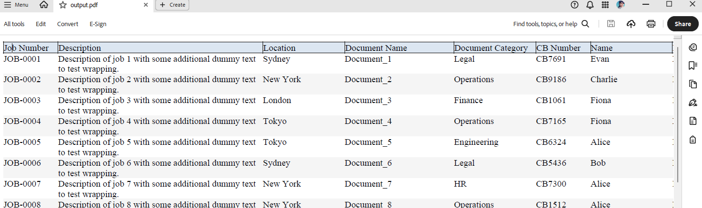

## Environment

| Version | Product | Author | 
| ---- | ---- | ---- | 
| 2025.3.806| RadPdfProcessing |[Desislava Yordanova](https://www.telerik.com/blogs/author/desislava-yordanova)| 

## Description

This article shows how to generate a PDF table with styled header cells with border and background color. For the data rows an alternating row color style is applied.

A similar design can be produced with the demonstrated approach:



## Solution

To achieve **Alternating Row Style** for Tables using RadPdfProcessing, follow these steps:

1. Generate dummy Report data.
1. Create a PDF document and generate a table using the sample data records.

```csharp
     internal class Report
    {
        public string? JobNumber { get; set; }
        public string? Description { get; set; }
        public string? Location { get; set; }
        public string? DocName { get; set; }
        public string? DocCategory { get; set; }
        public string? CBNumber { get; set; }
        public string? Name { get; set; }
        public string? DocType { get; set; }
        public string? Status { get; set; }
        public string? Pages { get; set; }
        public DateTime? StatusDate { get; set; }
    }

    internal static class ReportFactory
    {
        public static List<Report> Generate(int count, int seed = 123)
        {
            var list = new List<Report>(count);
            var rnd = new Random(seed);
            string[] locations = { "New York", "Berlin", "London", "Tokyo", "Sydney" };
            string[] categories = { "Engineering", "Finance", "HR", "Operations", "Legal" };
            string[] names = { "Alice", "Bob", "Charlie", "Diana", "Evan", "Fiona" };
            string[] docTypes = { "PDF", "DOCX", "XLSX", "DWG" };
            string[] statuses = { "Draft", "In Review", "Approved", "Rejected" };

            for (int i = 1; i <= count; i++)
            {
                list.Add(new Report
                {
                    JobNumber = $"JOB-{i:0000}",
                    Description = $"Description of job {i} with some additional dummy text to test wrapping.",
                    Location = locations[rnd.Next(locations.Length)],
                    DocName = $"Document_{i}",
                    DocCategory = categories[rnd.Next(categories.Length)],
                    CBNumber = $"CB{rnd.Next(1000, 9999)}",
                    Name = names[rnd.Next(names.Length)],
                    DocType = docTypes[rnd.Next(docTypes.Length)],
                    Status = statuses[rnd.Next(statuses.Length)],
                    Pages = rnd.Next(1, 40).ToString(),
                    StatusDate = DateTime.Today.AddDays(-rnd.Next(0, 365))
                });
            }
            return list;
        }
    }

        private static void GeneratedDummyTable()
        {
            FontBase defaultFont = FontsRepository.TimesRoman;
            FontFamily fontFamily = new FontFamily(defaultFont.Name);

            int index = 0;
            List<Report> reports = ReportFactory.Generate(20);

            while (index < reports.Count)
            {
                // Build table for this page
                var table = new Telerik.Windows.Documents.Fixed.Model.Editing.Tables.Table();
                table.LayoutType = TableLayoutType.AutoFit;

                // Header row
                var headerRow = table.Rows.AddTableRow();

                string[] headers = new[] {
               "Job Number", "Description", "Location", "Document Name",
               "Document Category", "CB Number", "Name", "Document Type",
               "Status", "Pages", "Status Date"
           };

                double[] preferredWidths = new double[] {
               80, 300, 120, 160, 120, 80, 120, 100, 80, 50, 100
           };

                for (int h = 0; h < headers.Length; h++)
                {
                    var headerCell = headerRow.Cells.AddTableCell();
                    headerCell.PreferredWidth = preferredWidths[h];
                    var headerBlock = headerCell.Blocks.AddBlock();
                    headerBlock.TextProperties.Font = defaultFont;
                    headerBlock.InsertText(headers[h]);

                    // Header cell styling
                    headerCell.Background = new RgbColor(220, 230, 241);
                    headerCell.Borders = new TableCellBorders(
                        new Border(1, new RgbColor(0, 0, 0)), // Top
                        new Border(1, new RgbColor(0, 0, 0)), // Right
                        new Border(1, new RgbColor(0, 0, 0)), // Bottom
                        new Border(1, new RgbColor(0, 0, 0))  // Left
                    );
                }

                while (index < reports.Count)
                {
                    var reportItem = reports[index];

                    var row = table.Rows.AddTableRow();
                    var c0 = row.Cells.AddTableCell();
                    c0.PreferredWidth = preferredWidths[0];
                    Block block1 = c0.Blocks.AddBlock();
                    block1.TextProperties.Font = defaultFont;
                    block1.InsertText(reportItem.JobNumber ?? string.Empty);

                    var c1 = row.Cells.AddTableCell();
                    c1.Blocks.AddBlock().InsertText(fontFamily, reportItem.Description ?? string.Empty);

                    var c2 = row.Cells.AddTableCell();
                    c2.Blocks.AddBlock().InsertText(fontFamily, reportItem.Location ?? string.Empty);

                    var c3 = row.Cells.AddTableCell();
                    c3.Blocks.AddBlock().InsertText(fontFamily, reportItem.DocName ?? string.Empty);

                    var c4 = row.Cells.AddTableCell();
                    c4.Blocks.AddBlock().InsertText(fontFamily, reportItem.DocCategory ?? string.Empty);

                    var c5 = row.Cells.AddTableCell();
                    c5.Blocks.AddBlock().InsertText(fontFamily, reportItem.CBNumber ?? string.Empty);

                    var c6 = row.Cells.AddTableCell();
                    c6.Blocks.AddBlock().InsertText(fontFamily, reportItem.Name ?? string.Empty);

                    var c7 = row.Cells.AddTableCell();
                    c7.Blocks.AddBlock().InsertText(fontFamily, reportItem.DocType ?? string.Empty);

                    var c8 = row.Cells.AddTableCell();
                    c8.Blocks.AddBlock().InsertText(fontFamily, reportItem.Status ?? string.Empty);

                    var c9 = row.Cells.AddTableCell();
                    c9.Blocks.AddBlock().InsertText(fontFamily, reportItem.Pages ?? string.Empty);

                    var c10 = row.Cells.AddTableCell();
                    c10.Blocks.AddBlock().InsertText(fontFamily, reportItem.StatusDate?.ToString("dd/MM/yyyy") ?? string.Empty);


                    for (var i = 0; i < row.Cells.Count; i++)
                    {
                        var cell = row.Cells[i];
                        // Alternating row colors
                        cell.Background = (index % 2 == 0) ? new RgbColor(255, 255, 255) : new RgbColor(245, 245, 245);
                        cell.PreferredWidth = preferredWidths[i];
                    }
                    index++;
                }

                RadFixedDocument fixedDocument = new RadFixedDocument();
                RadFixedPage contentPage = fixedDocument.Pages.AddPage();
                contentPage.Size = new Size(1400, 800);
                FixedContentEditor editor = new FixedContentEditor(contentPage);
                editor.TextProperties.FontSize = 10;
                editor.TextProperties.Font = defaultFont;

                editor.Position.Translate(10, 10);
                editor.DrawTable(table);

                string outputFilePath = "output.pdf";
                File.WriteAllBytes(outputFilePath, new PdfFormatProvider().Export(fixedDocument, TimeSpan.FromSeconds(10)));
                Process.Start(new ProcessStartInfo() { FileName = outputFilePath, UseShellExecute = true });
            }
        }
```


## See Also

- [ Tables in PdfProcessing]()

