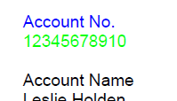

## Environment

| Version | Product | Author | 
| ---- | ---- | ---- | 
| 2024.4.1106| RadPdfProcessing |[Desislava Yordanova](https://www.telerik.com/blogs/author/desislava-yordanova)| 

## Description

When working with PDF documents using [RadPdfProcessing](), you may need to change the foreground color of text inside a table to differentiate between various pieces of information, such as an account number and its value. This knowledge base article also answers the following questions:
- How to change the text color within a PDF table using RadPdfProcessing?
- How to differentiate text elements in a PDF document by color?
- How to apply foreground colors to text blocks within a PDF table?

## Solution

To change the text color inside a table in a PDF document using RadPdfProcessing, use the **FillColor** property of [GraphicProperties](). This property controls the color used for drawing the content elements of a `Block`. You can temporarily change the graphic properties for specific text elements by using the `SaveGraphicProperties()` and `RestoreGraphicProperties()` methods. This allows you to apply different colors to different parts of the text inside a table cell. 

Here's how to achieve this:

1. Create a [table]() and add a [row]() and a [cell]() to it.
2. Add a [block]() to the cell for the text you want to display.
3. Use `SaveGraphicProperties()` to save the current graphic state.
4. Set the [FillColor]() property of [GraphicProperties]() to the desired color.
5. Insert the text into the block.
6. Use `RestoreGraphicProperties()` to revert to the previous graphic state.
7. Repeat steps 2-6 for any additional text blocks with different colors.

```csharp
Table table = new Table();
table.LayoutType = Telerik.Windows.Documents.Fixed.Model.Editing.Flow.TableLayoutType.FixedWidth;

TableRow row = table.Rows.AddTableRow();
TableCell cell = row.Cells.AddTableCell();

// First text block
Block block = cell.Blocks.AddBlock();
block.SaveGraphicProperties();
block.GraphicProperties.FillColor = new RgbColor(0, 0, 255); // Blue color for "Account No."
block.InsertText("Account No.");
block.RestoreGraphicProperties();

// Second text block
block = cell.Blocks.AddBlock();
block.SaveGraphicProperties();
block.GraphicProperties.FillColor = new RgbColor(0, 255, 0); // Green color for the account number value
block.InsertText("12345678910");
block.RestoreGraphicProperties();
```

 

By following these steps, you can successfully differentiate text elements in a PDF document by changing their foreground colors.

## See Also

- [Text and Graphic Properties in RadPdfProcessing]()
- [Block Content in RadPdfProcessing]()
- [Colors and Color Spaces]()
