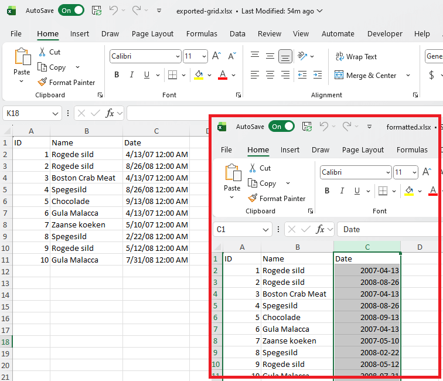

## Environment

| Version | Product | Author | 
| ---- | ---- | ---- | 
| 2025.3.806| RadSpreadProcessing |[Desislava Yordanova](https://www.telerik.com/blogs/author/desislava-yordanova)| 

## Description

Learn how to apply a custom date format (e.g., "yyyy-MM-dd") to the relevant columns in the exported Excel file generated from UI Grid components offered by the Telerik family.

 

## Solution

To change the date format in the exported Excel file, use [RadSpreadProcessing]() to modify the exported stream before saving the file.

Follow these steps:

1. Export the grid data to a `MemoryStream`.
2. Load the exported stream into a workbook using the [XlsxFormatProvider]().
3. Apply a custom [date format](#date-and-time-formatting) to the desired column in the workbook.
4. Save the modified workbook to a file.

Here is an example implementation:

```csharp
static void Main(string[] args)
{
    // Step 1: Export the grid data to a MemoryStream
    var exportedExcelStream = new MemoryStream(File.ReadAllBytes("exported-grid.xlsx"));

    // Step 2: Load the exported stream into a workbook
    XlsxFormatProvider formatProvider = new XlsxFormatProvider();
    Workbook workbook = formatProvider.Import(exportedExcelStream, TimeSpan.FromSeconds(10));

    // Step 3: Apply date format to the desired column (e.g., column index 2 for Dates)
    CellValueFormat dateFormat = new CellValueFormat("yyyy-MM-dd");
    ColumnSelection dateColumn = workbook.Worksheets[0].Columns[2]; // Update index as needed
    dateColumn.SetFormat(dateFormat);

    // Step 4: Save the modified workbook to a file
    string outputFilePath = "formatted.xlsx";
    File.WriteAllBytes(outputFilePath, formatProvider.Export(workbook, TimeSpan.FromSeconds(10)));
    Process.Start(new ProcessStartInfo() { FileName = outputFilePath, UseShellExecute = true });
}
```

### Explanation

- **Step 1:** Reads the exported Excel file into a `MemoryStream`.
- **Step 2:** Utilizes `XlsxFormatProvider` to parse the stream into a `Workbook` object for manipulation.
- **Step 3:** Sets a custom date format for the targeted column using `SetFormat`.
- **Step 4:** Saves the updated workbook and opens the file using the default application.

## See Also

- [XlsxFormatProvider]()
- [Date and Time Formatting](#date-and-time-formatting) 
