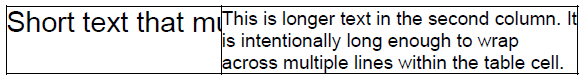

## Environment

| Version | Product | Author | 
| --- | --- | ---- | 
| 2026.3.826 | RadPdfProcessing | [Desislava Yordanova](https://www.telerik.com/blogs/author/desislava-yordanova) | 

## Description

In [RadPdfProcessing](), text inserted into a `TableCell` automatically wraps onto subsequent lines when it exceeds the cell's allocated column width. There is no built-in `NoWrap` or `Clip` property on `TableCell` to truncate or clip text on a single line.

However, certain report layouts require a specific table cell to clip or truncate overflowing text without wrapping, while other cells in the same table row wrap their content across multiple lines normally.

This article demonstrates how to combine `Table` layout with `FixedContentEditor.PushClipping()` to draw clipped single-line text over a table cell while allowing adjacent cells to wrap.



## Solution

To achieve this layout:

1. Create a `Table` with `TableLayoutType.FixedWidth`.
2. Define the first cell with a `PreferredWidth` and a spacer `Block` whose `LineSpacingType = HeightType.Exact` matches the desired cell height so the row reserves space.
3. In the second cell (`wrappingCell`), insert the multi-line text into a `Block` so it wraps naturally within its column width.
4. Draw the table onto the `RadFixedPage` using `FixedContentEditor.DrawTable()`.
5. Create a `FixedContentEditor` instance, define the clipping boundary matching the first cell (`cellBounds`), and call `PushClipping(cellBounds)` to draw single-line text using `DrawText()`. Any text that extends beyond the cell's width is clipped instead of wrapped.

The following complete example demonstrates the implementation:

```csharp
using System;
using System.Diagnostics;
using System.IO;
using Telerik.Windows.Documents.Fixed.FormatProviders.Pdf;
using Telerik.Windows.Documents.Fixed.Model;
using Telerik.Windows.Documents.Fixed.Model.ColorSpaces;
using Telerik.Windows.Documents.Fixed.Model.Data;
using Telerik.Windows.Documents.Fixed.Model.Editing;
using Telerik.Windows.Documents.Fixed.Model.Editing.Flow;
using Telerik.Windows.Documents.Fixed.Model.Editing.Tables;
#if WINDOWS
using System.Windows;
#else
using Telerik.Documents.Primitives;
#endif

namespace ClipTableCellTextExample
{
    class Program
    {
        static void Main(string[] args)
        {
            RadFixedDocument document = new RadFixedDocument();

            RadFixedPage page = document.Pages.AddPage();
            Rect cellBounds = new Rect(10, 100, 150, 40);

            Table table = new Table();
            Border border = new Border(1, BorderStyle.Single, new RgbColor(0, 0, 0));
            table.Borders = new TableBorders(border);
            table.DefaultCellProperties.Borders = new TableCellBorders(border, border, border, border);
            table.LayoutType = TableLayoutType.FixedWidth;

            TableRow row = table.Rows.AddTableRow();
            TableCell cell = row.Cells.AddTableCell();
            cell.PreferredWidth = cellBounds.Width;

            Block cellLayout = cell.Blocks.AddBlock();
            cellLayout.LineSpacingType = HeightType.Exact;
            cellLayout.LineSpacing = cellBounds.Height;
            cellLayout.InsertText(" ");

            TableCell wrappingCell = row.Cells.AddTableCell();
            wrappingCell.PreferredWidth = 250;
            wrappingCell.Blocks.AddBlock().InsertText(
                "This is longer text in the second column. It is intentionally long enough to wrap across multiple lines within the table cell.");

            FixedContentEditor tableEditor = new FixedContentEditor(page, new SimplePosition());
            tableEditor.Position.Translate(cellBounds.X, cellBounds.Y);
            tableEditor.DrawTable(table);

            FixedContentEditor textEditor = new FixedContentEditor(page, new SimplePosition());
            textEditor.TextProperties.FontSize = 20;

            using (textEditor.PushClipping(cellBounds))
            {
                textEditor.Position.Translate(cellBounds.X, cellBounds.Y);
                textEditor.DrawText("Short text that must not wrap");
            }

            string outputPath = Path.Combine(AppContext.BaseDirectory, "two-line-document.pdf");
            byte[] exportedPdf = new PdfFormatProvider().Export(document, null);
            File.WriteAllBytes(outputPath, exportedPdf);

            Process.Start(new ProcessStartInfo
            {
                FileName = outputPath,
                UseShellExecute = true
            });
        }
    }
}
```

## See Also

* [RadPdfProcessing Table Overview]()
* [TableCell]()
* [Block]()
* [FixedContentEditor]()
* [Clipping in RadPdfProcessing]()
