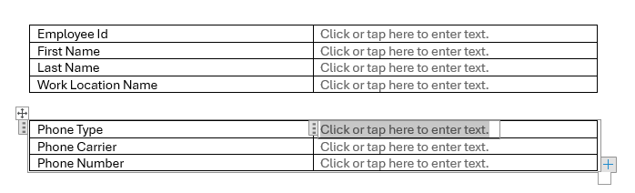
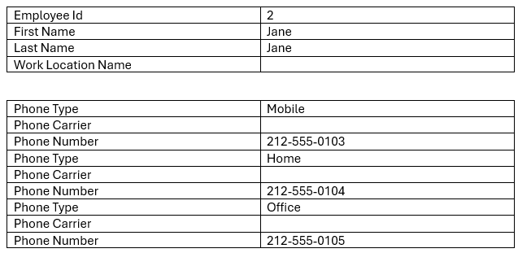

## Environment

| Version | Product | Author | 
| --- | --- | ---- | 
| 2024.3.806| RadWordsProcessing |[Desislava Yordanova](https://www.telerik.com/blogs/author/desislava-yordanova)| 

## Description 

When working with MS Word documents that contain [Content Controls](), it's straightforward to map model properties to the appropriate content control. However, cloning a [RepeatingSection][Content Controls](#repeatingsection) with content controls inside presents a challenge as there seems to be no direct method to clone a repeating section content control along with its contents. 

This KB article shows a sample approach how to duplicate the content controls inside a [RepeatingSection][Content Controls](#repeatingsection) in a Word document and populate them with data considering the mapped object.   

|Original Document|Result Document|
|----|----|
|||

## Solution 

Let's have an Employee object defined below. We need to use the  [RepeatingSection][Content Controls](#repeatingsection) to list all of the telephones associated with the respective Employee.

```csharp
    public class Employee
    {
        public int EmployeeId { get; set; }
        public string FirstName { get; set; }
        public string LastName { get; set; }
        public DateTime Dob { get; set; }
        public int WorkLocationId { get; set; }
        public WorkLocation WorkLocation { get; set; }
        public List<Telephone> Phones { get; set; } = new List<Telephone>();
    }

    public class Telephone
    {
        public int Id { get; set; }
        public string Carrier { get; set; }
        public string PhoneNumber { get; set; }
        public int PhoneTypeId { get; set; }
        public TelephoneType PhoneType { get; set; }
    }

    public class TelephoneType
    {
        public int Id { get; set; }
        public string Name { get; set; }

        public override string ToString()
        {
            return this.Name;
        }
    }
```
To simulate the MS Word behavior of duplicating a repeating section with all the content controls within the section, you can follow the custom approach detailed below. This solution involves generating table rows based on the number of instances in a collection, such as a list of telephone numbers associated with an employee. Note that this solution is custom and may require adjustments to fit specific requirements.

1. **Enumerate Content Controls and Identify Repeating Sections**: Iterate through all content controls in the document and identify those that are type `SdtType.RepeatingSection`.

2. **Clone Repeating Sections Programmatically**: For each identified repeating section, dynamically create and populate new table rows based on the data in the collection associated with the repeating section.

3. **Remove Original Repeating Section Content Controls**: After cloning and populating the new sections, remove the original repeating section content controls from the document to avoid duplication.

The following code snippet demonstrates how to populate a template document with dynamic data by cloning repeating section content controls:

```csharp
        static void Main(string[] args)
        {
            DocxFormatProvider provider = new DocxFormatProvider();
            var (employees, _, _) = MockDataGenerator.GenerateMockData();
            List<Employee> allEmployees = employees;
            int EmployeeId = 2;
            Employee employee = allEmployees.FirstOrDefault(e => e.EmployeeId == EmployeeId);
            RadFlowDocument document;
            using (Stream stream = File.OpenRead("SampleDocContentControls.docx"))
            {
                document = provider.Import(stream);
            }

            PopulateTemplate(document, employee);
            string outputFilePath = "Sample.docx";
            using (Stream output = File.OpenWrite(outputFilePath))
            {
                provider.Export(document, output);
            }

            Process.Start(new ProcessStartInfo() { FileName = outputFilePath, UseShellExecute = true });
        }
        private static void SetContentControlValue(SdtRangeStart contentControl, string value)
        {
            var paragraph = contentControl.Paragraph;
            if (paragraph != null)
            {
                paragraph.Inlines.Clear();
                paragraph.Inlines.AddRun(value);
            }
        }
        private static object GetValueFromEmployee(object instance, string tag)
        {
            string propertyPath = tag.Contains(".") ? tag.Substring(tag.LastIndexOf(".")+1) : tag;

            return GetValueFromObject(instance, propertyPath);
        }

        private static object GetValueFromObject(object obj, string propertyPath)
        {
            var properties = propertyPath.Split('.');
            object value = obj;

            foreach (var prop in properties)
            {
                if (value == null)
                {
                    return string.Empty;
                }

                // Handle collection properties
                if (value is IEnumerable<object> collection)
                {
                    if (int.TryParse(prop, out int index))
                    {
                        value = collection.ElementAtOrDefault(index);
                        if (value == null)
                        {
                            return string.Empty;
                        }
                    }
                    else
                    {
                        return string.Join(", ", collection.Select(item => GetValueFromObject(item,
                            string.Join(".", properties.Skip(Array.IndexOf(properties, prop))))));
                    }
                    continue;
                }

                var propInfo = value.GetType().GetProperty(prop);
                if (propInfo == null)
                {
                    return string.Empty;
                }
                value = propInfo.GetValue(value);
            }
            return value;
        }

        private static void PopulateTemplate(RadFlowDocument document, Employee employee)
        {
            var contentControls = document.EnumerateChildrenOfType<SdtRangeStart>().ToList();

            foreach (var contentControl in contentControls)
            {
                if (string.IsNullOrEmpty(contentControl.SdtProperties.Tag))
                    continue;

                if (contentControl.SdtProperties.Type == SdtType.RepeatingSection)
                {
                    var value = GetValueFromEmployee(employee, contentControl.SdtProperties.Tag);
                    List<Telephone> telephones = value as List<Telephone>;
                    if (telephones==null)
                    {
                        continue;
                    }
                    TableRow startRow = contentControl.Paragraph.Parent.Parent as TableRow;
                    TableRow endRow = contentControl.End.Paragraph.Parent.Parent as TableRow;
                    Table repeatingTable = startRow.Table;
                    int startIndex = repeatingTable.Rows.IndexOf(startRow);
                    int endIndex = repeatingTable.Rows.IndexOf(endRow);
                    foreach (Telephone tel in telephones)
                    {
                        for (int k = startIndex; k < endIndex + 1; k++)
                        {
                            TableRow newRow = repeatingTable.Rows.AddTableRow();
                            TableCell cell = newRow.Cells.AddTableCell();
                            cell.PreferredWidth = repeatingTable.Rows[k].Cells[0].PreferredWidth;
                            Paragraph p = repeatingTable.Rows[k].Cells[0].Blocks[0] as Paragraph;
                            string telPropName = (p.Inlines.Last() as Run).Text;
                            cell.Blocks.AddParagraph().Inlines.AddRun(telPropName);
                            cell = newRow.Cells.AddTableCell();
                            cell.PreferredWidth = repeatingTable.Rows[k].Cells[1].PreferredWidth;
                            var telValue = GetValueFromEmployee(tel, telPropName.Replace(" ", string.Empty));
                            cell.Blocks.AddParagraph().Inlines.AddRun(telValue?.ToString() ?? string.Empty);
                        }
                    }
                    for (int z = startIndex; z < endIndex + 1; z++)
                    {
                        repeatingTable.Rows.RemoveAt(0);
                    }
                    RadFlowDocumentEditor editor = new RadFlowDocumentEditor(document);
                    editor.RemoveStructuredDocumentTag(contentControl,false);
                }
                else
                {

                    var value = GetValueFromEmployee(employee, contentControl.SdtProperties.Tag);
                    SetContentControlValue(contentControl, value?.ToString() ?? string.Empty);
                }
            }
        }
```

The MockDataGenerator is responsible for returning sample data:

```csharp
    public static class MockDataGenerator
    {
        public static (List<Employee> Employees, List<WorkLocation> WorkLocations,
            List<TelephoneType> PhoneTypes) GenerateMockData()
        {
            // Create WorkLocations
            var workLocations = new List<WorkLocation>
        {
            new WorkLocation { Id = 1, Name = "Los Angeles", Description = "West Coast HQ" },
            new WorkLocation { Id = 2, Name = "New York", Description = "East Coast Office" },
            new WorkLocation { Id = 3, Name = "Boston", Description = "Research Center" }
        };

            // Create PhoneTypes
            var phoneTypes = new List<TelephoneType>
        {
            new TelephoneType { Id = 1, Name = "Mobile" },
            new TelephoneType { Id = 2, Name = "Office" },
            new TelephoneType { Id = 3, Name = "Home" }
        };

            // Create Employees with Phones
            var employees = new List<Employee>
        {
            new Employee
            {
                EmployeeId = 1,
                FirstName = "John",
                LastName = "Doe",
                Dob = new DateTime(1985, 5, 15),
                WorkLocationId = 1,
                WorkLocation = workLocations[0],
                Phones = new List<Telephone>
                {
                    new Telephone { Id = 1, Carrier = "Verizon", PhoneNumber = "310-555-0101",
                        PhoneTypeId = 1, PhoneType = phoneTypes[0] },
                    new Telephone { Id = 2, Carrier = "AT&T", PhoneNumber = "310-555-0102",
                        PhoneTypeId = 2, PhoneType = phoneTypes[1] }
                }
            },
            new Employee
            {
                EmployeeId = 2,
                FirstName = "Jane",
                LastName = "Smith",
                Dob = new DateTime(1990, 8, 22),
                WorkLocationId = 2,
                WorkLocation = workLocations[1],
                Phones = new List<Telephone>
                {
                    new Telephone { Id = 3, Carrier = "T-Mobile", PhoneNumber = "212-555-0103",
                        PhoneTypeId = 1, PhoneType = phoneTypes[0] },
                    new Telephone { Id = 4, Carrier = "Sprint", PhoneNumber = "212-555-0104",
                        PhoneTypeId = 3, PhoneType = phoneTypes[2] },
                    new Telephone { Id = 5, Carrier = "AT&T", PhoneNumber = "212-555-0105",
                        PhoneTypeId = 2, PhoneType = phoneTypes[1] }
                }
            },
            new Employee
            {
                EmployeeId = 3,
                FirstName = "Robert",
                LastName = "Johnson",
                Dob = new DateTime(1988, 3, 10),
                WorkLocationId = 3,
                WorkLocation = workLocations[2],
                Phones = new List<Telephone>
                {
                    new Telephone { Id = 6, Carrier = "Verizon", PhoneNumber = "617-555-0106",
                        PhoneTypeId = 1, PhoneType = phoneTypes[0] },
                    new Telephone { Id = 7, Carrier = "AT&T", PhoneNumber = "617-555-0107",
                        PhoneTypeId = 2, PhoneType = phoneTypes[1] }
                }
            },
            new Employee
            {
                EmployeeId = 4,
                FirstName = "Maria",
                LastName = "Garcia",
                Dob = new DateTime(1992, 11, 28),
                WorkLocationId = 1,
                WorkLocation = workLocations[0],
                Phones = new List<Telephone>
                {
                    new Telephone { Id = 8, Carrier = "T-Mobile", PhoneNumber = "310-555-0108",
                        PhoneTypeId = 1, PhoneType = phoneTypes[0] },
                    new Telephone { Id = 9, Carrier = "Verizon", PhoneNumber = "310-555-0109",
                        PhoneTypeId = 2, PhoneType = phoneTypes[1] },
                    new Telephone { Id = 10, Carrier = "AT&T", PhoneNumber = "310-555-0110",
                        PhoneTypeId = 3, PhoneType = phoneTypes[2] }
                }
            }
        };

            return (employees, workLocations, phoneTypes);
        }
    }
```

Usually, the content controls are mostly used by the editor controls like MS Word that allow the end user fill the required data. In case you are planning to edit the document programmatically, the [MailMerge]() functionality should be also considered as an appropriate solution.


## See Also

- [Content Controls]()
- [Populate a Table with Data using Nested Mail Merge Functionality]()
- [Generating a Word Document with Data Using MailMerge in RadWordsProcessing]()
- [Mail Merge Functionality in RadWordsProcessing]()
