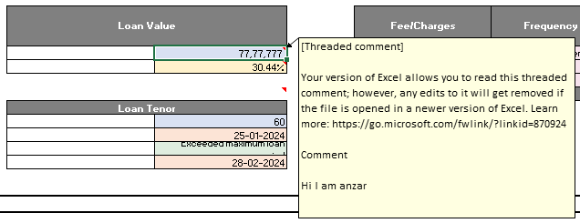
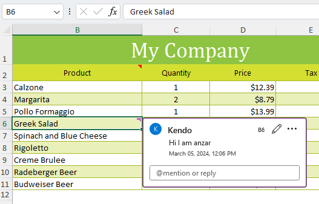
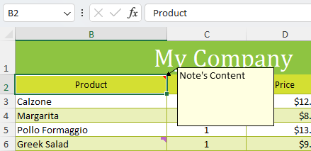

## Environment

| Version | Product | Author | 
| --- | --- | ---- | 
| 2024.1.124 | RadWordsProcessing |[Desislava Yordanova](https://www.telerik.com/blogs/author/desislava-yordanova)| 

## Description

When opening XLSX files in MS Excel, the comments may appear as threaded comments. This article explains the reason behind this behavior.

## Solution

The [SpreadProcessing]() library supports both [Comments]() and [Notes]() in Excel. The difference between them is as follows:

* **Comments**: These are the traditional comments that were available in earlier versions of Excel. They are anchored as small purple triangles in the corners of cells and can be viewed by hovering over the cell. Each comment can be replied to, forming a thread of information.

* **Notes**: Notes are used for making annotations about the data.

Microsoft rebranded their Comments to Notes, and added the ability to add comments to comments. This is now known as Threaded Comments or Comments. That is why some documents may have Comments and others have Notes. It depends on the MS Excel version on which the document was generated.

> For more information about the changes in the Excel functionality, refer to the [Comments and Notes Updates in Excel](https://support.microsoft.com/en-us/office/the-difference-between-threaded-comments-and-notes-75a51eec-4092-42ab-abf8-7669077b7be3) article.

The Telerik Document Processing libraries do not affect this changed behavior in MS Excel and how the documents are generated or displayed. The libraries provide both Comments and Notes functionalities. No matter what document is imported in the SpreadProcessing library, you can iterate both collections and extract whatever data is stored.

## See Also

* [Comments]()
* [Notes]()
