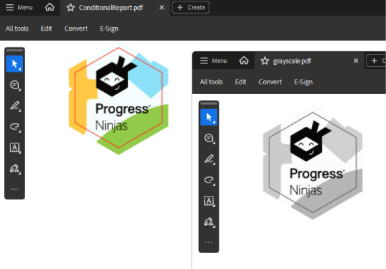

## Environment

| Version | Product | Author | 
| ---- | ---- | ---- | 
| 2024.4.1106| RadPdfProcessing |[Desislava Yordanova](https://www.telerik.com/blogs/author/desislava-yordanova)| 

## Description

This article shows a sample approach how to convert a **colored** PDF document to a **grayscale** one with [RadPdfProcessing](). 

   

## Solution

To convert a colored PDF file to black and white using Telerik Document Processing, follow the steps below:

1. Use the [RadPdfProcessing]() library to import the PDF file.
2. Iterate through the content of the PDF file, including [Path](), [TextFragment](), and [Image]() instances.
3. Modify the colors to grayscale and export the processed file as a new PDF document.

Here is a complete code snippet that demonstrates how to achieve this conversion:

```csharp
using System;
using System.Diagnostics;
using System.Windows.Media;
using System.Windows.Media.Imaging;
using Telerik.Windows.Documents.Fixed.FormatProviders.Pdf;
using Telerik.Windows.Documents.Fixed.Model;
using Telerik.Windows.Documents.Fixed.Model.ColorSpaces;
using Telerik.Windows.Documents.Fixed.Model.Common;
using Telerik.Windows.Documents.Fixed.Model.Graphics;
using Telerik.Windows.Documents.Fixed.Model.Objects;
using Telerik.Windows.Documents.Fixed.Model.Text;

namespace _1675661GrayScalePDF
{
    internal class Program
    {
        static void Main(string[] args)
        {
            var reportProcessor = new Telerik.Reporting.Processing.ReportProcessor();
            var deviceInfo = new System.Collections.Hashtable();
            var reportSource = new Telerik.Reporting.UriReportSource();
            reportSource.Uri = "ConditionalReport.trdp";

            Telerik.Reporting.Processing.RenderingResult result = reportProcessor.RenderReport("PDF", reportSource, deviceInfo);

            if (!result.HasErrors)
            {
                string fileName = result.DocumentName + "." + result.Extension;
                string path = System.IO.Path.GetTempPath();
                string filePath = System.IO.Path.Combine(path, fileName);

                using (System.IO.FileStream fs = new System.IO.FileStream(filePath, System.IO.FileMode.Create))
                {
                    fs.Write(result.DocumentBytes, 0, result.DocumentBytes.Length);
                }

                Process.Start(new ProcessStartInfo() { FileName = filePath, UseShellExecute = true });

                PdfFormatProvider provider = new PdfFormatProvider();
                RadFixedDocument document = provider.Import(System.IO.File.ReadAllBytes(filePath));

                foreach (RadFixedPage page in document.Pages)
                {
                    foreach (ContentElementBase element in page.Content)
                    {
                        MakeGrayscale(element);
                    }
                }

                string resultFile = "grayscale.pdf";

                if (System.IO.File.Exists(resultFile))
                {
                    System.IO.File.Delete(resultFile);
                }

                System.IO.File.WriteAllBytes(resultFile, provider.Export(document, TimeSpan.FromSeconds(10)));
                Process.Start(resultFile);

            }
        }
        private static void MakeGrayscale(ContentElementBase element)
        {
            TextFragment text = element as TextFragment;

            if (text != null)
            {
                text.Stroke = MakeGrayscale(text.Stroke);
                text.Fill = MakeGrayscale(text.Fill);
            }


            if (element is Path path)
            {
                path.Stroke = MakeGrayscale(path.Stroke);
                path.Fill = MakeGrayscale(path.Fill);
            }

            Image image = element as Image;

            if (image != null)
            {
                BitmapSource originalImage = image.ImageSource.GetBitmapSource();
                BitmapSource grayscaleImage = MakeGrayscale(originalImage);
                image.ImageSource = new Telerik.Windows.Documents.Fixed.Model.Resources.ImageSource(grayscaleImage);
            }
        }

        private static BitmapSource MakeGrayscale(BitmapSource source)
        {
            byte?[,] intensities = GetPixelsIntensity(source);
            BitmapSource grayscaleSource = CreateImageFromGrayPixels(intensities);

            return grayscaleSource;
        }

        private static ColorBase MakeGrayscale(ColorBase color)
        {
            RgbColor rgb = (RgbColor)color;

            byte gray = GetGrayIntensity(rgb.R, rgb.G, rgb.G);

            return new RgbColor(rgb.A, gray, gray, gray);
        }

        private static BitmapSource CreateImageFromGrayPixels(byte?[,] pixels)
        {
            double dpi = 96;
            int height = pixels.GetLength(0);
            int width = pixels.GetLength(1);
            byte[] pixelData = new byte[width * height];

            for (int y = 0; y < height; ++y)
            {
                int yIndex = y * width;
                for (int x = 0; x < width; ++x)
                {
                    pixelData[x + yIndex] = pixels[y, x] ?? 255;
                }
            }

            BitmapSource bmpSource = BitmapSource.Create(width, height, dpi, dpi, PixelFormats.Gray8, null, pixelData, width);

            return bmpSource;
        }

        private static byte?[,] GetPixelsIntensity(BitmapSource bitmapSource)
        {
            int width = bitmapSource.PixelWidth;
            int height = bitmapSource.PixelHeight;
            byte?[,] intensities = new byte?[height, width];
            int[] pixels = GetPixels(bitmapSource);
            int pixelIndex = 0;

            for (int i = 0; i < height; i++)
            {
                for (int j = 0; j < width; j++)
                {
                    byte a, r, g, b;
                    GetComponentsFromPixel(pixels[pixelIndex++], out a, out r, out g, out b);
                    byte? intensity;
                    if (a == 0)
                    {
                        intensity = null;
                    }
                    else
                    {
                        intensity = (byte)((a / 255.0) * GetGrayIntensity(r, g, b));
                        intensity = intensity.Value < 255 ? ((byte)(intensity.Value + 1)) : intensity.Value;
                    }

                    intensities[i, j] = intensity;
                }
            }

            return intensities;
        }

        private static void GetComponentsFromPixel(int pixel, out byte a, out byte r, out byte g, out byte b)
        {
            b = (byte)(pixel & 0xFF);
            g = (byte)((pixel >> 8) & 0xFF);
            r = (byte)((pixel >> 16) & 0xFF);
            a = (byte)((pixel >> 24) & 0xFF);
        }

        private static int[] GetPixels(BitmapSource source)
        {
            int[] pixels = new int[source.PixelWidth * source.PixelHeight];
            if (source.Format == PixelFormats.Bgr32 || source.Format == PixelFormats.Bgra32 || source.Format == PixelFormats.Pbgra32)
            {
                checked
                {
                    source.CopyPixels(pixels, source.PixelWidth * 4, 0);
                }
            }
            else if (source.Format == PixelFormats.Indexed8)
            {
                byte[] indices = new byte[source.PixelWidth * source.PixelHeight];
                source.CopyPixels(indices, source.PixelWidth, 0);
                for (int i = 0; i < indices.Length; ++i)
                {
                    Color c = source.Palette.Colors[indices[i]];
                    pixels[i] = (c.A << 24) | (c.R << 16) | (c.G << 8) | (c.B << 0);
                }
            }
            else
            {
                FormatConvertedBitmap converted = new FormatConvertedBitmap(source, PixelFormats.Bgra32, null, 0);
                converted.CopyPixels(pixels, source.PixelWidth * 4, 0);
            }

            return pixels;
        }

        private static byte GetGrayIntensity(byte r, byte g, byte b)
        {
            return (byte)(0.2126 * r + 0.7152 * g + 0.0722 * b);
        }
    }
}
```

Ensure to adjust the `MakeGrayscale` methods for `ColorBase`, `Path`, and `Image` according to your specific needs. This sample demonstrates the basic approach to converting document elements to grayscale but might require adjustments for complex scenarios or specific color processing requirements.

## See Also

- [RadPdfProcessing Overview]()
- [How to Generate a PDF Document from Images with FixedContentEditor]() 
- [How to Generate a PDF Document from Images with RadFixedDocumentEditor]()
