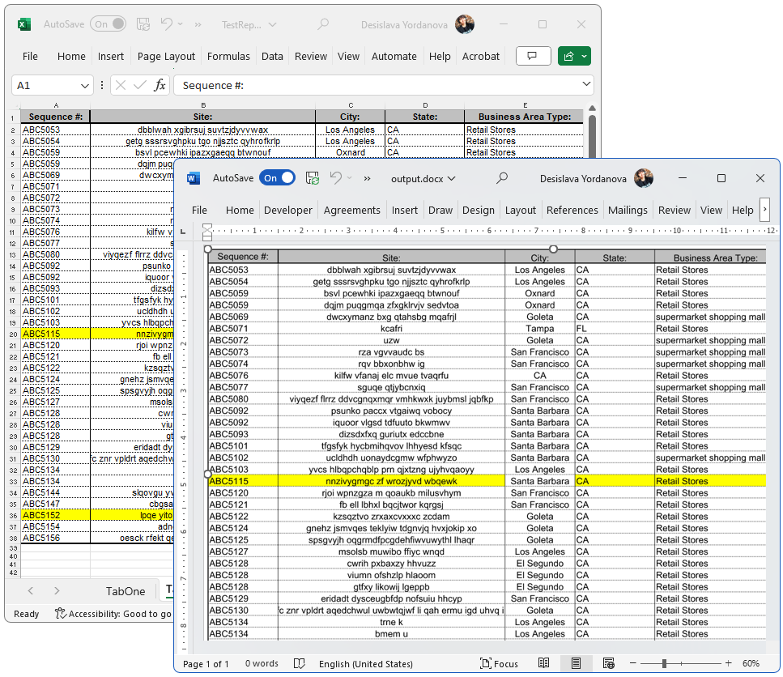

## Environment
| Version | Product | Author | 
| --- | --- | ---- | 
| 2024.1.124 | Document Processing Libraries (.NET Standard)|[Desislava Yordanova](https://www.telerik.com/blogs/author/desislava-yordanova)| 

## Description
A common requirement is to convert XSLX documents to DOCX format. However, direct conversion is not supported.

This tutorial demonstrates a sample approach how to convert an Excel document into an image and insert it into a Word document.

  

## Solution
To accomplish this task, we will need to use [RadSpreadProcessing](), [RadPdfProcessing]() and [RadWordsProcessing]() libraries. Follow the steps below:

1. Import the Excel file as a Workbook using the [XlsxFormatProvider]() from the SpreadProcessing library.
2. Select the desired range of the content to export.
3. Export the selected range as a PDF document using the [PdfFormatProvider]() that RadSpreadProcessing offers.
4. Import the exported PDF file using the [PdfFormatProvider]() from the RadPdfProcessing library.
5. Export the PDF pages as images using the [SkiaImageFormatProvider]().
6. Create a [RadFlowDocument]() using the WordsProcessing library.
7. [Insert the exported images]() into the RadFlowDocument.
8. Export the RadFlowDocument as a DOCX file using the [DocxFormatProvider]().

Here is a complete code snippet that demonstrates this functionality:

```csharp
using Telerik.Windows.Documents.Spreadsheet.FormatProviders.OpenXml.Xlsx;
using Telerik.Windows.Documents.Spreadsheet.FormatProviders;
using Telerik.Windows.Documents.Spreadsheet.Model;
using Telerik.Windows.Documents.Fixed.Model;
using Telerik.Documents.Fixed.FormatProviders.Image.Skia;
using Telerik.Windows.Documents.Extensibility;
using Telerik.Windows.Documents.Spreadsheet.Extensibility;
using Telerik.Windows.Documents.Model;
using Telerik.Windows.Documents.Spreadsheet.Model.Printing;
using Telerik.Documents.Primitives;
using Telerik.Windows.Documents.Primitives;
using Telerik.Windows.Documents.Flow.FormatProviders.Docx;
using Telerik.Windows.Documents.Flow.Model;

// Step 1. Start with XLSX---------------------------------

Workbook workbook;
IWorkbookFormatProvider xlsxFormatProvider = new XlsxFormatProvider();

using (Stream input = new FileStream(@"..\..\..\..\TestReport.xlsx", FileMode.Open))
{
    workbook = xlsxFormatProvider.Import(input);
}

//Set export settings
WorksheetPageSetup pageSetup = workbook.ActiveWorksheet.WorksheetPageSetup;
pageSetup.PageOrientation = PageOrientation.Landscape;
pageSetup.Margins = new PageMargins(0, 0, 0, 0);
pageSetup.PaperType = PaperTypes.A1; /*make sure the size of the PaperType is bigger than the dimentions from the used range of cells*/

Telerik.Windows.Documents.Spreadsheet.FormatProviders.Pdf.PdfFormatProvider spreadPdfFormatProvider = new Telerik.Windows.Documents.Spreadsheet.FormatProviders.Pdf.PdfFormatProvider();
spreadPdfFormatProvider.ExportSettings = new Telerik.Windows.Documents.Spreadsheet.FormatProviders.Pdf.Export.PdfExportSettings(ExportWhat.ActiveSheet, true);

// Step 2. Export to PDF-----------------------------------

SpreadTextMeasurerBase fixedTextMeasurer = new SpreadFixedTextMeasurer();
SpreadExtensibilityManager.TextMeasurer = fixedTextMeasurer;
string pdfOutput = @"..\..\..\..\output.pdf";
using (Stream output = File.OpenWrite(pdfOutput))
{
    spreadPdfFormatProvider.Export(workbook, output);
}

// Step 3. Import PDF--------------------------------------
RadFixedDocument document;
Telerik.Windows.Documents.Fixed.FormatProviders.Pdf.PdfFormatProvider fixedPdfFormatProvider = new Telerik.Windows.Documents.Fixed.FormatProviders.Pdf.PdfFormatProvider();

using (Stream input = File.OpenRead(pdfOutput))
{
    document = fixedPdfFormatProvider.Import(input);
}

// Step 4. Set new page size to ensure that the generated image will be with proper size
Size tableSize = CalculateRangeSize(workbook.ActiveWorksheet, workbook.ActiveWorksheet.UsedCellRange);
RadFixedPage fixedPage = document.Pages.First();
fixedPage.Size = new Size(tableSize.Width, tableSize.Height);

// Step 5. Export PDF to image
SkiaImageFormatProvider imageProvider = new SkiaImageFormatProvider();

int count = 1;
foreach (RadFixedPage page in document.Pages)
{
    byte[] resultImage = imageProvider.Export(page);
    File.WriteAllBytes("..\\..\\..\\..\\image " + count++ + ".jpg", resultImage);
}

// Step 6. Create new DOCX file and insert the PDF image

var wordFlowDocument = new Telerik.Windows.Documents.Flow.Model.RadFlowDocument();
 
Section section = wordFlowDocument.Sections.AddSection();
section.PageOrientation = PageOrientation.Landscape;
section.PageSize = new Telerik.Documents.Primitives.Size(tableSize.Width+20, tableSize.Height+20);
section.PageMargins = new Padding(10);

Telerik.Windows.Documents.Flow.Model.Editing.RadFlowDocumentEditor flowEditor = new Telerik.Windows.Documents.Flow.Model.Editing.RadFlowDocumentEditor(wordFlowDocument);
Telerik.Documents.Primitives.Size ImageSize = new Telerik.Documents.Primitives.Size(tableSize.Width, tableSize.Height);

using (Stream stream = new FileStream($"..\\..\\..\\..\\image 1.jpg", FileMode.Open))

{
    flowEditor.InsertImageInline(stream, "jpg", ImageSize);
}

// Step 7. Export the DOCX file 
DocxFormatProvider docxFormatProvider = new DocxFormatProvider();
using (Stream output = File.OpenWrite("..\\..\\..\\..\\output.docx"))
{
    docxFormatProvider.Export(wordFlowDocument, output);
}

Size CalculateRangeSize(Worksheet worksheet, CellRange range)
{
    double totalHeight = 0;
    double totalWidth = 0;

    for (int row = range.FromIndex.RowIndex; row <= range.ToIndex.RowIndex; row++)
    {
        double rowHeight = worksheet.Rows[row].GetHeight().Value.Value;
        totalHeight += rowHeight;
    }

    for (int column = range.FromIndex.ColumnIndex; column <= range.ToIndex.ColumnIndex; column++)
    {
        double columnWidth = worksheet.Columns[column].GetWidth().Value.Value;
        totalWidth += columnWidth;
    }

    return new Size(totalWidth, totalHeight);
}
```
>note Please be aware that the resolution of the exported images may vary depending on the settings used. You can adjust the image quality, compression, scale factor, and anti-aliasing properties in the SkiaImageFormatProvider to achieve the desired results.

# See Also
- [XlsxFormatProvider]() 
- [SkiaImageFormatProvider]()
- [PdfFormatProvider]()
