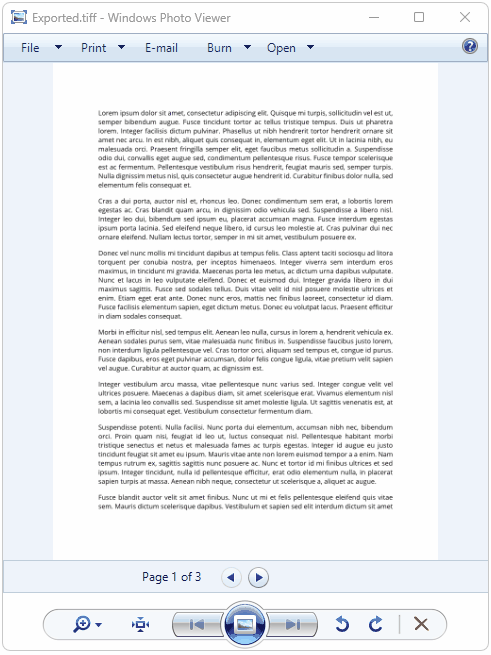

## Environment

| Version | Product | Author | 
| --- | --- | ---- | 
| 2024.2.426| RadPdfProcessing |[Desislava Yordanova](https://www.telerik.com/blogs/author/desislava-yordanova)| 

## Description

When working with PDF documents, a common task might be to convert the PDF pages into multipage TIFF images. This scenario arises due to the need for image-based representations of document pages, often for archival or compatibility reasons with certain systems that prefer image formats. Converting a PDF document to a multipage TIFF file can be challenging, as this functionality is not directly supported by many graphic applications, including Adobe. This KB article demonstrates how to convert PDF documents to multipage TIFF images using RadPdfProcessing.

  

## Solution

To convert a PDF document to a multipage TIFF image, follow the steps below:

1. Use the [PdfFormatProvider]() to import the PDF document.
2. Iterate through all the pages ([RadFixedPage]()) of the imported [RadFixedDocument](%slug radpdfprocessing-model-radfixeddocument%).
3. For each page, create a thumbnail image.
4. Render each thumbnail image onto a `RenderTargetBitmap`.
5. Add each rendered bitmap as a frame to a [TiffBitmapEncoder](https://learn.microsoft.com/en-us/dotnet/api/system.windows.media.imaging.tiffbitmapencoder?view=windowsdesktop-8.0).
6. Save the encoded TIFF image to a file.

Here is the code snippet demonstrating this process:

```csharp
[STAThread]
private static void Main(string[] args)
{
    string inputFilePath = @"path_to_your_pdf_document.pdf";
    PdfFormatProvider pdfProcessingProvider = new PdfFormatProvider();
    RadFixedDocument document = pdfProcessingProvider.Import(File.ReadAllBytes(inputFilePath));
    ThumbnailFactory factory = new ThumbnailFactory();
    BitmapEncoder encoder = new TiffBitmapEncoder();
    string exportedFileName = "Exported.tiff";
    using (FileStream fileStream = new FileStream(exportedFileName, FileMode.Create))
    {
        foreach (RadFixedPage page in document.Pages)
        {
            ImageSource imageSource = factory.CreateThumbnail(page, page.Size);
            System.Windows.Controls.Image image = new System.Windows.Controls.Image();
            image.Source = imageSource;
            Grid container = new Grid();
            container.Background = Brushes.White;
            container.Children.Add(image);
            container.Measure(new Size(double.PositiveInfinity, double.PositiveInfinity));
            container.Arrange(new Rect(new Point(0, 0), container.DesiredSize));

            RenderTargetBitmap bitmap = new RenderTargetBitmap((int)PageLayoutHelper.GetActualWidth(page), 
                (int)PageLayoutHelper.GetActualHeight(page), 96, 96, PixelFormats.Pbgra32);
            bitmap.Render(container);

            encoder.Frames.Add(BitmapFrame.Create(bitmap));
        }
        encoder.Save(fileStream);
    }
    Process.Start(new ProcessStartInfo() { FileName = exportedFileName, UseShellExecute = true });
}
```

## Required Assemblies

* Telerik.Windows.Controls.FixedDocumentViewers.dll
* Telerik.Windows.Documents.Core.dll
* Telerik.Windows.Documents.Fixed.dll
* WindowsBase.dll
* PresentationCore.dll

## Notes

- Ensure you have added references to the necessary Telerik Document Processing and WPF libraries in your project.
- Adjust the `inputFilePath` variable to point to your PDF document.
- The generated TIFF file will be saved with the name "Exported.tiff" in the project's directory. You can modify the `exportedFileName` variable to change the output file's name and location.

## See Also

- [RadPdfProcessing Overview]()
- [Export RadFixedPage to TIFF Image]()
- [TiffBitmapEncoder Class Documentation](https://docs.microsoft.com/en-us/dotnet/api/system.windows.media.imaging.tiffbitmapencoder)
- [Using SkiaImageFormatProvider]()
- [Converting Multi-page TIFF Images to PDF]()
