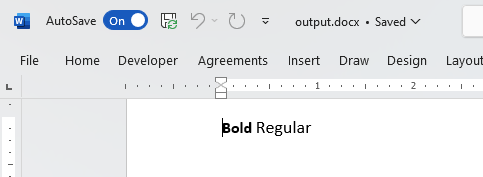

## Environment
| Version | Product | Author | 
| ---- | ---- | ---- | 
| 2024.1.124 | RadWordsProcessing |[Desislava Yordanova](https://www.telerik.com/blogs/author/desislava-yordanova)| 

## Description
Learn how to create a bold text part in a paragraph using RadWordsProcessing, while keeping the rest of the information regular. 

## Solution
To achieve bold text for a specific part of an inline element, such as a [Run](), you need to use two separate [Run]() objects with different font weights and sizes. Here is an example of how to accomplish this using Telerik [RadWordsProcessing]():

```csharp
RadFlowDocument document = new RadFlowDocument();
RadFlowDocumentEditor editor = new RadFlowDocumentEditor(document);
Section section = editor.InsertSection();
Paragraph paragraph = section.Blocks.AddParagraph();

Run articleTitle = new Run(document);
articleTitle.Text = "Bold ";
articleTitle.FontWeight = FontWeights.Bold;
articleTitle.FontSize = 16;
paragraph.Inlines.Add(articleTitle);

Run articleValue = new Run(document);
articleValue.Text = "Regular";
articleValue.FontWeight = FontWeights.Normal;
articleValue.FontSize = 18;
paragraph.Inlines.Add(articleValue);

Telerik.Windows.Documents.Flow.FormatProviders.Docx.DocxFormatProvider provider = new Telerik.Windows.Documents.Flow.FormatProviders.Docx.DocxFormatProvider();
string outputFilePath = "output.docx";
using (Stream output = File.OpenWrite(outputFilePath))
{ 
    provider.Export(document, output);
}

Process.Start(new ProcessStartInfo() { FileName = outputFilePath, UseShellExecute = true });
```
>note This code creates a `RadFlowDocument` and inserts a section and a paragraph. Two separate `Run` objects are used to define the bold and the regular text. Finally, the document is exported to a DOCX file and opened.

  

## See Also

* [Run]()
