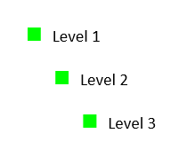

## Environment

| Version | Product | Author | 
| ---- | ---- | ---- | 
| 2025.4.1216 | RadWordsProcessing |[Yoan Karamanov](https://www.telerik.com/blogs/author/yoan-karamanov)| 

## Description

Learn how to create bullet lists using paragraph styles instead of direct paragraph formatting in [RadWordsProcessing](). This style-based approach provides better maintainability, consistency, and reusability compared to setting list properties directly on individual paragraphs.

## Solution

The style-based approach involves creating custom [paragraph styles]() that contain the list formatting information, then applying these styles to paragraphs. This method offers several advantages:

* **Centralized formatting**: Change the style once and all paragraphs update automatically
* **Better maintainability**: Easier to manage consistent formatting across large documents  
* **Improved interoperability**: Styles are preserved when copying content between documents
* **Template-friendly**: Perfect for document templates and automated generation

### Step-by-Step Implementation

Follow these steps to create bullet lists using paragraph styles:

1. **Create a RadFlowDocument** and add a bullet list template.
2. **Configure list properties** for all levels (bullet style, font, color, size).
3. **Create paragraph styles** that reference the list ID and specific levels.
4. **Add styles to the RadFlowDocument's StyleRepository**.
5. **Create paragraphs** and apply the styles using StyleId.
6. **Add text content** to the paragraphs.

```csharp
RadFlowDocument document = new RadFlowDocument();

List list = document.Lists.Add(ListTemplateType.BulletDefault);

// Set list properties
for (int i = 0; i < 8; i++)
{
    list.Levels[i].NumberingStyle = NumberingStyle.Bullet;
    list.Levels[i].NumberTextFormat = "◼";
    list.Levels[i].CharacterProperties.FontFamily.LocalValue = new ThemableFontFamily("Symbol");
    list.Levels[i].CharacterProperties.ForegroundColor.LocalValue = new ThemableColor(Color.FromRgb(0, 255, 0));
    list.Levels[i].CharacterProperties.FontSize.LocalValue = 20;
}

// Create paragraph style for list level 1
document.StyleRepository.Add(new Style("Numbering bullet 1", StyleType.Paragraph));
document.StyleRepository.Styles.Last().ParagraphProperties.ListId.LocalValue = list.Id;
document.StyleRepository.Styles.Last().ParagraphProperties.ListLevel.LocalValue = 1;

// Create paragraph style for list level 2
document.StyleRepository.Add(new Style("Numbering bullet 2", StyleType.Paragraph));
document.StyleRepository.Styles.Last().ParagraphProperties.ListId.LocalValue = list.Id;
document.StyleRepository.Styles.Last().ParagraphProperties.ListLevel.LocalValue = 2;

// Create paragraph style for list level 3
document.StyleRepository.Add(new Style("Numbering bullet 3", StyleType.Paragraph));
document.StyleRepository.Styles.Last().ParagraphProperties.ListId.LocalValue = list.Id;
document.StyleRepository.Styles.Last().ParagraphProperties.ListLevel.LocalValue = 3;

Telerik.Windows.Documents.Flow.Model.Section section = document.Sections.AddSection();

Paragraph paragrahLevel1 = section.Blocks.AddParagraph();
Run runLevel1 = paragrahLevel1.Inlines.AddRun(string.Format("Level 1"));
paragrahLevel1.StyleId = "Numbering bullet 1";

Paragraph paragrahLevel2 = section.Blocks.AddParagraph();
Run runLevel2 = paragrahLevel2.Inlines.AddRun(string.Format("Level 2"));
paragrahLevel2.StyleId = "Numbering bullet 2";

Paragraph paragrahLevel3 = section.Blocks.AddParagraph();
Run runLevel3 = paragrahLevel3.Inlines.AddRun(string.Format("Level 3"));
paragrahLevel3.StyleId = "Numbering bullet 3";
```


## See Also

* [Lists]()
* [Styles]()
* [Style Properties]()
* [Paragraph]()