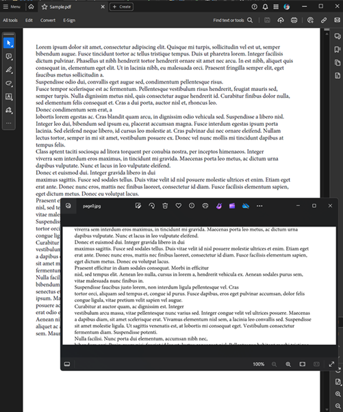

## Environment

| Version | Product | Author | 
| --- | --- | ---- | 
| 2024.2.426| RadPdfProcessing |[Desislava Yordanova](https://www.telerik.com/blogs/author/desislava-yordanova)| 

## Description

When working with PDF documents, you might encounter scenarios where you need to extract and crop a specific page to create a new PDF document. This article demonstrates how to use [RadPdfProcessing]() to crop a page from an existing PDF and save the cropped content as a new PDF document.

## Solution

To create a new PDF document from a cropped page of an existing PDF, follow these steps:

1. **Extract the desired page from the original PDF document.** Use the [PdfFileSource]() class to access the pages of the original PDF.

2. **Create a new PDF document with the extracted page.** Utilize the [PdfStreamWriter]() class to write the extracted page into a new PDF document.

3. **Crop the content of the newly created PDF.** Modify the `CropBox` of the `RadFixedPage` to specify the cropped area.

4. **Export the cropped document as a new PDF file.**

Here's a complete code snippet illustrating the process:

```csharp
        private static void CreateCroppedPagePDF()
        {
            string originalFilePath = @"WinForms PdfViewer.pdf";
            int pageIndex = 3;
            string outputPageFilePath = @"..\..\page3.pdf";
            File.Delete(outputPageFilePath);
            using (PdfFileSource fileToSplit = new PdfFileSource(File.OpenRead(originalFilePath)))
            {
                PdfPageSource page = fileToSplit.Pages[pageIndex];

                using (PdfStreamWriter fileWriter = new PdfStreamWriter(File.OpenWrite(outputPageFilePath)))
                {
                    fileWriter.WritePage(page);
                }
            }
            PdfFormatProvider provider = new PdfFormatProvider();
            RadFixedDocument croppedDocument = provider.Import(File.ReadAllBytes(outputPageFilePath));
            Rect middleRectangle = new Rect(0, croppedDocument.Pages.First().Size.Height / 3, croppedDocument.Pages.First().Size.Width, croppedDocument.Pages.First().Size.Height / 3);
            foreach (RadFixedPage page in croppedDocument.Pages)
            {
                page.CropBox = middleRectangle;
            }
            File.WriteAllBytes(outputPageFilePath, provider.Export(croppedDocument));
            Process.Start(new ProcessStartInfo() { FileName = outputPageFilePath, UseShellExecute = true });
        }
```

This code snippet demonstrates how to create a new PDF by cropping the center third of a specific page from an existing PDF document. The observed result is illustrated below:

 

## See Also

- [RadPdfProcessing Documentation]()
- [PdfStreamWriter]() 
- [Telerik Document Processing SDK Repository](https://github.com/telerik/document-processing-sdk)

---
