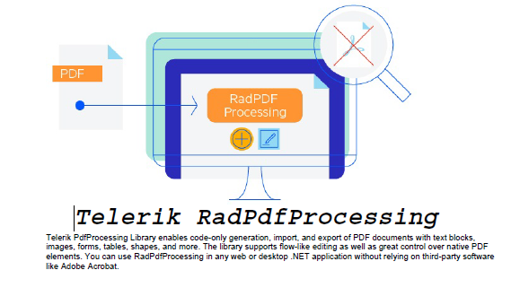

# Environment
| Version | Product | Author | 
| --- | --- | ---- | 
| 2024.1.124 | RadPdfProcessing |[Desislava Yordanova](https://www.telerik.com/blogs/author/desislava-yordanova)| 

# Description

This tutorial demonstrates a sample approach how to create a PDF document from scratch that contains a logo and text. 

# Solution

The powerful [FixedContentEditor]() allows you draw any element at the desired [Position]():

```
        public static System.Windows.Size pageSize = new System.Windows.Size(Unit.MmToDip(210), Telerik.Windows.Documents.Media.Unit.MmToDip(297));
        public static Padding pageMarginsValue = new Telerik.Windows.Documents.Primitives.Padding(
             Unit.MmToDip(20),//left
              Unit.MmToDip(0),//top
               Unit.MmToDip(0),//right
                Unit.MmToDip(0));//bottom
        public static double currentYposition = pageMarginsValue.Top;
        public static double currentXposition = pageMarginsValue.Left;
        public static double pageYLimit = pageSize.Height - pageMarginsValue.Bottom;
        public static double pageXLimit = pageSize.Width - pageMarginsValue.Right;
        static void Main(string[] args)
        {
            RadFixedDocument fixedDocument = new RadFixedDocument();

            DrawLogo(fixedDocument);
            DrawHeading(fixedDocument);
            DrawText(fixedDocument);


            PdfFormatProvider provider = new PdfFormatProvider();
            string outputFilePath = @"..\..\sample.pdf";
            File.Delete(outputFilePath);
            using (Stream output = File.OpenWrite(outputFilePath))
            {
                provider.Export(fixedDocument, output);
            }
            Process.Start(outputFilePath);
        }

        private static void DrawText(RadFixedDocument fixedDocument)
        {
            RadFixedPage fixedPage = fixedDocument.Pages.LastOrDefault();
            if (fixedPage == null) { fixedPage = fixedDocument.Pages.AddPage(); }
            FixedContentEditor fixedEditor = new FixedContentEditor(fixedPage);

            fixedEditor.Position.Translate(currentXposition, currentYposition);

            fixedEditor.TextProperties.Font = FontsRepository.HelveticaOblique;

            Block textBlock = new Block();

            string text = "Telerik PdfProcessing Library enables code-only generation, import, and export of PDF documents " +
                "with text blocks, images, forms, tables, shapes, and more. The library supports flow-like editing as well " +
                "as great control over native PDF elements. You can use RadPdfProcessing in any web or desktop .NET " +
                "application without relying on third-party software like Adobe Acrobat.";
            textBlock.InsertText(text);
            System.Windows.Size textBlockDesiredSize = textBlock.Measure();

            double desiredYLocationToDraw = currentYposition + textBlockDesiredSize.Height;
            double desiredXLocationToDraw = currentXposition + textBlockDesiredSize.Width;
            if (desiredYLocationToDraw > pageYLimit)
            {
                //add a new page if there is not enough remaining space on the current page
                currentYposition = pageMarginsValue.Top;
                currentXposition = pageMarginsValue.Left;
                fixedPage = fixedDocument.Pages.AddPage();
                fixedPage.Size = pageSize;
                fixedEditor = new FixedContentEditor(fixedPage);

            }
            if (desiredXLocationToDraw > pageXLimit)
            {
                currentXposition = pageMarginsValue.Left;
            }
            fixedEditor.Position.Translate(currentXposition, currentYposition);
            fixedEditor.DrawBlock(textBlock, new Size(pageSize.Width - pageMarginsValue.Right - pageMarginsValue.Left, double.PositiveInfinity));
            currentYposition += textBlock.ActualSize.Height;
            currentXposition += textBlock.ActualSize.Width;
            fixedEditor.Position.Translate(currentXposition, currentYposition);
        }

        private static void DrawHeading(RadFixedDocument fixedDocument)
        {
            RadFixedPage fixedPage = fixedDocument.Pages.LastOrDefault();
            if (fixedPage == null) { fixedPage = fixedDocument.Pages.AddPage(); }
            FixedContentEditor fixedEditor = new FixedContentEditor(fixedPage);
            fixedEditor.Position.Translate(pageMarginsValue.Left, currentYposition);

            Block textBlock = new Block();
            textBlock.TextProperties.Font = FontsRepository.CourierBoldOblique;
            textBlock.TextProperties.FontSize = 40;
            textBlock.HorizontalAlignment = Telerik.Windows.Documents.Fixed.Model.Editing.Flow.HorizontalAlignment.Center;

            string text = "Telerik RadPdfProcessing";
            textBlock.InsertText(text);
            System.Windows.Size textBlockDesiredSize = textBlock.Measure();

            double desiredYLocationToDraw = currentYposition + textBlockDesiredSize.Height;
            if (desiredYLocationToDraw > pageYLimit)
            {
                //add a new page if there is not enough remaining space on the current page
                currentYposition = pageMarginsValue.Top;
                currentXposition = pageMarginsValue.Left;
                fixedPage = fixedDocument.Pages.AddPage();
                fixedPage.Size = pageSize;
                fixedEditor = new FixedContentEditor(fixedPage);
                //move the cursor to the beginning of the new page
                fixedEditor.Position.Translate(currentXposition, currentYposition);
            }
            currentXposition = (fixedPage.Size.Width / 2) - (textBlockDesiredSize.Width / 2);
            fixedEditor.Position.Translate(currentXposition, currentYposition);

            fixedEditor.DrawBlock(textBlock);
            currentYposition += textBlock.ActualSize.Height;
            currentXposition += textBlock.ActualSize.Width;
            fixedEditor.Position.Translate(currentXposition, currentYposition);
        }

        private static void DrawLogo(RadFixedDocument fixedDocument)
        {
            RadFixedPage fixedPage = fixedDocument.Pages.LastOrDefault();
            if (fixedPage == null) { fixedPage = fixedDocument.Pages.AddPage(); }
            FixedContentEditor fixedEditor = new FixedContentEditor(fixedPage);
            fixedEditor.Position.Translate(pageMarginsValue.Left, currentYposition);
            using (Stream imageStream = File.OpenRead("pdf-processing-overview.jpg"))
            {
                Block imageBlock = new Block();
                imageBlock.SpacingAfter = 0;
                imageBlock.HorizontalAlignment = Telerik.Windows.Documents.Fixed.Model.Editing.Flow.HorizontalAlignment.Center;
                Telerik.Windows.Documents.Fixed.Model.Resources.ImageSource _imageSource =
                    new Telerik.Windows.Documents.Fixed.Model.Resources.ImageSource(imageStream);
                imageBlock.InsertImage(_imageSource);
                System.Windows.Size imageBlockDesiredSize = imageBlock.Measure();

                double desiredYLocationToDraw = currentYposition + imageBlockDesiredSize.Height;
                if (desiredYLocationToDraw > pageYLimit)
                {
                    //add a new page if there is not enough remaining space on the current page
                    currentYposition = pageMarginsValue.Top;
                    currentXposition = pageMarginsValue.Left;
                    fixedPage = fixedDocument.Pages.AddPage();
                    fixedPage.Size = pageSize;
                    fixedEditor = new FixedContentEditor(fixedPage);
                    //move the cursor to the beginning of the new page
                    fixedEditor.Position.Translate(currentXposition, currentYposition);

                }
                fixedEditor.DrawBlock(imageBlock);
                currentYposition += imageBlock.ActualSize.Height;
                currentXposition += imageBlock.ActualSize.Width;
                fixedEditor.Position.Translate(currentXposition, currentYposition);
            }
        }

```
The achieved result is illustrated below:



# See Also
- [FixedContentEditor]()
- [Position]()
