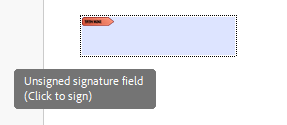

## Environment

| Version | Product | Author | 
| ---- | ---- | ---- | 
| 2025.1.205| RadPdfProcessing |[Desislava Yordanova](https://www.telerik.com/blogs/author/desislava-yordanova)| 

## Description
Learn how to create a PDF document with an empty signature field, which allows signing the document in any PDF viewer. The document should only contain the empty signature field, and when opened in a viewer, it should provide the option to sign.

 

## Solution

To create a PDF document with an empty [signature field]() using [RadPdfProcessing](), follow these steps:

1. Create a new PDF document and add a page.
2. Define the rectangle area for the [signature field]().
3. Create a signature field with a unique name.
4. Add a [widget]() to the signature field and set its size and position.
5. Add the widget to the page's annotations.
6. Save the document to a file.

Here is the complete code snippet:

```csharp
// Create a new PDF document and a page
RadFixedDocument document = new RadFixedDocument();
RadFixedPage page = document.Pages.AddPage();

// Define the rectangle for the signature field
Rect signatureRect = new Rect(50, 700, 200, 50);

// Create the signature field (do not assign a certificate or signature)
SignatureField signatureField = document.AcroForm.FormFields.AddSignature("SignatureFieldUniqueName");

// Add a widget for the signature field and set its position and size
SignatureWidget signatureWidget = signatureField.Widgets.AddWidget();
signatureWidget.Rect = signatureRect;

// Add the widget to the page's annotations
page.Annotations.Add(signatureWidget);

// Save the document
string filePath = "EmptySignatureWidget.pdf";
File.Delete(filePath);
using (var output = new System.IO.FileStream(filePath, System.IO.FileMode.Create, System.IO.FileAccess.Write))
{
    new PdfFormatProvider().Export(document, output, TimeSpan.FromSeconds(10));
}

// Open the PDF
Process.Start(new ProcessStartInfo() { FileName = filePath, UseShellExecute = true });
```

### Notes
- The code creates an empty signature field without assigning a certificate or signature.
- The resulting PDF can be opened in any PDF viewer that supports signing, allowing the user to sign the document.

## See Also

- [Digital Signature]()
- [Signature Field]()
- [Signing an Unsigned PDF Document that Contains a Signature Field with RadPdfProcessing]()
