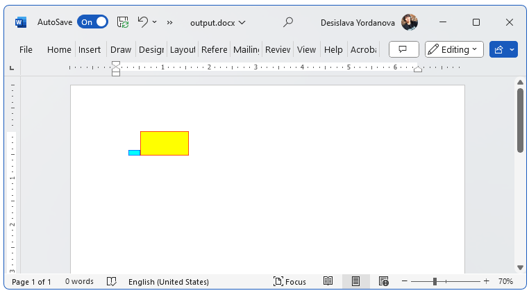

# Environment

| Version | Product | Author | 
| ---- | ---- | ---- | 
| 2024.1.124 | RadWordsProcessing |[Desislava Yordanova](https://www.telerik.com/blogs/author/desislava-yordanova)| 

## Description

A common requirement is to insert [shapes]() in a RadFlowDocument (or a DOCX file). Currently, RadWordsProcessing doesn't support such functionality.

This article demonstrates a sample approach how to create a RadFlowDocument with colored squares with borders using the library.

>note A similar approach can be used for any other shapes such as circles, triangles, etc. 

## Solution

The easiest way to achieve the colored square is to generate an image with the desired size and insert it in the RadFlowDocument. Then, exporting the document to DOCX or any supported format will give you the following result:

 

Here is a code snippet that demonstrates the process:

```csharp
using System.IO; 
using Telerik.Windows.Documents.Flow.Model.Editing;
using Telerik.Windows.Documents.Flow.Model;
using System.Drawing;
using Telerik.Windows.Documents.Flow.FormatProviders.Docx;
using System.Diagnostics;

namespace DrawSquareShapesInFlowDocument
{
    internal class Program
    {
        static void Main(string[] args)
        {
            RadFlowDocument flowDocument = new RadFlowDocument();
            RadFlowDocumentEditor editor = new RadFlowDocumentEditor(flowDocument);
            InsertImage(editor, Color.Aqua, Color.Blue, new Size(40, 20));
            InsertImage(editor, Color.Yellow, Color.Red, new Size(100, 50));

            DocxFormatProvider provider = new DocxFormatProvider();
            string filePath = @"..\..\output.docx";
            File.Delete(filePath);
            using (Stream output = File.OpenWrite(filePath))
            {
                provider.Export(flowDocument, output);
            }
            Process.Start(filePath);
        }

        private static void InsertImage(RadFlowDocumentEditor editor, Color fillColor, Color borderColor, Size size)
        {
            Image img = CreateBitmapFromColors(fillColor, borderColor, size);

            string imagePath = @"..\..\test.png";
            img.Save(imagePath);
            using (Stream stream = File.OpenRead(imagePath))
            {
                editor.InsertImageInline(stream, "png");
            }
            File.Delete(imagePath);
        }

        private static Image CreateBitmapFromColors(Color fillColor, Color borderColor, Size s)
        {
            Bitmap bitmap = new Bitmap(s.Width, s.Height);
            using (Graphics g = Graphics.FromImage(bitmap))
            {
                Rectangle colorRect = new Rectangle(0, 0, s.Width, s.Height);
                using (SolidBrush brush = new SolidBrush(fillColor))
                {
                    g.FillRectangle(brush, colorRect);
                }
                colorRect.X += s.Width;
                Rectangle fullRect = new Rectangle(0, 0, bitmap.Width, bitmap.Height);
                fullRect.Width -= 1;
                fullRect.Height -= 1;
                g.DrawRectangle(new System.Drawing.Pen(borderColor), fullRect);
            }

            return bitmap;
        }
    }
}
```

## See Also

 * [Shapes]()
