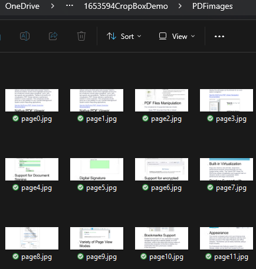

## Environment

| Version | Product | Author | 
| --- | --- | ---- | 
| 2024.2.426| RadPdfProcessing |[Desislava Yordanova](https://www.telerik.com/blogs/author/desislava-yordanova)| 

## Description

This article shows a sample approach how to load the original PDF document, crop the central 1/3 part of the PDF page and extract this part to an image.

## Solution

To achieve the desired functionality of cropping parts of a PDF page and saving them as images, follow the steps below. Note that OCR functionality is not directly supported by RadPdfProcessing, but you can use external libraries for that purpose after exporting the images.

1. **Load the PDF document** using the `PdfFormatProvider` and create a `RadFixedDocument`.

2. **Set the CropBox** for each page to define the area you want to crop. The CropBox property specifies the region of the page to be displayed or printed.

3. **Export the cropped pages as images**. You can use the [RadPdfViewer](https://docs.telerik.com/devtools/winforms/controls/pdfviewer/overview) which offers [export to image](https://docs.telerik.com/devtools/winforms/controls/pdfviewer/export-to-image) functionality out of the box.

Here is a simplified code example demonstrating these steps:

```csharp
         static void Main(string[] args)
        {
            string originalFilePath = @"sample.pdf";
            PdfFormatProvider provider = new PdfFormatProvider();
            RadFixedDocument croppedDocument = provider.Import(File.ReadAllBytes(originalFilePath));

            foreach (var item in croppedDocument.Pages)
            {
                //crop the central 1/3 part of the PDF page 
                item.CropBox = new Rect(0, item.Size.Height / 3, item.Size.Width, item.Size.Height / 3);
            }

            GenerateImagesFromPdfViewer(croppedDocument); 
        }

        private static void GenerateImagesFromPdfViewer(RadFixedDocument croppedDocument)
        {
            Telerik.WinControls.UI.RadPdfViewer rViewer = new Telerik.WinControls.UI.RadPdfViewer();
            rViewer.DocumentLoaded += RViewer_DocumentLoaded;
            rViewer.Document = croppedDocument;
            rViewer.LoadElementTree();
            System.Windows.Forms.Application.DoEvents();
        }

        private static void RViewer_DocumentLoaded(object sender, System.EventArgs e)
        {
            DeleteAllExistingImages();
            string filePath = @"..\..\PDFimages\page";
            Telerik.WinControls.UI.RadPdfViewerElement pdfViewerElement = sender as Telerik.WinControls.UI.RadPdfViewerElement;
            if (pdfViewerElement != null)
            {
                for (int i = 0; i < pdfViewerElement.Document.Pages.Count; i++)
                {
                    System.Drawing.Image imagePage = pdfViewerElement.ExportPage(i, 1, true, System.Drawing.Imaging.ImageFormat.Jpeg);
                    imagePage.Save(filePath + i + ".jpg");
                }
            }
        }
```
 

The above example is just a sample approach. Feel free to further fine-tune or adjust the crop rectangle according to the specific part of the page that should be extracted as an image.

## See Also

- [How to Export Each Page as an Image in PDF Documents](https://docs.telerik.com/devtools/winforms/knowledge-base/pdfviewer-export-page-images-with-no-ui)

