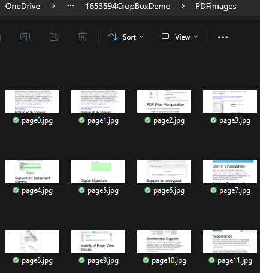

## Environment

| Version | Product | Author | 
| --- | --- | ---- | 
| 2024.2.426| RadPdfProcessing |[Desislava Yordanova](https://www.telerik.com/blogs/author/desislava-yordanova)| 

## Description

This article shows how to load an original PDF document, crop the central 1/3 part of the PDF page, and extract this part to an image.

## Solution

To crop parts of a PDF page and save them as images, follow the steps below. OCR is not directly supported by `RadPdfProcessing`, but you can use external libraries for that purpose after exporting the images.

1. **Load the PDF document** using the [PdfFormatProvider]() and create a `RadFixedDocument`.

2. Set the `CropBox` for each page to define the area you want to crop. The `CropBox` property specifies the region of the page to display or print.

3. **Export the cropped pages as images**. You can use the [RadPdfViewer](https://docs.telerik.com/devtools/winforms/controls/pdfviewer/overview) which offers the [export to image](https://docs.telerik.com/devtools/winforms/controls/pdfviewer/export-to-image) feature without additional configuration.

>note For .NET Standard scenarios, use the [SkiaImageFormatProvider]().

Here is a simplified code example that shows these steps:

```csharp
         static void Main(string[] args)
        {
            string originalFilePath = @"sample.pdf";
            PdfFormatProvider provider = new PdfFormatProvider();
            RadFixedDocument croppedDocument = provider.Import(File.ReadAllBytes(originalFilePath));

            foreach (var item in croppedDocument.Pages)
            {
                //crop the central 1/3 part of the PDF page 
                item.CropBox = new Rect(0, item.Size.Height / 3, item.Size.Width, item.Size.Height / 3);
            }

            GenerateImagesFromPdfViewer(croppedDocument); 
        }

        private static void GenerateImagesFromPdfViewer(RadFixedDocument croppedDocument)
        {
            Telerik.WinControls.UI.RadPdfViewer rViewer = new Telerik.WinControls.UI.RadPdfViewer();
            rViewer.DocumentLoaded += RViewer_DocumentLoaded;
            rViewer.Document = croppedDocument;
            rViewer.LoadElementTree();
            System.Windows.Forms.Application.DoEvents();
        }

        private static void RViewer_DocumentLoaded(object sender, System.EventArgs e)
        {
            DeleteAllExistingImages();
            string filePath = @"..\..\PDFimages\page";
            Telerik.WinControls.UI.RadPdfViewerElement pdfViewerElement = sender as Telerik.WinControls.UI.RadPdfViewerElement;
            if (pdfViewerElement != null)
            {
                for (int i = 0; i < pdfViewerElement.Document.Pages.Count; i++)
                {
                    System.Drawing.Image imagePage = pdfViewerElement.ExportPage(i, 1, true, System.Drawing.Imaging.ImageFormat.Jpeg);
                    imagePage.Save(filePath + i + ".jpg");
                }
            }
        }
```
 

The above example is a sample approach. You can further adjust the crop rectangle according to the specific part of the page that you want to extract as an image.

## See Also

* [How to Export Each Page as an Image in PDF Documents](https://docs.telerik.com/devtools/winforms/knowledge-base/pdfviewer-export-page-images-with-no-ui)

