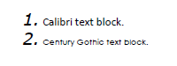

## Environment

| Version | Product | Author | 
| --- | --- | ---- | 
| 2024.2.426| RadPdfProcessing |[Desislava Yordanova](https://www.telerik.com/blogs/author/desislava-yordanova)| 

## Description

When creating a PDF and adding a numbered list to a set of blocks, the font of the numbers does not change according to the block's font and remains as Helvetica. This KB article shows how to customize the font of a numbered list in a PDF document.

## Solution

To customize the font of the list numbers to match the font of the block, specify the font by using the [Levels](https://docs.telerik.com/devtools/document-processing/api/telerik.windows.documents.fixed.model.editing.collections.listlevelcollection) collection and the [CharacterProperties](https://docs.telerik.com/devtools/document-processing/api/telerik.windows.documents.fixed.model.editing.flow.characterproperties) property of the respective level in the list. Below is an example demonstrating how to achieve this:

1. Implement a custom [FontsProvider]() class to supply the desired fonts in [Cross-platform scenarios](). This class should override the `GetFontData` method to return the font data for the specified `FontProperties`.

2. Before creating the PDF document, set the custom `FontsProvider` as the fonts provider.

3. Create the font instance for the list numbers using the `FontsRepository.TryCreateFont` method.

4. Create a new [List]() instance with `ListTemplateType.NumberedDefault` and set the font and size for the list's first level.

5. Add blocks to the document and set their bullet to the customized list.

6. [Export the document](https://docs.telerik.com/devtools/document-processing/libraries/radpdfprocessing/formats-and-conversion/pdf/pdfformatprovider/pdfformatprovider#export) to a PDF file.


```csharp
        static void Main(string[] args)
        {
            Telerik.Windows.Documents.Extensibility.FontsProviderBase fontsProvider = new FontsProvider();
            Telerik.Windows.Documents.Extensibility.FixedExtensibilityManager.FontsProvider = fontsProvider;

            FontBase font;
            bool success = FontsRepository.TryCreateFont(new FontFamily("Verdana"), FontStyles.Italic ,FontWeights.Normal, out font);

            RadFixedDocument document = new RadFixedDocument();
            RadFixedDocumentEditor editor = new RadFixedDocumentEditor(document);
            List list = new(ListTemplateType.NumberedDefault);
            list.Levels[0].CharacterProperties.Font = font;
            list.Levels[0].CharacterProperties.FontSize = 20;

            Block block = new Block();
            block.TextProperties.TrySetFont(new Telerik.Documents.Core.Fonts.FontFamily("Calibri"));
            block.TextProperties.FontSize = 14;
            block.SetBullet(list, 0);
            block.InsertText("Calibri text block.");
            editor.InsertBlock(block);

            block = new Block();
            block.TextProperties.TrySetFont(new Telerik.Documents.Core.Fonts.FontFamily("Century Gothic"));
            block.TextProperties.FontSize = 10;
            block.SetBullet(list, 0);
            block.InsertText("Century Gothic text block.");
            editor.InsertBlock(block);

            string outputFilePath = "sample.pdf";
            File.Delete(outputFilePath);
            PdfFormatProvider provider = new PdfFormatProvider();
            using (Stream output = File.OpenWrite(outputFilePath))
            {
                provider.Export(document, output);
            }
            Process.Start(new ProcessStartInfo() { FileName = outputFilePath, UseShellExecute = true });
        }
        public class FontsProvider : Telerik.Windows.Documents.Extensibility.FontsProviderBase
        {
            public override byte[] GetFontData(Telerik.Windows.Documents.Core.Fonts.FontProperties fontProperties)
            {
                string fontFileName = fontProperties.FontFamilyName + ".ttf";
                string fontFolder = Environment.GetFolderPath(Environment.SpecialFolder.Fonts);

                //The fonts can differ depending on the file 
                if (fontProperties.FontFamilyName == "Calibri")
                {
                    if (fontProperties.FontStyle == FontStyles.Italic && fontProperties.FontWeight == FontWeights.Bold)
                    {
                        fontFileName = $"calibriz.ttf";
                    }
                    else if (fontProperties.FontStyle == FontStyles.Italic)
                    {
                        fontFileName = $"calibrii.ttf";
                    }
                    else if (fontProperties.FontWeight == FontWeights.Normal)
                    {
                        fontFileName = "calibri.ttf";
                    }
                    else if (fontProperties.FontWeight == FontWeights.Bold)
                    {
                        fontFileName = $"calibrib.ttf";
                    }
                }

                else if (fontProperties.FontFamilyName == "Century Gothic")
                {
                    if (fontProperties.FontStyle == FontStyles.Italic && fontProperties.FontWeight == FontWeights.Bold)
                    {
                        fontFileName = $"gothicbi.ttf";
                    }
                    else if (fontProperties.FontStyle == FontStyles.Italic)
                    {
                        fontFileName = $"gothici.ttf";
                    }
                    else if (fontProperties.FontWeight == FontWeights.Normal)
                    {
                        fontFileName = "gothic.ttf";
                    }
                    else if (fontProperties.FontWeight == FontWeights.Bold)
                    {
                        fontFileName = $"gothicb.ttf";
                    }
                }

                else if (fontProperties.FontFamilyName == "Verdana")
                {
                    if (fontProperties.FontStyle == FontStyles.Italic)
                    {
                        fontFileName = $"verdanai.ttf";
                    }
                }

                //...add more fonts if needed... 

                DirectoryInfo directory = new DirectoryInfo(fontFolder);
                FileInfo[] fontFiles = directory.GetFiles();

                var fontFile = fontFiles.FirstOrDefault(f => f.Name.Equals(fontFileName, StringComparison.InvariantCultureIgnoreCase));
                if (fontFile != null)
                {
                    var targetPath = fontFile.FullName;
                    using (FileStream fileStream = File.OpenRead(targetPath))
                    {
                        using (MemoryStream memoryStream = new MemoryStream())
                        {
                            fileStream.CopyTo(memoryStream);
                            return memoryStream.ToArray();
                        }
                    }
                }

                return null;
            }
        }

```

The achieved result is illustrated in the below screenshot:



This approach allows you to customize the font and font size of the numbers in a numbered list, ensuring they match the rest of the text in the PDF document.

## See Also

- [RadPdfProcessing - Using Lists with Block Class]()
- [Cross-platform scenarios]()
- [How to Implement FontsProvider]()
- [Create Custom Image Bullets]()
