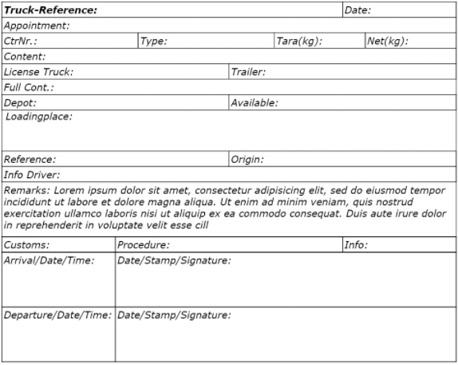
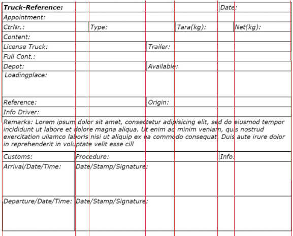
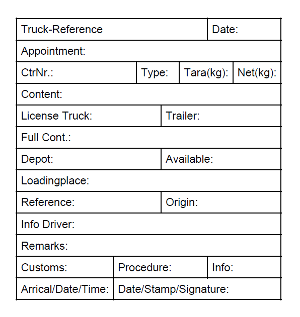

## Environment

| Version | Product | Author | 
| --- | --- | ---- | 
| 2024.3.806| RadPdfProcessing |[Desislava Yordanova](https://www.telerik.com/blogs/author/desislava-yordanova)| 

## Description
Creating tables with customized layouts, including varying column spans, is a common requirement for document processing. This article demonstrates how to achieve a table with multiple rows, each having a different column layout, using the [RadPdfProcessing]() library. 

Here is demonstrated a sample design for such a custom layout:

  

## Solution

Before starting with the solution, let's divide the table columns with red lines for better understanding how to build the layout:

   

To create a table with varying column layouts, follow the steps below:

1. Define a `Table` and set its `LayoutType` to `AutoFit`. Customize the `DefaultCellProperties` to set padding and borders for the cells.
2. Add table rows using `table.Rows.AddTableRow()`.
3. For each row, add cells using `row.Cells.AddTableCell()`. Customize each cell's content by adding blocks of text with specific styles (e.g., font family, font style, font weight).
4. To change the column layout, set the `ColumnSpan` property of the cells accordingly.
5. To adjust the row height, insert content with the desired height in each cell or use the `Padding` property for minor adjustments.

Here's an example code snippet demonstrating the setup:

```csharp

        static void Main(string[] args)
        {
            RadFixedDocument fixedDocument = new RadFixedDocument();
            RadFixedPage page = new RadFixedPage();
            page.Size = new Size(1200, 800);
            fixedDocument.Pages.Add(page);
            
            FixedContentEditor editor = new FixedContentEditor(page);
            editor.Position.Translate(Unit.CmToDip(2), Unit.CmToDip(2)); 

            editor.DrawTable(GenerateCustomTable()); 

            string outputFilePath = "sample.pdf";
            File.Delete(outputFilePath);
            PdfFormatProvider provider = new PdfFormatProvider();

            using (Stream output = File.OpenWrite(outputFilePath))
            {
                provider.Export(fixedDocument, output);
            }
            Process.Start(new ProcessStartInfo() { FileName = outputFilePath, UseShellExecute = true });
        }

        private static Table GenerateCustomTable()
        {
            Border blackBorder = new Border(1, new RgbColor(0, 0, 0));
            Table table = new Table
            {
                LayoutType = TableLayoutType.AutoFit,
                DefaultCellProperties =
                {
            Padding = new Thickness(5, 5, 5, 5),
            Borders = new TableCellBorders(blackBorder, blackBorder, blackBorder, blackBorder)
                }
            };

            TableRow row = table.Rows.AddTableRow();
            TableCell cell = row.Cells.AddTableCell();
            cell.Blocks.AddBlock().InsertText(new FontFamily("Helvetica"), FontStyles.Normal, FontWeights.Normal, "Truck-Reference");
            cell.ColumnSpan = 5;
            TableCell cell2 = row.Cells.AddTableCell();
            cell2.Blocks.AddBlock().InsertText(new FontFamily("Helvetica"), FontStyles.Normal, FontWeights.Normal, "Date:");
            cell2.ColumnSpan = 2;

            TableRow row2 = table.Rows.AddTableRow();
            TableCell cell3 = row2.Cells.AddTableCell();
            cell3.Blocks.AddBlock().InsertText(new FontFamily("Helvetica"), FontStyles.Normal, FontWeights.Normal, "Appointment:");
            cell3.ColumnSpan = 7;

            TableRow row3 = table.Rows.AddTableRow();
            TableCell cell4 = row3.Cells.AddTableCell();
            cell4.Blocks.AddBlock().InsertText(new FontFamily("Helvetica"), FontStyles.Normal, FontWeights.Normal, "CtrNr.:");
            cell4.ColumnSpan = 2;
            TableCell cell5 = row3.Cells.AddTableCell();
            cell5.Blocks.AddBlock().InsertText(new FontFamily("Helvetica"), FontStyles.Normal, FontWeights.Normal, "Type:");
            cell5.ColumnSpan = 2;
            TableCell cell6 = row3.Cells.AddTableCell();
            cell6.Blocks.AddBlock().InsertText(new FontFamily("Helvetica"), FontStyles.Normal, FontWeights.Normal, "Tara(kg):");
            cell6.ColumnSpan = 2;
            TableCell cell7 = row3.Cells.AddTableCell();
            cell7.Blocks.AddBlock().InsertText(new FontFamily("Helvetica"), FontStyles.Normal, FontWeights.Normal, "Net(kg):");
            cell7.ColumnSpan = 1;

            TableRow row4 = table.Rows.AddTableRow();
            TableCell cell8 = row4.Cells.AddTableCell();
            cell8.Blocks.AddBlock().InsertText(new FontFamily("Helvetica"), FontStyles.Normal, FontWeights.Normal, "Content:");
            cell8.ColumnSpan = 7;

            TableRow row5 = table.Rows.AddTableRow();
            TableCell cell9 = row5.Cells.AddTableCell();
            cell9.Blocks.AddBlock().InsertText(new FontFamily("Helvetica"), FontStyles.Normal, FontWeights.Normal, "License Truck:");
            cell9.ColumnSpan = 3;
            TableCell cell10 = row5.Cells.AddTableCell();
            cell10.Blocks.AddBlock().InsertText(new FontFamily("Helvetica"), FontStyles.Normal, FontWeights.Normal, "Trailer:");
            cell10.ColumnSpan = 4;

            TableRow row6 = table.Rows.AddTableRow();
            TableCell cell11 = row6.Cells.AddTableCell();
            cell11.Blocks.AddBlock().InsertText(new FontFamily("Helvetica"), FontStyles.Normal, FontWeights.Normal, "Full Cont.:");
            cell11.ColumnSpan = 7;

            TableRow row7 = table.Rows.AddTableRow();
            TableCell cell12 = row7.Cells.AddTableCell();
            cell12.Blocks.AddBlock().InsertText(new FontFamily("Helvetica"), FontStyles.Normal, FontWeights.Normal, "Depot:");
            cell12.ColumnSpan = 3;
            TableCell cell13 = row7.Cells.AddTableCell();
            cell13.Blocks.AddBlock().InsertText(new FontFamily("Helvetica"), FontStyles.Normal, FontWeights.Normal, "Available:");
            cell13.ColumnSpan = 4;

            TableRow row8 = table.Rows.AddTableRow();
            TableCell cell14 = row8.Cells.AddTableCell();
            cell14.Blocks.AddBlock().InsertText(new FontFamily("Helvetica"), FontStyles.Normal, FontWeights.Normal, "Loadingplace:");
            cell14.ColumnSpan = 7;

            TableRow row9 = table.Rows.AddTableRow();
            TableCell cell15 = row9.Cells.AddTableCell();
            cell15.Blocks.AddBlock().InsertText(new FontFamily("Helvetica"), FontStyles.Normal, FontWeights.Normal, "Reference:");
            cell15.ColumnSpan = 3;
            TableCell cell16 = row9.Cells.AddTableCell();
            cell16.Blocks.AddBlock().InsertText(new FontFamily("Helvetica"), FontStyles.Normal, FontWeights.Normal, "Origin:");
            cell16.ColumnSpan = 4;

            TableRow row10 = table.Rows.AddTableRow();
            TableCell cell17 = row10.Cells.AddTableCell();
            cell17.Blocks.AddBlock().InsertText(new FontFamily("Helvetica"), FontStyles.Normal, FontWeights.Normal, "Info Driver:");
            cell17.ColumnSpan = 7;

            TableRow row11 = table.Rows.AddTableRow();
            TableCell cell18 = row11.Cells.AddTableCell();
            cell18.Blocks.AddBlock().InsertText(new FontFamily("Helvetica"), FontStyles.Normal, FontWeights.Normal, "Remarks:");
            cell18.ColumnSpan = 7;

            TableRow row12 = table.Rows.AddTableRow();
            TableCell cell19 = row12.Cells.AddTableCell();
            cell19.Blocks.AddBlock().InsertText(new FontFamily("Helvetica"), FontStyles.Normal, FontWeights.Normal, "Customs:");
            cell19.ColumnSpan = 1;
            TableCell cell20 = row12.Cells.AddTableCell();
            cell20.Blocks.AddBlock().InsertText(new FontFamily("Helvetica"), FontStyles.Normal, FontWeights.Normal, "Procedure:");
            cell20.ColumnSpan = 4;
            TableCell cell21 = row12.Cells.AddTableCell();
            cell21.Blocks.AddBlock().InsertText(new FontFamily("Helvetica"), FontStyles.Normal, FontWeights.Normal, "Info:");
            cell21.ColumnSpan = 2;

            TableRow row13 = table.Rows.AddTableRow();
            TableCell cell22 = row13.Cells.AddTableCell();
            cell22.Blocks.AddBlock().InsertText(new FontFamily("Helvetica"), FontStyles.Normal, FontWeights.Normal, "Arrical/Date/Time:");
            cell22.ColumnSpan = 1;
            TableCell cell23 = row13.Cells.AddTableCell();
            cell23.Blocks.AddBlock().InsertText(new FontFamily("Helvetica"), FontStyles.Normal, FontWeights.Normal, "Date/Stamp/Signature:");
            cell23.ColumnSpan = 6;

            return table;
        }

```
 The code snippet achieves the below result:

    

 When dealing the ColumnSpan functionality, pay attention to two important things:

* The rows which contain cells with ColumnSpan should contain less text blocks, e.g. if ColumnSpan=4, you need to insert 4 text blocks less for this row. Hence, skip adding the text block for the cells participating in the ColumnSpan functionality.

* For a column to exist and have a calculated width, it must contain at least one cell with content among the rows within the table.


## See Also

- [Tables in RadPdfProcessing]()
- [TableCell]()
