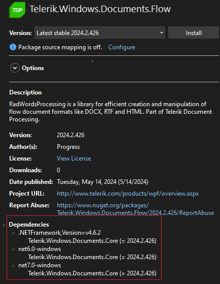
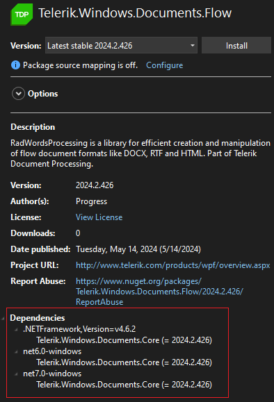
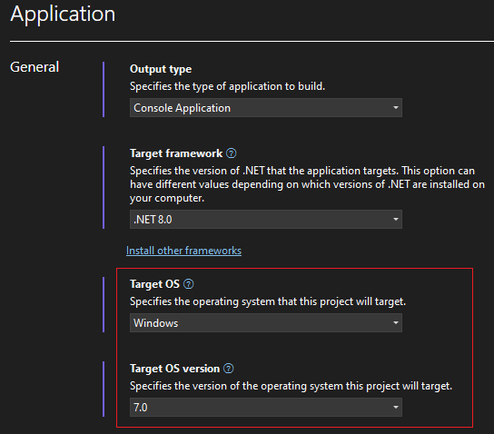
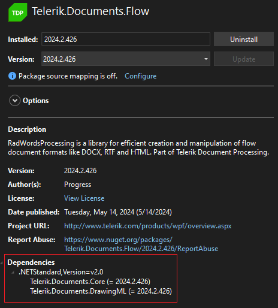
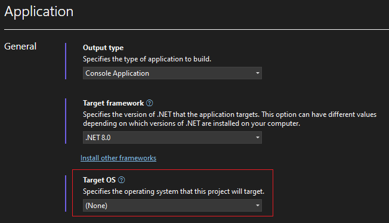

## Environment

| Version | Product | Author | 
| --- | --- | ---- | 
| 2024.2.426| Telerik Document Processing|[Desislava Yordanova](https://www.telerik.com/blogs/author/desislava-yordanova)| 

## Description
Learn how to find and download the Telerik Document Processing libraries for the appropriate .NET version and ensure compatibility of Telerik Document Processing libraries with the used target framework in the project.

## Solution

The [Telerik Document Processing]() libraries are compatible across different .NET implementations, including .NET Framework, .NET Standard, {{site.dotnetversions}}, and newer versions. However, the libraries are [distributed with different Telerik UI products](). Depending on the target framework of your project (.NET Framework, .NET Standard, {{site.dotnetversions}}, etc.), you should pick the library version accordingly. 

Depending on the product suite you are using (Telerik UI for WinForms, WPF, ASP.NET AJAX, Blazor, ASP.NET Core, etc.), the [libraries are included](https://docs.telerik.com/devtools/document-processing/introduction#available-assemblies) in the respective NuGet packages:
   
- For **.NET Framework** projects, libraries are distributed with Telerik UI for WinForms, WPF, ASP.NET AJAX, ASP.NET MVC.

  

- For **{{site.dotnetversions}}** (or newer) projects, libraries are included with Telerik UI for WinForms and WPF.

  

   

- For projects targeting .NET Standard, libraries are distributed with Telerik UI for Blazor, ASP.NET Core, .NET MAUI, WinUI, Xamarin.

  

    

As the above screenshots shows, the respective NuGet package indicates the exact target frameworks version considering the application's Target framework and Target OS. All versions are available as [NuGet packages](). The assemblies/packages for .NET Standard do not contain the word *Windows* in their name.

>note There are no implementation/functionality differences between the Document Processing versions for .NET Framework and .NET Core/.NET 6 (or newer). However, the .NET Standard version comes with some limitations. More information about the limitations can be found in the [Cross-Platform Support]() article.

### Download the Libraries

To download the libraries, visit the [Telerik Document Processing installation guide](). This guide provides detailed instructions on how to install the libraries on your computer, catering to the specific product suite you are using.

## Notes

- Ensure that your project's target framework is compatible with the version of the Telerik Document Processing libraries you intend to use.
- The functionality and implementation of the Document Processing libraries remain consistent across different .NET versions, with some exceptions noted for .NET Standard.

## See Also

- [Cross-Platform Support for Telerik Document Processing]()
- [Supported Target Frameworks](https://docs.telerik.com/devtools/document-processing/introduction#available-assemblies)
- [Installing Telerik Document Processing on Your Computer]()
