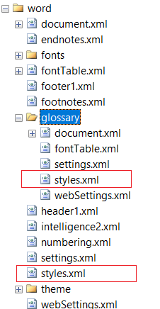

## Environment

| Version | Product | Author | 
| ---- | ---- | ---- | 
| 2025.4.1104| RadPdfProcessing |[Desislava Yordanova](https://www.telerik.com/blogs/author/desislava-yordanova)| 

## Description

When using the [DocxFormatProvider]() to import, modify, and export DOCX documents, the exported file may exhibit unexpected changes in the Normal style properties, such as font, font size, and line spacing. These inconsistencies are caused by the `glossary` folder in the DOCX archive, which contains a secondary `styles.xml` file that overrides the main `styles.xml` file.

  

This knowledge base article also answers the following questions:
- How do I prevent style changes during DOCX export with DocxFormatProvider?
- Why does my exported DOCX file have different font and spacing?
- How can I fix Normal style changes caused by DOCX glossary content?

## Solution

To prevent style changes during DOCX export, remove the glossary folder from the DOCX archive before processing the document. Use the Telerik ZipLibrary to programmatically delete the glossary folder. Below is an example implementation:

```csharp
using System.IO;
using Telerik.Windows.Zip;
using Telerik.Windows.Documents.Flow.FormatProviders.Docx;

string path = @"sample_document.docx";
using (Stream str = new FileStream(path, FileMode.OpenOrCreate, FileAccess.ReadWrite))
{
    using (ZipArchive archive = ZipArchive.Update(str, null))
    {
        foreach (ZipArchiveEntry entry in archive.Entries.ToList())
        {
            if (entry.FullName.StartsWith("word/glossary"))
            {
                entry.Delete(); // Remove glossary folder entries
            }
        }
    }

    DocxFormatProvider provider = new DocxFormatProvider();
    var flowDocument = provider.Import(str, null); // Process document after cleanup
}
```

### Key Points:
1. The `word/glossary` folder is deleted to prevent it from overriding the main style definitions.
2. Use Telerik's [ZipLibrary]() for efficient DOCX archive modification.
3. Process the **cleaned** document with the DocxFormatProvider.

## See Also

- [DocxFormatProvider]()
- [Updating Zip Archives with ZipLibrary](#delete-entry)
