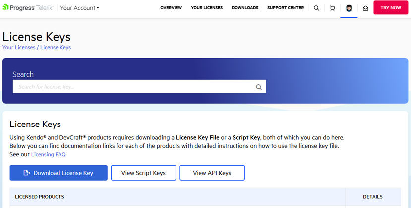
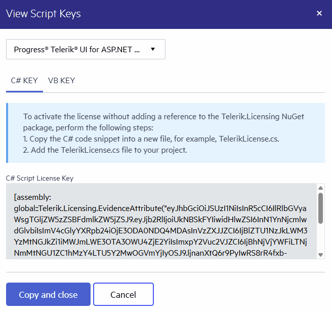
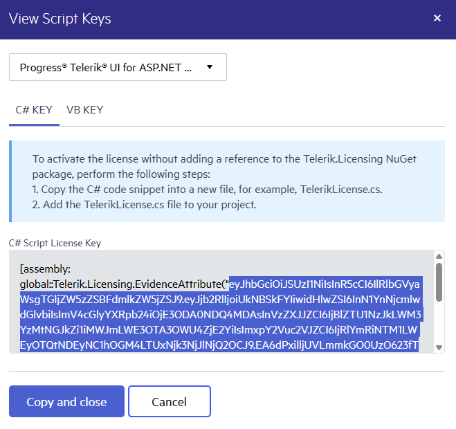

## Environment

| Version | Product | Author | 
| ---- | ---- | ---- | 
| 2026.1.210| Telerik Document Procesing|[Desislava Yordanova](https://www.telerik.com/blogs/author/desislava-yordanova)| 
|Target Framework|.NET Framework||

## Description

If Telerik assemblies are referenced manually (DLLs in /bin) and the project does not have the Telerik.Licensing NuGet package, in this scenario, [licensing must be activated via a script key](#adding-a-license-key-to-projects-without-nuget-references) (EvidenceAttribute). This article shows how to download such a script key.

## Solution

1. Go to the [License Keys](https://www.telerik.com/account/your-licenses/license-keys) page in your Telerik account.

2. Click the `View Script Keys` button:

      
 
3. A new Script Key window is shown with your C#/VB Script Key for the selected product. The drop down at the top lists all the products accessible with your license. Select the desired product:

     


The code snippet from the Script Key contains an assembly attribute called **EvidenceAttribute** that holds information about the script license key.

4.  Copy the whole key string to the bottom of the scrollbar in the Telerik.Licensing.EvidenceAttribute("script-key"):

       

    >note Do not publish the script key snippet in publicly accessible repositories. This is your personal script license key.

5. Now, we can register the copied script key above by using the TelerikLicensing.Register("script key").

    >note The script key needs to be registered before initializing any code related to the Telerik Document Processing Libraries. 

```csharp
namespace LicensingInLambda;
 
public class Function
{
    public string FunctionHandler(string input, ILambdaContext context)
    {
        // Lambda function entry point
 
        // This requires adding a reference to the Telerik.Licensing.Runtime.dll.
        TelerikLicensing.Register("your script key");
 
        // TODO: DPL - generate PDF here
 
        var entryAssembly = Assembly.GetEntryAssembly();
        var name = entryAssembly?.GetName();
 
        return $"Entry assembly: {entryAssembly?.GetName()} ... {Class1.DoYourMagic()}";
    }
}
```

## See Also

- [Setting Up License Key]()  
