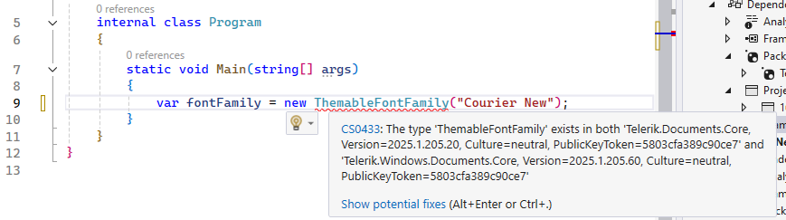
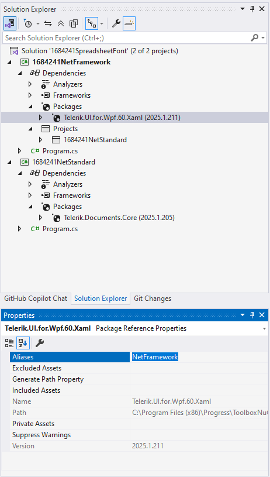

## Environment

| Version | Product | Author | 
| ---- | ---- | ---- | 
| 2025.1.205| Telerik Document Processing|[Desislava Yordanova](https://www.telerik.com/blogs/author/desislava-yordanova)| 

## Description

When developing a WPF application that utilizes [RadSpreadProcessing]() to set a font in a spreadsheet, and the solution includes a cross-platform project referencing `Telerik.Documents.Core`, an ambiguous reference error may occur. 

 

The issue arises due to identical namespaces in both assemblies when both platform-specific projects and cross-platform projects are part of the solution.

## Solution

The Telerik Document Processing libraries are available in .NET Framework, .NET 8/.NET 9 (or newer) for Windows and .NET Standard compatible versions. All versions are available as NuGet packages. The assemblies/packages for .NET Standard do not contain the word *Windows* in their name. Learn [What Versions of Document Processing Libraries are Distributed with the Telerik Products]().

In a WPF project, you need to use the assemblies containing the word *Windows* and avoid mixing .NET Framework and .NET Standard compatible versions.

However, to resolve the ambiguous reference error in a WPF application using RadSpreadProcessing alongside a cross-platform project, use the [extern alias](https://learn.microsoft.com/en-us/dotnet/csharp/language-reference/keywords/extern-alias) directive. This approach allows differentiating between assemblies that have the same namespace but are intended for different platforms. Follow the steps below to apply this solution:

1. **Assign an alias to the conflicting assembly in the WPF project**. Right-click on the referenced assembly in the Solution Explorer and select `Properties`. In the `Aliases` field, enter a unique alias (e.g., `NetFramework`).

  

2. **Use the `extern alias` directive in your WPF project code**. At the top of your C# file where you are facing the ambiguous reference, declare the alias defined in step 1. This explicitly specifies which assembly to use for the conflicting types.

```csharp
extern alias NetFramework;
using NetFramework::Telerik.Documents.Common.Model;
```

3. **Reference the `ThemableFontFamily` using the alias**. After specifying the extern alias, use it to qualify the namespace of the `ThemableFontFamily` class or any other ambiguous type. This disambiguates the reference and allows your code to compile successfully.

```csharp
namespace YourNamespace
{
    public class YourClass
    {
        public void YourMethod()
        {
            // Use the ThemableFontFamily from the aliased assembly
            ThemableFontFamily fontFamily = new ThemableFontFamily("Courier New");
        }
    }
}
```

By following these steps, you can successfully resolve the ambiguous reference error and set the spreadsheet font in a WPF application using RadSpreadProcessing, even when your solution includes cross-platform projects.

## See Also

- [What Versions of Document Processing Libraries are Distributed with the Telerik Products]()
- [Resolve Compile-Time Error Between RadPdfProcessing and Telerik Reporting]()
- [C# Extern Alias - Microsoft Documentation](https://learn.microsoft.com/en-us/dotnet/csharp/language-reference/keywords/extern-alias)
