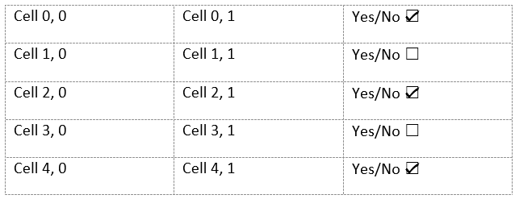

## Environment

| Version | Product | Author | 
| --- | --- | ---- | 
| 2024.2.426| RadWordsProcessing |[Desislava Yordanova](https://www.telerik.com/blogs/author/desislava-yordanova)| 

## Description

This article demonstrates how to create tables and checkboxes within a DOCX document programmatically.

   

## Solution

To generate a DOCX document dynamically, including tables and checkboxes, follow these steps:

1. Create a new [RadFlowDocument]() and a [RadFlowDocumentEditor]().
2. Use the editor to insert a [table]() into the document.
3. Populate the table with rows and cells. For cells intended to contain checkboxes, add a checkbox using [structured document tags]() (SDT).
4. Customize the checkbox appearance and checked state.
5. [Export the document]() as a DOCX file.

Here is a sample code snippet demonstrating how to accomplish this: 

```csharp
static void Main(string[] args)
{
    RadFlowDocument document = new RadFlowDocument();
    RadFlowDocumentEditor editor = new RadFlowDocumentEditor(document);
    Table table = editor.InsertTable();

    for (int i = 0; i < 5; i++)
    {
        TableRow row = table.Rows.AddTableRow();

        for (int j = 0; j < 3; j++)
        {
            TableCell cell = row.Cells.AddTableCell();
            if (j == 2)
            {
                Run r = cell.Blocks.AddParagraph().Inlines.AddRun("Yes/No ");
                SdtCheckBoxState checkedBoxState = new SdtCheckBoxState
                {
                    Font = new FontFamily("MS Gothic"),
                    CharacterCode = 0x2611
                };

                SdtCheckBoxState uncheckedBoxState = new SdtCheckBoxState
                {
                    Font = new FontFamily("MS Gothic"),
                    CharacterCode = 0x2610
                };

                CheckBoxProperties checkBoxProperties = new CheckBoxProperties
                {
                    CheckedState = checkedBoxState,
                    UncheckedState = uncheckedBoxState,
                    Checked = i % 2 == 0
                };

                editor.MoveToInlineEnd(r);
                SdtRangeStart sdt = editor.InsertStructuredDocumentTag(checkBoxProperties);
                editor.MoveToInlineEnd(sdt);
                Run runWithCheckBox = editor.InsertText(((char)(checkBoxProperties.Checked ? checkBoxProperties.CheckedState.CharacterCode : checkBoxProperties.UncheckedState.CharacterCode)).ToString());
                runWithCheckBox.Properties.FontFamily.LocalValue = new ThemableFontFamily(checkBoxProperties.CheckedState.Font);
                editor.MoveToInlineEnd(sdt.End);
            }
            else
            {
                cell.Blocks.AddParagraph().Inlines.AddRun(string.Format("Cell {0}, {1}", i, j));
            }
            cell.PreferredWidth = new TableWidthUnit(150);
        }
    }

    Telerik.Windows.Documents.Flow.FormatProviders.Docx.DocxFormatProvider provider = new Telerik.Windows.Documents.Flow.FormatProviders.Docx.DocxFormatProvider();
    string outputFilePath = "output.docx";
    File.Delete(outputFilePath);
    using (Stream output = File.OpenWrite(outputFilePath))
    {
        provider.Export(document, output);
    }

    Process.Start(new ProcessStartInfo { FileName = outputFilePath, UseShellExecute = true });
}
```


For more examples and details on working with content controls and other features of RadWordsProcessing, refer to the [SDK examples](https://github.com/telerik/document-processing-sdk/blob/master/WordsProcessing/ContentControls/DocumentGenerator.cs).

## See Also

- [RadWordsProcessing Overview]()
- [Working with Tables in RadWordsProcessing]()
- [Content Controls in RadWordsProcessing]() 

