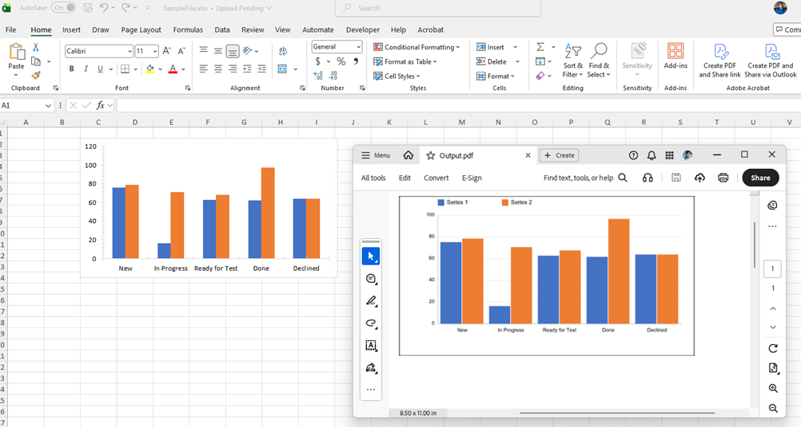

## Environment

| Version | Product | Author | 
| ---- | ---- | ---- | 
| 2026.1.402| RadSpreadProcessing |[Desislava Yordanova](https://www.telerik.com/blogs/author/desislava-yordanova)| 

## Description

[RadSpreadProcessing]() provides support for exporting worksheets with chart objects to PDF format only in .NET Framework and .NET (Target OS: Windows). This article shows a custom approach to exporting Excel workbooks containing bar chart objects to PDF format using the Telerik Document Processing libraries. Because the standard PDF export does not natively render [FloatingChartShape]() objects, this solution **converts each chart into a PNG image** and replaces the original chart shape with a [FloatingImage]() at the same position before exporting to PDF.

 

## Solution

The provided solution follows these steps: 

1. Generate a Workbook with Charts: The `GenerateWorkbookWithChart()` method builds a `Workbook` with a `Worksheet` containing a column chart. The chart is constructed programmatically using the Telerik SpreadProcessing model. The workbook is first exported to `.xlsx` format for verification.
2. Convert the Charts to image format: Call `ChartToImageConverter.ConvertChartToImage()` to render the chart as a PNG byte array.
3. Replace the Charts with the Images: Construct a `FloatingImage` at the same `CellIndex`, offset, width, and height as the original chart. Remove all original `FloatingChartShape` objects from the worksheet, then add the generated `FloatingImage` objects.
4. Export to PDF format: After replacement, the workbook (now containing images instead of charts) is exported to PDF using `PdfFormatProvider`.

>note The `ChartToImageConverter` class is the core of the custom implementation. It uses the **Telerik Fixed Document API** (`RadFixedDocument`, `FixedContentEditor`) to draw a visual representation of the chart, then exports the rendered page to PNG using `SkiaImageFormatProvider`.

The `Program` class:

```csharp
    internal class Program
    {
        static void Main(string[] args)
        {  
            Telerik.Documents.ImageUtils.ImagePropertiesResolver defaultImagePropertiesResolver = new Telerik.Documents.ImageUtils.ImagePropertiesResolver();
            Telerik.Windows.Documents.Extensibility.FixedExtensibilityManager.ImagePropertiesResolver = defaultImagePropertiesResolver;

            Workbook workbook  = GenerateWorkbookWithChart(); 
            string fileName = "SampleFile.xlsx";
            Telerik.Windows.Documents.Spreadsheet.FormatProviders.OpenXml.Xlsx.XlsxFormatProvider formatProvider = new Telerik.Windows.Documents.Spreadsheet.FormatProviders.OpenXml.Xlsx.XlsxFormatProvider();

            using (Stream output = new FileStream(fileName, FileMode.Create))
            {
                formatProvider.Export(workbook, output, TimeSpan.FromSeconds(10));
            }
            Process.Start(new ProcessStartInfo() { FileName = fileName, UseShellExecute = true });

            ReplaceChartWithImages(workbook);
           
            Telerik.Windows.Documents.Spreadsheet.FormatProviders.Pdf.PdfFormatProvider pdfFormatProvider = new PdfFormatProvider();

            string outputFilePath = "Output.pdf";
            File.Delete(outputFilePath);
            using (Stream output = File.OpenWrite(outputFilePath))
            {
                pdfFormatProvider.Export(workbook, output, TimeSpan.FromSeconds(10));
            }
            Process.Start(new ProcessStartInfo() { FileName = outputFilePath, UseShellExecute = true });
        }

        private static Workbook GenerateWorkbookWithChart()
        {
            Workbook workbook = new Workbook();
            Worksheet worksheet = workbook.Worksheets.Add();
            FloatingChartShape chartShape = new FloatingChartShape(worksheet, new CellIndex(1, 2), new CellRange(1, 1, 1, 1), ChartType.Column)
            {
                Width = 460,
                Height = 250
            };

            DocumentChart chart = new DocumentChart();
            BarSeriesGroup barSeriesGroup = new BarSeriesGroup();
            barSeriesGroup.BarDirection = BarDirection.Column;

            StringChartData barCategoryData = new StringChartData(new List<string> { "New", "In Progress", "Ready for Test", "Done", "Declined" });
            NumericChartData barValueScore1Data = new NumericChartData(new List<double> { 75.31, 16.3, 62.78, 61.72, 63.9 });
            NumericChartData barValueScore2Data = new NumericChartData(new List<double> { 78.56, 70.7, 67.63, 96.71, 63.9 });
            barSeriesGroup.Series.Add(barCategoryData, barValueScore1Data);
            barSeriesGroup.Series.Add(barCategoryData, barValueScore2Data);
            chart.SeriesGroups.Add(barSeriesGroup);
            ValueAxis valueAxis = new ValueAxis();
            valueAxis.Outline.Fill = new SolidFill(new ThemableColor(ThemeColorType.Text1, 0.85));
            valueAxis.Outline.Width = 0.75;

            CategoryAxis categoryAxis = new CategoryAxis();
            categoryAxis.Outline.Fill = new SolidFill(new ThemableColor(ThemeColorType.Text1, 0.85));
            categoryAxis.Outline.Width = 0.75;

            chart.PrimaryAxes = new AxisGroup(categoryAxis, valueAxis);
            worksheet.Charts.Add(chartShape);

            worksheet.Charts[0].Chart.SeriesGroups.First().Series.First().Title = new TextTitle("Team 1");
            worksheet.Charts[0].Chart.SeriesGroups.First().Series.Last().Title = new TextTitle("Team 2");
            chartShape.Chart = chart;

            return workbook;
        }

        private static void ReplaceChartWithImages(Workbook workbook)
        {
            // Iterate all charts in all worksheets, generate images, and replace charts with images
            foreach (Worksheet ws in workbook.Worksheets)
            {
                var chartShapes = ws.Charts.ToList();
                var imagesToAdd = new List<(FloatingImage image, byte[] data)>();

                foreach (FloatingChartShape cs in chartShapes)
                {
                    byte[] imageBytes = ChartToImageConverter.ConvertChartToImage(cs, workbook.Theme);
                    if (imageBytes.Length == 0) continue;

                    FloatingImage floatingImage = new FloatingImage(ws, cs.CellIndex, cs.OffsetX, cs.OffsetY)
                    {
                        Width = cs.Width,
                        Height = cs.Height
                    };
                    floatingImage.ImageSource = new Telerik.Windows.Documents.Media.ImageSource(imageBytes, "png");

                    imagesToAdd.Add((floatingImage, imageBytes));
                }

                // Remove all chart shapes
                foreach (FloatingChartShape cs in chartShapes)
                {
                    ws.Charts.Remove(cs);
                }

                // Add images
                foreach (var (image, _) in imagesToAdd)
                {
                    ws.Images.Add(image);
                }
            }
        }
    }
```
The `ChartToImageConverter` class:

```csharp
    internal static class ChartToImageConverter
    {
        public static byte[] ConvertChartToImage(FloatingChartShape chartShape, DocumentTheme theme = null)
        {
            double width = chartShape.Width;
            double height = chartShape.Height;

            RadFixedDocument document = new RadFixedDocument();
            RadFixedPage page = document.Pages.AddPage();
            page.Size = new Size(width, height);

            FixedContentEditor editor = new FixedContentEditor(page);

            DocumentChart chart = chartShape.Chart;
            if (chart == null)
            {
                return Array.Empty<byte>();
            }

            // Draw background
            editor.GraphicProperties.FillColor = new RgbColor(255, 255, 255);
            editor.DrawRectangle(new Rect(0, 0, width, height));

            double marginLeft = 60;
            double marginRight = 20;
            double marginTop = 30;
            double marginBottom = 50;
            double chartAreaWidth = width - marginLeft - marginRight;
            double chartAreaHeight = height - marginTop - marginBottom;

            // Collect all series data
            var allSeriesData = new List<(string title, List<double> values)>();
            var categoryLabels = new List<string>();

            foreach (var seriesGroup in chart.SeriesGroups)
            {
                foreach (var series in seriesGroup.Series)
                {
                    string title = $"Series {allSeriesData.Count + 1}";
                    if (series.Title is TextTitle textTitle)
                    {
                        title = textTitle.Text;
                    }

                    var values = new List<double>();
                    if (series is CategorySeriesBase catSeries)
                    {
                        if (catSeries.Values is NumericChartData numericData)
                        {
                            values.AddRange(numericData.NumericLiterals);
                        }

                        if (categoryLabels.Count == 0 && catSeries.Categories is StringChartData stringCatData)
                        {
                            categoryLabels.AddRange(stringCatData.StringLiterals);
                        }
                    }

                    allSeriesData.Add((title, values));
                }
            }

            if (allSeriesData.Count == 0)
            {
                return Array.Empty<byte>();
            }

            int categoryCount = categoryLabels.Count > 0 ? categoryLabels.Count : allSeriesData.Max(s => s.values.Count);
            int seriesCount = allSeriesData.Count;

            // Use axis min/max from the chart's ValueAxis when available
            double dataMax = allSeriesData.SelectMany(s => s.values).DefaultIfEmpty(0).Max();

            double minValue = 0;
            double maxValue = dataMax;

            if (chart.PrimaryAxes != null)
            {
                var valueAxis = chart.PrimaryAxes.ValueAxis;
                if (valueAxis != null)
                {
                    if (valueAxis.Min.HasValue)
                        minValue = valueAxis.Min.Value;
                    if (valueAxis.Max.HasValue)
                        maxValue = valueAxis.Max.Value;
                }
            }

            // If max was not explicitly set, round up to a nice value (Excel-style: 0, 10, 20, ...)
            bool maxExplicit = chart.PrimaryAxes?.ValueAxis?.Max.HasValue == true;
            if (!maxExplicit)
            {
                double roughInterval = dataMax / 5.0;
                if (roughInterval <= 0) roughInterval = 1;
                double magnitude = Math.Pow(10, Math.Floor(Math.Log10(roughInterval)));
                double residual = roughInterval / magnitude;
                double niceInterval;
                if (residual <= 1.5) niceInterval = 1 * magnitude;
                else if (residual <= 3.5) niceInterval = 2 * magnitude;
                else if (residual <= 7.5) niceInterval = 5 * magnitude;
                else niceInterval = 10 * magnitude;

                maxValue = Math.Ceiling(dataMax / niceInterval) * niceInterval;
            }

            // Extract original fill colors from each series
            var seriesColors = new List<RgbColor>();
            RgbColor[] fallbackColors = new RgbColor[]
            {
                new RgbColor(79, 129, 189),
                new RgbColor(192, 80, 77),
                new RgbColor(155, 187, 89),
                new RgbColor(128, 100, 162),
                new RgbColor(75, 172, 198)
            };
            int seriesIdx = 0;
            foreach (var seriesGroup in chart.SeriesGroups)
            {
                foreach (var series in seriesGroup.Series)
                {
                    RgbColor color = fallbackColors[seriesIdx % fallbackColors.Length];
                    if (series.Fill is SolidFill solidFill)
                    {
                        var themableColor = solidFill.Color;
                        Telerik.Documents.Media.Color actualColor = theme != null
                            ? themableColor.GetActualValue(theme)
                            : themableColor.LocalValue;
                        color = new RgbColor(actualColor.R, actualColor.G, actualColor.B);
                    }
                    seriesColors.Add(color);
                    seriesIdx++;
                }
            }

            // Draw axes
            editor.GraphicProperties.StrokeColor = new RgbColor(180, 180, 180);
            editor.GraphicProperties.StrokeThickness = 0.75;

            editor.DrawLine(new Point(marginLeft, marginTop),
                           new Point(marginLeft, marginTop + chartAreaHeight));

            editor.DrawLine(new Point(marginLeft, marginTop + chartAreaHeight),
                           new Point(marginLeft + chartAreaWidth, marginTop + chartAreaHeight));

            // Grid lines and Y-axis labels
            int gridLineCount = 5;
            for (int i = 0; i <= gridLineCount; i++)
            {
                double yVal = minValue + (maxValue - minValue) * i / gridLineCount;
                double yPos = marginTop + chartAreaHeight - (chartAreaHeight * i / gridLineCount);

                editor.GraphicProperties.StrokeColor = new RgbColor(220, 220, 220);
                editor.GraphicProperties.StrokeThickness = 0.5;
                editor.DrawLine(new Point(marginLeft, yPos),
                               new Point(marginLeft + chartAreaWidth, yPos));

                editor.SavePosition();
                editor.Position.Translate(marginLeft - 55, yPos - 6);
                Block labelBlock = new Block();
                labelBlock.HorizontalAlignment = Telerik.Windows.Documents.Fixed.Model.Editing.Flow.HorizontalAlignment.Right;
                labelBlock.TextProperties.FontSize = 8;
                labelBlock.InsertText(yVal.ToString("F0"));
                editor.DrawBlock(labelBlock, new Size(50, 12));
                editor.RestorePosition();
            }

            // Draw bars
            double groupWidth = chartAreaWidth / categoryCount;
            double barGap = 4;
            double totalBarWidth = groupWidth - barGap * 2;
            double singleBarWidth = totalBarWidth / seriesCount;

            for (int catIdx = 0; catIdx < categoryCount; catIdx++)
            {
                for (int serIdx = 0; serIdx < seriesCount; serIdx++)
                {
                    double value = catIdx < allSeriesData[serIdx].values.Count ? allSeriesData[serIdx].values[catIdx] : 0;
                    double barHeight = (value - minValue) / (maxValue - minValue) * chartAreaHeight;

                    double barX = marginLeft + catIdx * groupWidth + barGap + serIdx * singleBarWidth;
                    double barY = marginTop + chartAreaHeight - barHeight;

                    RgbColor color = seriesColors[serIdx % seriesColors.Count];
                    editor.GraphicProperties.FillColor = color;
                    editor.GraphicProperties.StrokeColor = color;
                    editor.GraphicProperties.StrokeThickness = 0;
                    editor.DrawRectangle(new Rect(barX, barY, singleBarWidth - 1, barHeight));
                }

                if (catIdx < categoryLabels.Count)
                {
                    double labelX = marginLeft + catIdx * groupWidth;
                    double labelY = marginTop + chartAreaHeight + 5;
                    editor.SavePosition();
                    editor.Position.Translate(labelX, labelY);
                    Block catBlock = new Block();
                    catBlock.HorizontalAlignment = Telerik.Windows.Documents.Fixed.Model.Editing.Flow.HorizontalAlignment.Center;
                    catBlock.TextProperties.FontSize = 8;
                    catBlock.InsertText(categoryLabels[catIdx]);
                    editor.DrawBlock(catBlock, new Size(groupWidth, 30));
                    editor.RestorePosition();
                }
            }

            // Draw legend
            double legendX = marginLeft;
            double legendY = 5;
            for (int serIdx = 0; serIdx < seriesCount; serIdx++)
            {
                RgbColor color = seriesColors[serIdx % seriesColors.Count];
                double itemX = legendX + serIdx * 100;

                editor.GraphicProperties.FillColor = color;
                editor.GraphicProperties.StrokeThickness = 0;
                editor.DrawRectangle(new Rect(itemX, legendY, 10, 10));

                editor.SavePosition();
                editor.Position.Translate(itemX + 14, legendY - 1);
                Block legendBlock = new Block();
                legendBlock.TextProperties.FontSize = 9;
                legendBlock.InsertText(allSeriesData[serIdx].title);
                editor.DrawBlock(legendBlock, new Size(80, 14));
                editor.RestorePosition();
            }

            // Export page to PNG
            SkiaImageFormatProvider imageProvider = new SkiaImageFormatProvider();
            imageProvider.ExportSettings = new SkiaImageExportSettings()
            {
                ImageFormat = SkiaImageFormat.Png
            };
            byte[] imageBytes;
            using (MemoryStream ms = new MemoryStream())
            {
                imageProvider.Export(page, ms, TimeSpan.FromSeconds(10));
                imageBytes = ms.ToArray();
            }

            return imageBytes;
        }
    }
```

## NuGet Packages

| Package | Purpose |
|---------|---------|
| `Telerik.Documents.Spreadsheet` | Workbook/Worksheet model, chart objects |
| `Telerik.Documents.Spreadsheet.FormatProviders.OpenXml` | XLSX export |
| `Telerik.Documents.Spreadsheet.FormatProviders.Pdf` | PDF export |
| `Telerik.Documents.Fixed.FormatProviders.Image.Skia` | PNG rendering of `RadFixedPage` |
| `Telerik.Documents.ImageUtils` | `ImagePropertiesResolver` for image handling |

## Limitations

* The rendered chart image is a **simplified column/bar chart**. Other chart types (line, pie, scatter, and so on) are not currently supported by the converter.
* The visual output is an approximation—font rendering, exact spacing, and styling may differ from the native Excel chart rendering.
* Theme color resolution requires passing the `DocumentTheme`. If the theme is unavailable, the converter falls back to `ThemableColor.LocalValue`.

## See Also

* [FixedContentEditor]()
* [SkiaImageFormatProvider]()
* [Export Chart to PDF]()
* [Exporting Images to PDF format in .NET Standard]()
* [How to Eliminate Formatting Issues when Exporting XLSX to PDF Format]()

