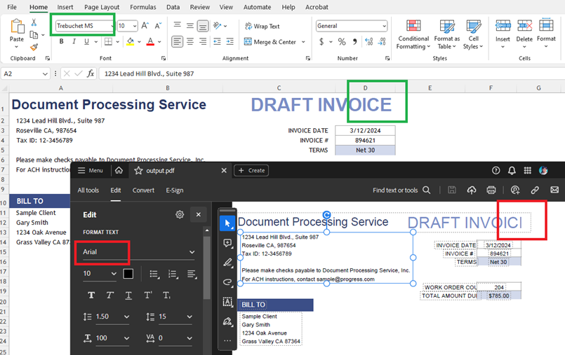
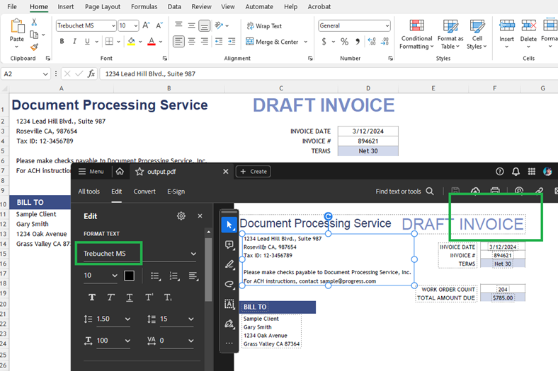

##Environment
| Version | Product | Author | 
| --- | --- | ---- | 
| .NET Standard | RadSpreadProcessing |[Desislava Yordanova](https://www.telerik.com/blogs/author/desislava-yordanova)| 

## Description
This article demonstrates how to deal with formatting difficulties when exporting an XLSX file to PDF using the RadSpreadProcessing library in .NET Standard. 

The most common scenario is:
1. [Export an XLSX file to PDF]() using the RadSpreadProcessing library.
2. Observe the resulting PDF file with truncated columns or different font.

   

## Solution
The limitations of .NET Standard may cause differences in the font and text size (text measuring) when converting to PDF format.

1\. To address the issue with the size discrepancy, set a [SpreadFixedTextMeasurer](}) to handle the problem with the size:

```csharp
        SpreadTextMeasurerBase fixedTextMeasurer = new SpreadFixedTextMeasurer();
        SpreadExtensibilityManager.TextMeasurer = fixedTextMeasurer;
```

2\. Implement a [FontsProvider]() to handle differences in fonts. 

```csharp
        FontsProviderBase fontsProvider = new FontsProvider();
        FixedExtensibilityManager.FontsProvider = fontsProvider;
```

This class provides a mechanism to read the fonts used in the document:

```csharp
    public class FontsProvider : Telerik.Windows.Documents.Extensibility.FontsProviderBase
    {
        public override byte[] GetFontData(Telerik.Windows.Documents.Core.Fonts.FontProperties fontProperties)
        {
            string fontFileName = fontProperties.FontFamilyName + ".ttf";
            string fontFolder = Environment.GetFolderPath(Environment.SpecialFolder.Fonts);

            //The fonts can differ depending on the file 
            if (fontProperties.FontFamilyName == "Trebuchet MS")
            {
                if (fontProperties.FontStyle == FontStyles.Italic && fontProperties.FontWeight == FontWeights.Bold)
                {
                    fontFileName = $"trebucbi.ttf";
                }
                else if (fontProperties.FontStyle == FontStyles.Italic)
                {
                    fontFileName = $"trebucit.ttf";
                }
                else if (fontProperties.FontWeight == FontWeights.Normal)
                {
                    fontFileName = "trebuc.ttf";
                }
                else if (fontProperties.FontWeight == FontWeights.Bold)
                {
                    fontFileName = $"trebucbd.ttf";
                }
            }        
            

            //...add more fonts if needed... 

            DirectoryInfo directory = new DirectoryInfo(fontFolder);
            FileInfo[] fontFiles = directory.GetFiles();

            var fontFile = fontFiles.FirstOrDefault(f => f.Name.Equals(fontFileName, StringComparison.InvariantCultureIgnoreCase));
            if (fontFile != null)
            {
                var targetPath = fontFile.FullName;
                using (FileStream fileStream = File.OpenRead(targetPath))
                {
                    using (MemoryStream memoryStream = new MemoryStream())
                    {
                        fileStream.CopyTo(memoryStream);
                        return memoryStream.ToArray();
                    }
                }
            }

            return null;
        }
    }
```
Now, the font in the exported PDF document is the correct one and the text is not clipped.

    

## See Also
- [Cross-Platform Support]()
- [Text Measuring]()
- [Fonts in PdfProcessing]()
- [How to implement FontsProvider]()
