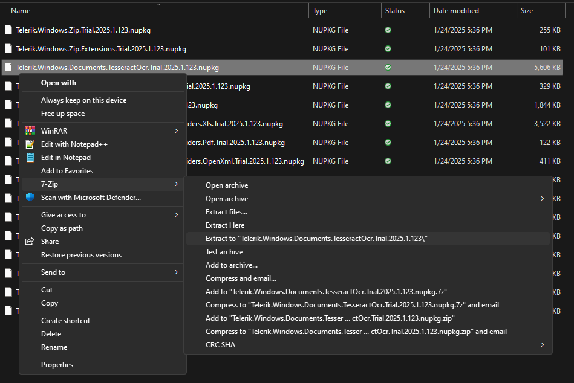
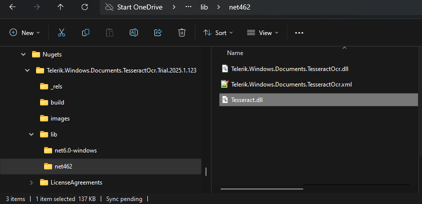

## Environment

| Version | Product | Author | 
| --- | --- | ---- | 
| Q1 2025 | Document Processing Libraries |[Desislava Yordanova](https://www.telerik.com/blogs/author/desislava-yordanova)| 

## Description

This article demonstrates how to extract the signed Tesseract.dll from the Telerik.Windows.Documents.TesseractOcr NuGet package.

>note A similar approach can be followed for any other NuGet package in order to extract the assemblies contained inside the **.nupkg**.

## Solution

1\. Right-click on the Telerik.Windows.Documents.TesseractOcr NuGet package and select **Extract** Using 7-Zip:

     

2\. Find the contained assemvlies in the lib folder:

    

3\. Use explicitly this Tesseract.dll in your project.

## See Also

* [Prerequisites]()
* [Using OcrFormatProvider]()
* [Available NuGet Packages]()
